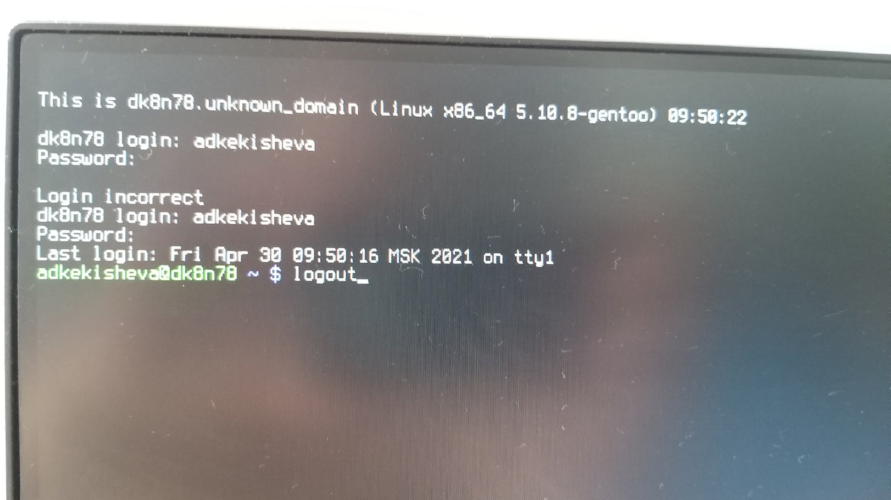
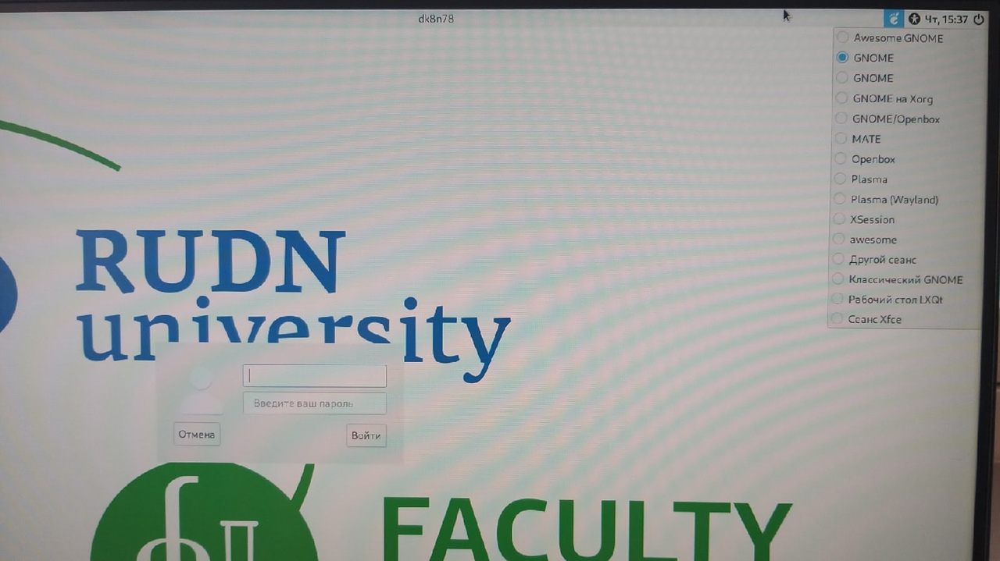
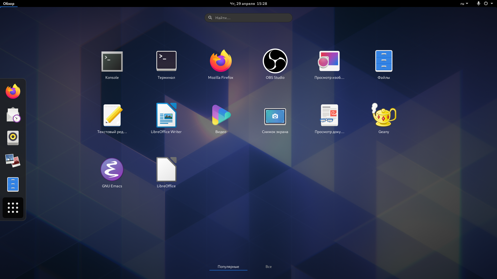
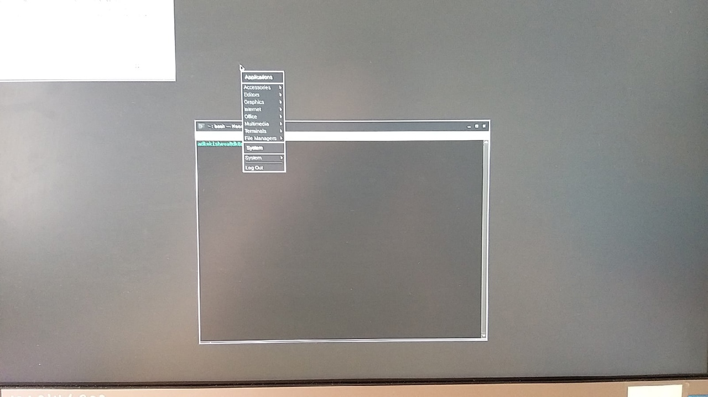
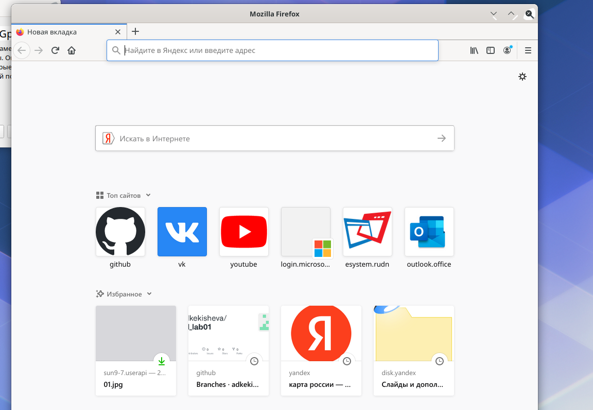
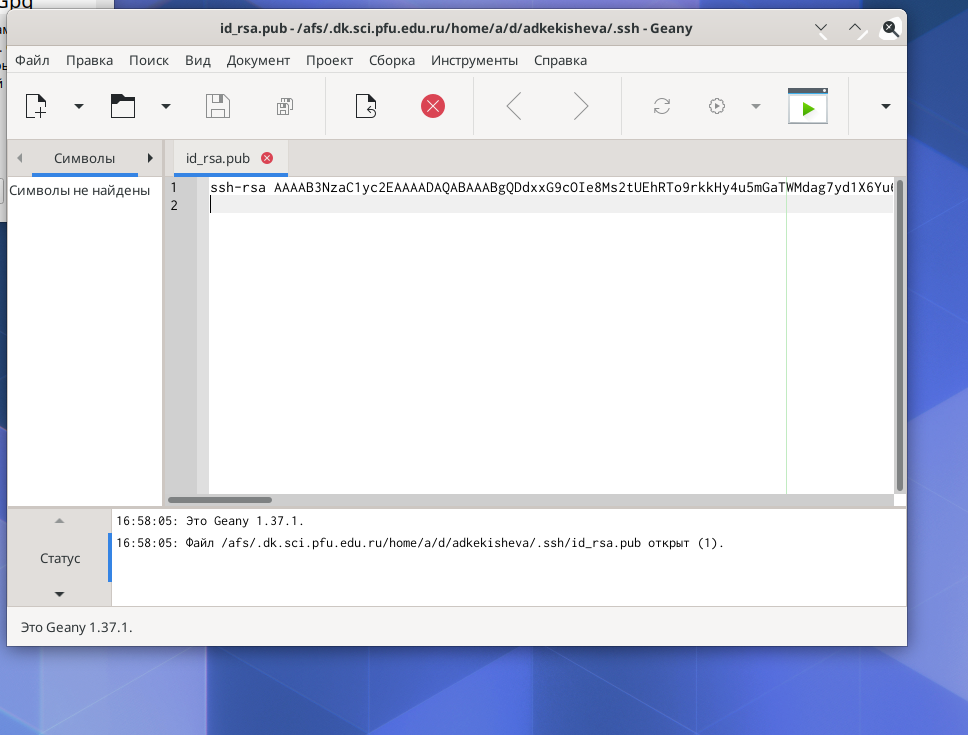

---
## Front matter
lang: ru-RU
title: Лабораторная работа №4. Знакомство с операционной системой Linux.

author: 
	Кекишева Анастасия Дмитриевна, НБИ-01-20, \inst{}

institute: |
	\inst{1}RUDN University, Moscow, Russian Federation
date: 30 апреля, 2021

## Formatting
toc: false
slide_level: 2
theme: metropolis
header-includes: 
 - \metroset{progressbar=frametitle,sectionpage=progressbar,numbering=fraction}
 - '\makeatletter'
 - '\beamer@ignorenonframefalse'
 - '\makeatother'
aspectratio: 43
section-titles: true
---

## Цель работы
Познакомиться с операционной системой Linux,получить практические навыки работы с консолью и некоторыми графическими менеджерами рабочих столов операционной системы.

## Работа с текстовми консолями

{ #fig:001 width=70% }

Перемещаемя между текстовыми консолями командой Alt+Fn.

Логин и пароль от входа в систему Linux.

Завершить консольный сеанс команда logout.

Переключиться на графический интерфейc: Alt+F7.

## Менеджер рабочих столов

{ #fig:001 width=70% }

Менеджер,запускаемый по умолчанию: классический GNOME.

## Графический менеджер  Xfce и PLASMA

{ #fig:001 width=70% }
{ #fig:001 width=70% }

## Графический менеджер GNOME и оконый менеджер Openbox

{ #fig:001 width=70% }

{ #fig:001 width=70% }

## Запуск браузера,текстового редактора,текстового процессора,эмулятора консоли

{ #fig:001 width=70% }

{ #fig:001 width=70% }

## Вывод
Я ознакомилась с операционной системой Linux, ознакомилась с различными менеджерами рабочих столов и получила практические навыки с ними, а также с текстовой и графической консолью.

