---
# Front matter
lang: ru-RU
title: "Отчёт лабораторной работы № 3"
subtitle: "Markdown"
author: "Кекишева Анастасия Дмитриевна"

# Formatting
toc-title: "Содержание"
toc: true # Table of contents
toc_depth: 2
lof: true # List of figures
lot: true # List of tables
fontsize: 12pt
linestretch: 1.5
papersize: a4paper
documentclass: scrreprt
polyglossia-lang: russian
polyglossia-otherlangs: english
mainfont: PT Serif
romanfont: PT Serif
sansfont: PT Sans
monofont: PT Mono
mainfontoptions: Ligatures=TeX
romanfontoptions: Ligatures=TeX
sansfontoptions: Ligatures=TeX,Scale=MatchLowercase
monofontoptions: Scale=MatchLowercase
indent: true
pdf-engine: lualatex
header-includes:
  - \linepenalty=10 # the penalty added to the badness of each line within a paragraph (no associated penalty node) Increasing the value makes tex try to have fewer lines in the paragraph.
  - \interlinepenalty=0 # value of the penalty (node) added after each line of a paragraph.
  - \hyphenpenalty=50 # the penalty for line breaking at an automatically inserted hyphen
  - \exhyphenpenalty=50 # the penalty for line breaking at an explicit hyphen
  - \binoppenalty=700 # the penalty for breaking a line at a binary operator
  - \relpenalty=500 # the penalty for breaking a line at a relation
  - \clubpenalty=150 # extra penalty for breaking after first line of a paragraph
  - \widowpenalty=150 # extra penalty for breaking before last line of a paragraph
  - \displaywidowpenalty=50 # extra penalty for breaking before last line before a display math
  - \brokenpenalty=100 # extra penalty for page breaking after a hyphenated line
  - \predisplaypenalty=10000 # penalty for breaking before a display
  - \postdisplaypenalty=0 # penalty for breaking after a display
  - \floatingpenalty = 20000 # penalty for splitting an insertion (can only be split footnote in standard LaTeX)
  - \raggedbottom # or \flushbottom
  - \usepackage{float} # keep figures where there are in the text
  - \floatplacement{figure}{H} # keep figures where there are in the text
---

# Цель работы
Изучить идеологию и применение средств контроля версий.

# Задание к лабораторной работе №2
- Настройка системы Git;
- Подключение репозитория к github;
- Первичная конфигурация, добавление файла лизензии;
- Конфигурация git-flow;

# Выполнение лабораторной работы
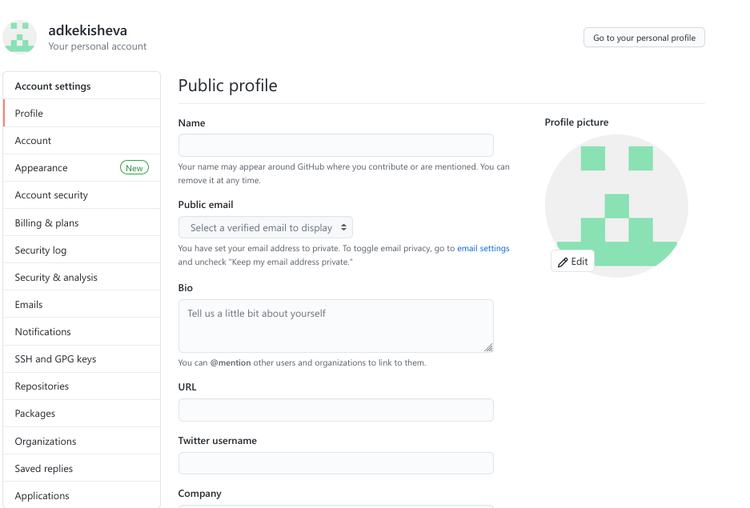{ #fig:001 width=70% }
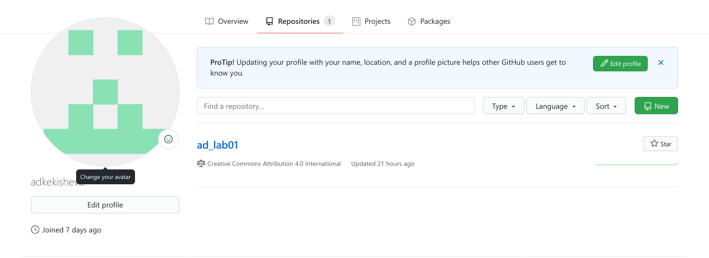{ #fig:001 width=70% }

Прежде всего, я создала аккаунт на github, а также создала пустой репозиторий.

{ #fig:001 width=70% }

Далее, перешла в папку .sshи в ней сгенерировала пароль с помощью команды ssh-keygen-C

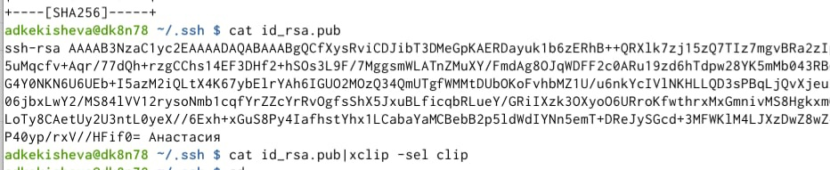{ #fig:001 width=70% }

После с помощью команды `catid_rsa.pub` просмотрела публичный вопрос а затем командой catid_rsa.pub|xclip-selclipскопировала этот пароль.

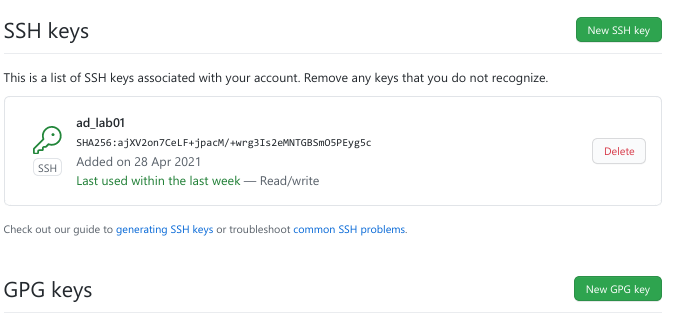{ #fig:001 width=70% }

Вставила скопированный публичный пароль, дала название ключу, и добавила SSH ключ на github.

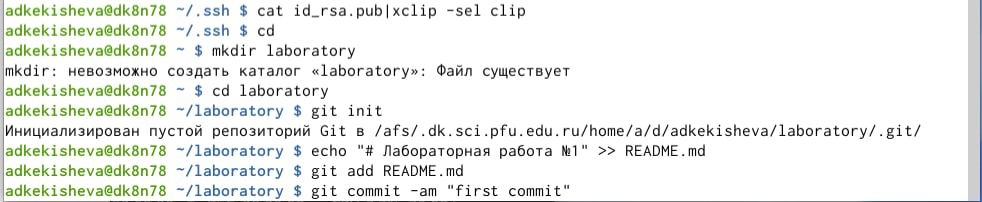{ #fig:001 width=70% }

Перешла в домашний каталог и создала в нём папку laboratory(mkdir laboratory) и перешла в неё.  Далее инициализировала git-репозиторий (git init) и создала заготовку для файла README.md: в этот файл я добавила строку «Лабораторная работа №1», а потом с помощью команды gitaddя добавила файл README.mdи сохранила все изменения в папке с помощью команды gitcommit-amcописанием “first commit”.

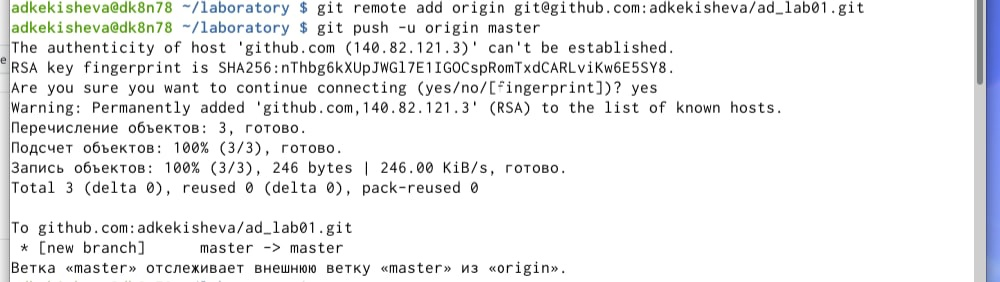{ #fig:001 width=70% }

И чтобы закинуть файл README.mdна githubя воспользовалась командами git add origin+ ссылка на репозиторий и gitpush-u.

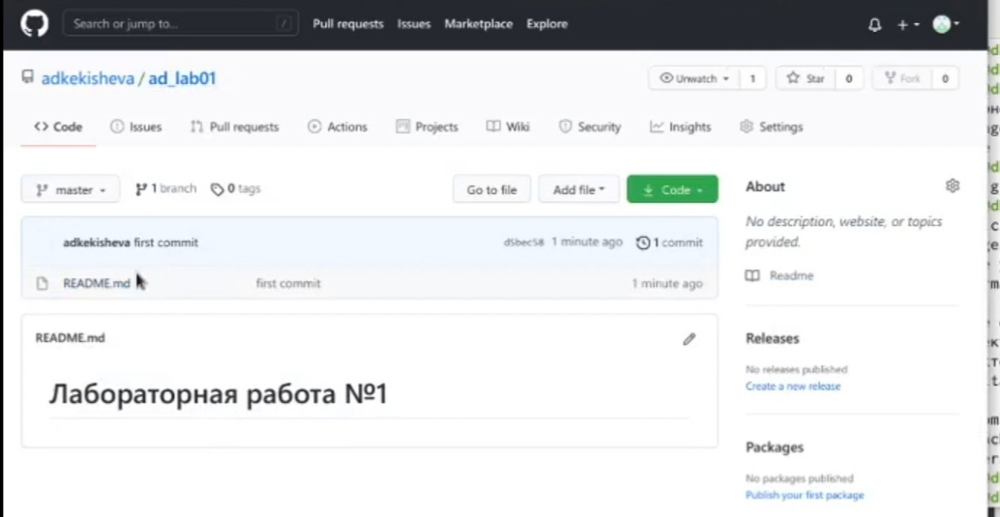{ #fig:001 width=70% }

Проверила репозиторий: у меня создался файл README.mdи в нём появился заголовок «Лабораторная работаNo1».

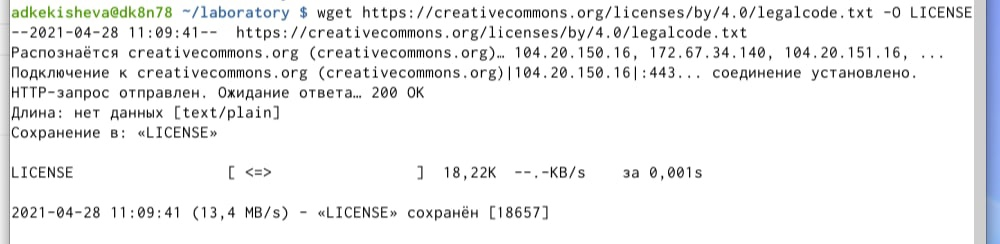{ #fig:001 width=70% }

Добавила файл лицензии.

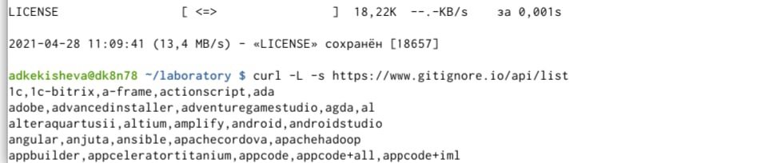{ #fig:001 width=70% }

Добавила шаблон игнорируемых файлов и просмотрела список имеющихся шаблонов.

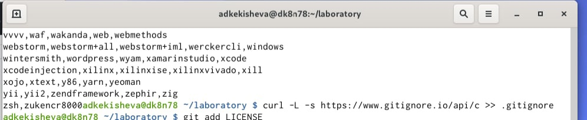{ #fig:001 width=70% }

И скачала шаблон

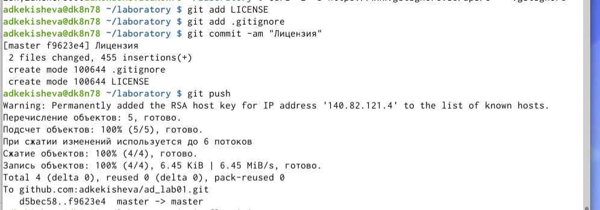{ #fig:001 width=70% }

Добавила и сохранила файлы LICENSE и .gitignore в текущем каталоге, потом сохранила все добавленные изменения с описанием (Лицензия). И отправила файлы в репозиторий

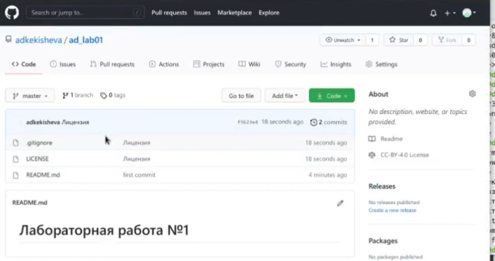{ #fig:001 width=70% }

Проверила, всё добавилось.

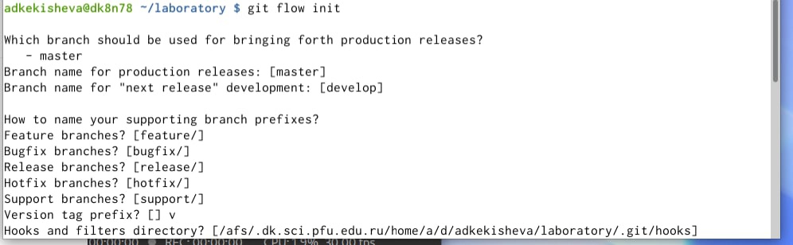{ #fig:001 width=70% }

Проинициализировала git-flowкомандой git-flow init. Префикс для ярлыков установила в v.Далее, с помощью команды gitbranchпроверила, что нахожусь в ветке develop.

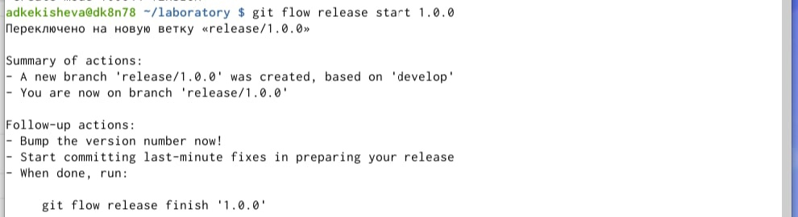{ #fig:001 width=70% }

Создала релиз с версией 1.0.0

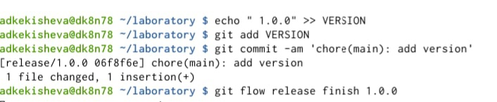{ #fig:001 width=70% }

Записала в файл VERSION строку с версией, добавила и сохранила изменения.

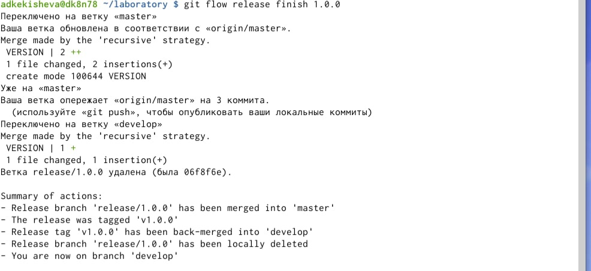{ #fig:001 width=70% }

Залила релизную ветку в основную ветку.

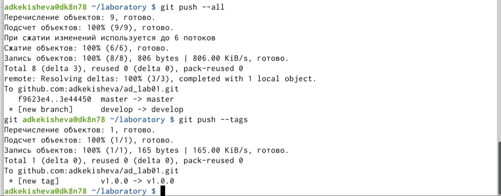{ #fig:001 width=70% }

И отправила все фали и теги на github.

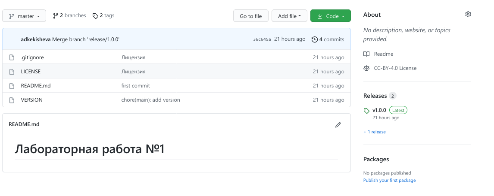{ #fig:001 width=70% }

Проверила, у меня создались 2 ветки, а также 1 тег.

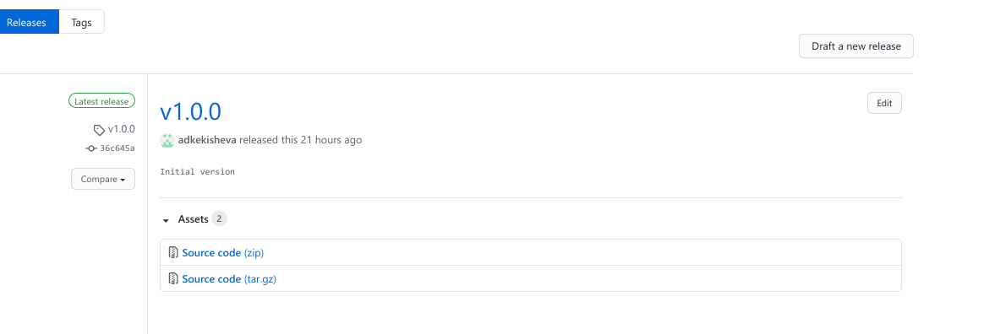{ #fig:001 width=70% }

И создала релиз v1.0.0

# Вывод:
Я познакомилась с системой контроля версий Git,изучила основные команды для работы с git,получила практические навыки по работе с сервером репозитория, а также, как вносить изменения, делатькоммиты и выкладывать их на github, также поработала с gitflow, научилась создавать релиз с версией, заливать этот релиз в основную ветку и создавать релиз на github. 

**Контрольные вопросы:**

1. Система управления версиями-программное обеспечениедля облегчения работы с изменяющейся  информацией.  Система  управления  версиями  позволяет  хранить несколько версий одного и того же документа, при необходимости возвращаться к более ранним версиям, определять, кто и когда сделал то или иное изменение, и многое другое.В основном применяются при работе нескольких человек над одним проектом. 
2. Хранилище  или  репозиторий-место  хранения  всех  версий  и  служебной информации.Commit -процесссоздания новой версии.После внесения изменений пользовательможет сохранить все добавленные изменения и все изменённые файлы.Понятие истории в vcsможно объяснить так: в любой момент пользователь может вручную выбрать нужную версию, отменить изменения вовсе или заблокировать файлы для изменения, а также просмотретьистории изменений.Рабочая  копия-текущее  состояние  файлов  проекта,  основанное  на  версии,загруженной из хранилища (обычно на последней).
3. Централизованныесистемыконтроляверсийпредставляютсобойприложениятипаклиент-сервер,когдарепозиторийпроектасуществуетвединственномэкземпляреихранитсянасервере.Доступкнемуосуществлялсячерезспециальноеклиентскоеприложение.ВкачествепримеровтакихпрограммныхпродуктовможнопривестиCVS,Subversion.Распределенные(децентрализованные)системы контроля версий позволяют хранить репозиторий (его копию) у каждого разработчика, работающего с данной системой. При этом можно выделить центральный репозиторий (условно), в который будут отправляться изменения из локальных и, с ним жеэти локальные репозитории будут синхронизироваться. При   работе   с   такой   системойпользователи периодическисинхронизируютсвои  локальные  репозитории  с  центральным  и работают  непосредственно  со  своей  локальной  копией.  После  внесения достаточного   количества   изменений   в локальную   копию   они (изменения)отправляются   на   сервер. Две   наиболее   известныеDVCS–этоGitиMercurial.
4. При  единоличной  работе  с  хранилищем,  как правило, есть репозиторий и несколько копий файла, над которым идёт работа. Все изменеия сохраняються,  и  можно  вернуться  в  любому этапу работы, а также объединять файлы. 
5. Участник  проекта  после  внесения  изменений,  размещает  новую  версию  в хранилище. При этом предыдущие версии не удаляются из центрального хранилища и к ним можно вернуться в любой момент.Сервер может сохранять не полную версию изменённых файлов, а производить так называемую дельтакомпрессию —сохранять только изменения между последовательными версиями, что позволяет уменьшить объём хранимых данных. м. Можно объединить изменения, сделанныеразными участниками, вручную выбрать нужную версию, отменить изменения вовсе или заблокировать файлы для изменения. В зависимости от настроек блокировка не позволяет  другим  пользователям  получить  рабочую  копию  или  препятствует изменению   рабочей   копии   файла средствами   файловой   системы   ОС, обеспечивая таким образом, привилегированный доступ только одному пользователю,  работающему  с  файлом  и отправлять все изменения в хранилище.
6. У Git две основных задачи: первая -хранить информацию о всех изменениях в вашем коде, начиная с самой первой строчки, а вторая -обеспечение удобства командной работы над кодом.
7. Команды:
 - git init -создание основного дерева репозитория;
 - git  pull -получение обновлений (изменений) текущего дерева из центрального репозитория;
 - git push -отправка  всех  произведённых  изменений  локального  дерева  в центральный репозиторий
 - git status -просмотр списка изменённых файлов в текущей директории;
 - git diff -просмотр текущих изменения;
 - git add . добавить все изменённые и/или созданные файлы и/или каталоги;
 - git add имена файлов -добавить конкретные изменённые и/или созданные файлы и/или каталоги;
 - git rm имена_файлов - удалить файл и/или каталог из индекса репозитория (при этом файл и/или каталог остаётся в локальной директории;
 - git commit -am 'Описание коммита' -сохранить все добавленные изменения и все изменённые файлы;
 - git checkout -b имя_ветки - создание новой ветки, базирующейся на текущей;
 - git checkout имя_ветки -переключение на некоторую ветку(при переключении на ветку, которой ещё нет в локальном репозитории, она будет создана и связана с удалённой);
 - git push origin имя_ветки -отправка изменений конкретной ветки в центральный репозиторий;
 - git merge --no-ff имя_ветки -слияние ветки с текущим деревом;
 - git  branch -d имя_ветки -удаление локальной уже слитой с основным деревом ветки;
 - git branch -D имя_ветки -принудительное удаление локальной ветки;
8. Локальныйрепозиторий храниться на нашем компьютере, в рабочей папке проекта, в которой мы проинициализировали репозиторий и в которой находться папка.git, в которойбудет храниться история изменений.Удалённыйрепозиторий  хранится  в облаке, на  сторонних  сервисах,специально созданных под работу с проектами git. Удаленный репозиториявыполняет роль резервной  копии,  даёт возможность  работать  в  команде,  а  также некоторые дополнительные возможности. Например, визуализация истории или возможность работать над проектом прямо в веб-интерфейсе.
9. Для фиксации истории проекта в рамках этого процесса вместо одной ветки master используются две ветки. В ветке master хранится официальная история релиза, а ветка  develop  предназначена  для  объединения  всех  функций. Помимо  главных ветвей master и develop, наша модель разработки содержит некоторое количество типов  вспомогательных  ветвей,  которые  используются  для  распараллеливания разработки между членами команды, для упрощения внедрения нового функционала (features),  для  подготовки  релизов  и  для  быстрого  исправления  проблем  в производственной версии приложения. В целом ветки позволяют решать задачи система управления версиямиgit.
10. Во время работы над проектом так или иначе могут создаваться файлы (временные файлы,  создаваемые редакторами,  или  объектные  файлы,  создаваемые компиляторами),  которые  не  требуется  добавлять  в  последствии  в  репозиторий, поэтому мы можем их игнорировать. Чтобы устранить ненужные файла, можно прописать шаблоны игнорируемых при добавлении в репозиторий типов файлов в файл .gitignore с помощью сервисов. Для этого сначала нужно получить список имеющихся шаблонов, затем скачать шаблон, например, для C
