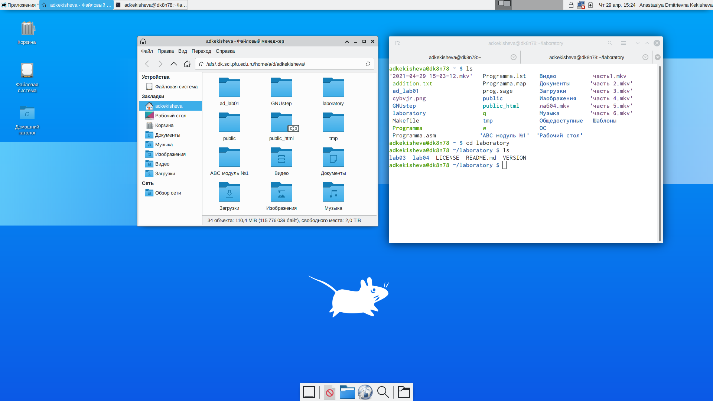
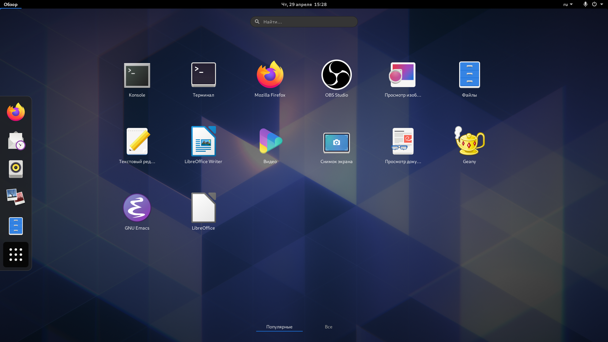
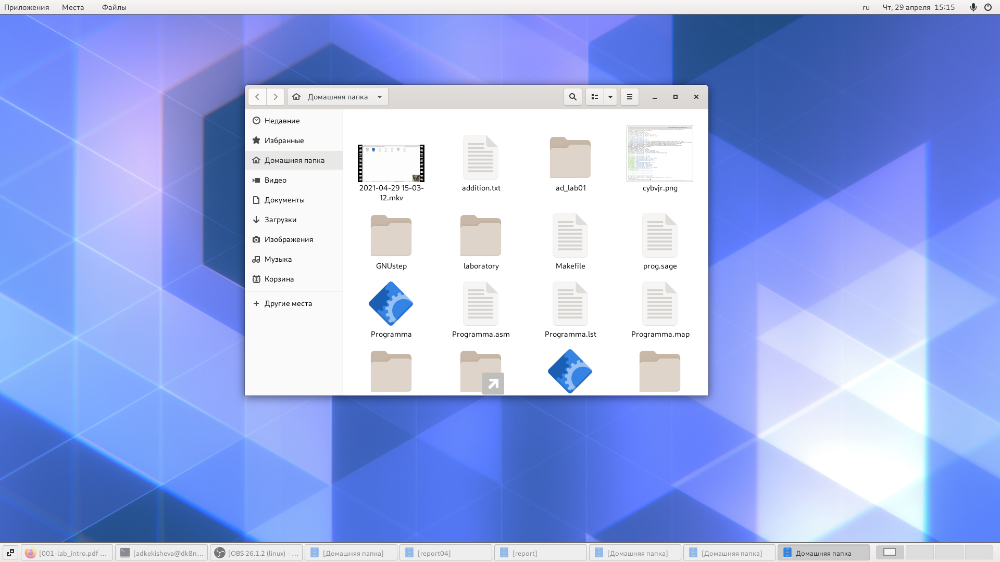
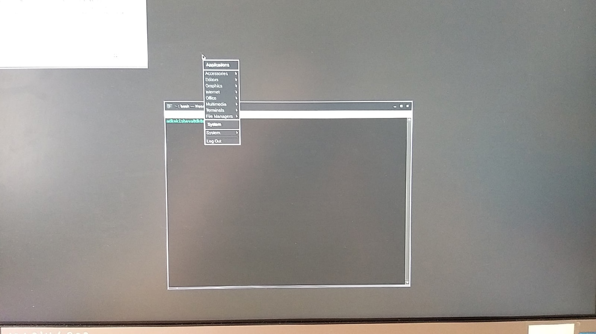
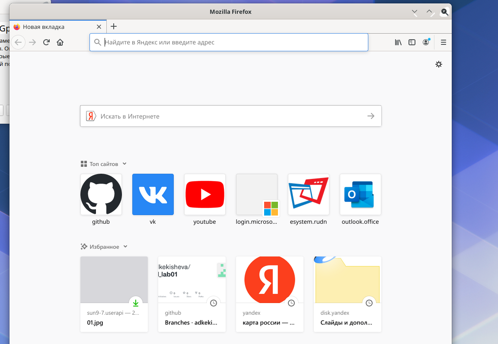
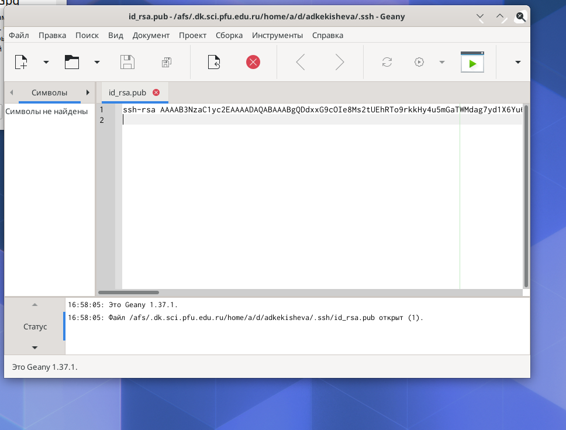
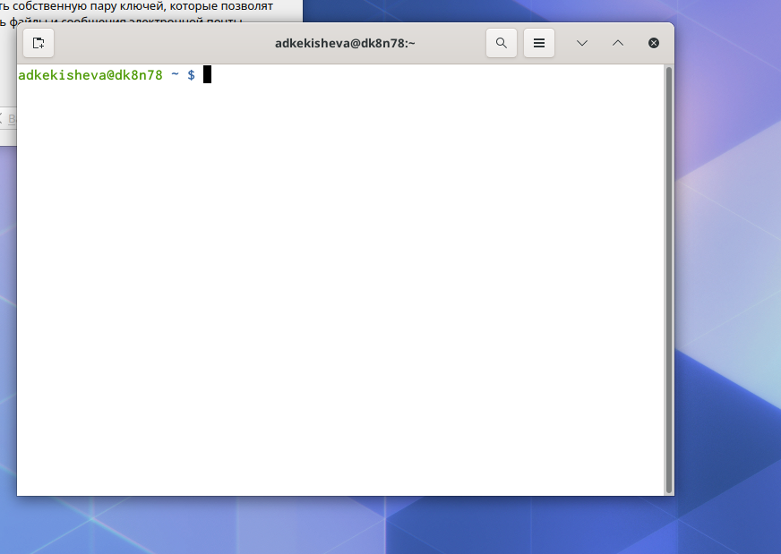

---
# Front matter
lang: ru-RU
title: "Отчёт к лабораторной работе №4"
subtitle: "Знакомство с операционной системой Linux"
author: "Кекишева Анастасия Дмитриевна"

# Formatting
toc-title: "Содержание"
toc: true # Table of contents
toc_depth: 2
lof: true # List of figures
lot: true # List of tables
fontsize: 12pt
linestretch: 1.5
papersize: a4paper
documentclass: scrreprt
polyglossia-lang: russian
polyglossia-otherlangs: english
mainfont: PT Serif
romanfont: PT Serif
sansfont: PT Sans
monofont: PT Mono
mainfontoptions: Ligatures=TeX
romanfontoptions: Ligatures=TeX
sansfontoptions: Ligatures=TeX,Scale=MatchLowercase
monofontoptions: Scale=MatchLowercase
indent: true
pdf-engine: lualatex
header-includes:
  - \linepenalty=10 # the penalty added to the badness of each line within a paragraph (no associated penalty node) Increasing the value makes tex try to have fewer lines in the paragraph.
  - \interlinepenalty=0 # value of the penalty (node) added after each line of a paragraph.
  - \hyphenpenalty=50 # the penalty for line breaking at an automatically inserted hyphen
  - \exhyphenpenalty=50 # the penalty for line breaking at an explicit hyphen
  - \binoppenalty=700 # the penalty for breaking a line at a binary operator
  - \relpenalty=500 # the penalty for breaking a line at a relation
  - \clubpenalty=150 # extra penalty for breaking after first line of a paragraph
  - \widowpenalty=150 # extra penalty for breaking before last line of a paragraph
  - \displaywidowpenalty=50 # extra penalty for breaking before last line before a display math
  - \brokenpenalty=100 # extra penalty for page breaking after a hyphenated line
  - \predisplaypenalty=10000 # penalty for breaking before a display
  - \postdisplaypenalty=0 # penalty for breaking after a display
  - \floatingpenalty = 20000 # penalty for splitting an insertion (can only be split footnote in standard LaTeX)
  - \raggedbottom # or \flushbottom
  - \usepackage{float} # keep figures where there are in the text
  - \floatplacement{figure}{H} # keep figures where there are in the text
---

# Цель работы
Познакомиться с операционной системой Linux,получить практические навыки работы с консолью и некоторыми графическими менеджерами рабочих столов операционной системы.

# Задание
**Выполнить данныые пункты и ответить на вопросы:**

1. Ознакомиться с теоретическим материалом;
2. Загрузить компьютер;
3. Перейти на текстовую консоль.Сколько текстовых консолей доступно на вашем компьютере?
4. Перемещаться междутекстовыми консолями.Какие комбинации клавиш необходимопри этом нажимать?
5. Зарегистрироваться в текстовой консоли операционной системы.Какой логин вы приэтом использовали? Какие символы отображаются при вводе пароля?
6. Завершить консольный сеанс.Какую команду или комбинацию клавиш необходимодля этого использовать?
7. Переключиться на графический интерфейс. Какую комбинацию клавиш для этогонеобходимо нажать?
8. Ознакомиться с менеджером рабочих столов.Как называется менеджер,запускаемыйпо умолчанию?
9. Поочерёдно зарегистрироваться в разных графических менеджерах рабочих столов(GNOME,KDE,XFCE) и оконных менеджерах (Openbox).Продемонстрировать разницумежду ними, сделав снимки экрана (скриншоты). Какие графические менеджеры установлены на вашем компьютере?
10. Изучить список установленных программ. Обратить внимание на предпочтительные программы для разных применений.Запустите поочерёдно браузер,текстовой редактор,текстовой процессор,эмулятор консоли.Укажите названия программ.

# Выполнение лабораторной работы
1. Я ознакомилась с теоритическим материалом и приступила к выполнеию.
2. Загрузила компьютер и начала сеанс, введя свой логин и пароль;
3. С помощью сочетания клавиш ctrl+alt+F1 (можно от F1 до F6) перешла в текстовую консоль. Доступно 6 текстовых консолей;
4. Я переключалась по шести консолям и использовала при этом сочетания клавиш alt+(F1-F6).
5. Далее зарегестрировалась в одной из консолей, введя свои логин и пароль, которые соотвествует моей учётной записи Linux. При написании пароля никаких символов не отображается.
6. После завершила сеанс, используя команду logout. Также это можно сделать сочетанием клавиш ctrl+D или командой ext.
7. Далее переключилась на графический интерфейс, используя комбинацию клавиш ctrl+alt+F6.

{ #fig:001 width=70% }

8. Ознакомилась с менеджером рабочих столов. Менеджер по умолчанию - это классический GNOME;

9. Далее, поочерёдно зарегистрировалась в разных графических менеджерах рабочих столов (GNOME,KDE,XFCE) и оконных менеджерах (Openbox).Сделал скрины, они демонстрируют разницу между ними. Графические менеджеры установленные на данном компьютере: см. рисунок 1

{ #fig:001 width=70% }

Графический менеджер  Xfce
 
 
{ #fig:001 width=70% }

Графический менеджер plasma

{ #fig:001 width=70% }

Графический менеджер GNOME

{ #fig:001 width=70% }

Графический менеджер классический GNOME

{ #fig:001 width=70% }

Оконный менеджер Openbox

10. Далее изучила список установленных программ.Запустила поочерёдно браузер,текстовый редактор,текстовой процессор,эмулятор консоли.

{ #fig:001 width=70% }

Запустили браузер Mozilla Firefox

{ #fig:001 width=70% }

Текстовый тедактор Geany

{ #fig:001 width=70% }

Эмулятор консоли

# Вывод
Я ознакомилась с операционной системой Linux, ознакомилась с различными менеджерами рабочих столов и получила практические навыки с ними, а также с текстовой и графической консолью.

**Контрольные вопросы:**
 
 
1. Входное имя пользователя — это login, то есть название учётной записи пользователя.

2. Компьютерный терминал—устройство ввода–вывода, основные функции которого заключаются в вводе и отображении данных.
С помощью терминала Linux можно сделать всё и даже намного больше, чем в графическом интерфейсе. Благодаря истории команд, автодополнению команд и путей к файлам, поиску по истории, операциям обеднения команд и удобным горячим клавишам, терминалом пользоваться очень удобно, если привыкнуть. А при необходимости можно писать целые скрипты на Bash для автоматизации действий.

3. Учётные записи пользователей хранятся в файле /etc/passwd.
Изначально поле пароля содержало хеш пароля и использовалось для аутентификации. Однако для безопасности все пароли были перенесены в специальный файл /etc/shadow. Они хранятся в виде, недоступном для чтения обычным пользователям. Поэтому в файле /etc/passwd поле password имеет значение x.

4. Настройки пользовательских программ хранятся в домашнем каталоге в папках, начинающихся с точки. Например, ....

5. Учётная запись пользователя с UID=0 называется root.

6. Да, полномочия администратора обычно не ограничены. Он может влиять на жизнеспособность самой операционной системы и работу других пользователей.

7. Linux — многопользовательская операционная система, т.е. несколько пользователей могут работать с ней одновременно с помощью терминалов.
В многопользовательской модели пользователи делятся на пользователей с обычными правами и администраторов. Пользователь с обычными правами может производить действия с элементами операционной системы только в рамках выделенного ему про- странства и ресурсов, не влияя на жизнеспособность самой операционной системы и работу других пользователей. Полномочия же пользователей с административными правами обычно не ограничены.

8. Кроме пароля и логина учётная запись пользователя содержит:
– внутренний идентификатор пользователя (User ID);
– идентификатор группы (Group ID);
– анкетные данные пользователя (General Information);
– домашний каталог (Home Dir);
– указатель на программную оболочку (Shell).

9. UID, в которой перед “ID” добавлена буква “U”, которая может быть расшифрована как “unique” — “уникальный”, или как “user” — “пользователь”. Поэтому есть два варианта расшифровки аббревиатуры UID:
UID (Unique identifier) или УИД — уникальный идентификатор.
UID (User identifier) — идентификатор пользователя в операционной системе или на сайте.

Некоторые идентификаторы являются уникальными, то есть могут принадлежать только одному субъекту (имя может совпадать, а номер паспорта всегда отличается).

Идентификационный номер группы GID - это номер, обозначающий группу, к которой по умолчанию относится пользователь. Группы позволяют регулировать доступ многих пользователей к различным ресурсам.
Каждый пользователь принадлежит одной или нескольким группам, и эту принадлежность устанавливает системный администратор.

10. GECOS (General Information или GECOS) - анкетные данные пользователя являются необязательным параметром учётной записи и могут содержать реальное имя пользователя
(фамилию, имя), адрес, телефон.

11. В домашних каталогах пользователей хранятся пользовательские файлы, а также пользовательские настройки различных программ. Каждый пользователь имеет свой уникальный и неповторимый каталог для своих личных, персональных файлов.

Этот каталог называется Домашним каталогом пользователя и обозначается /home/Имя_Пользователя.

Такое разделение пользовательских каталогов и файлов операционной системы упрощает сохранение данных и повышает надежность самой операционной системы.

12. home

13. В домашнем каталоге пользователя хранятся данные (файлы) пользователя, настройки рабочего стола и других приложений. Содержимое домашнего каталога обычно не доступно другим пользователям с обычными правами и не влияет на работу и настройки, а доступ администратора к этому каталогу не ограничивается. 

14. В файле /etc/passwd хранятся учётные записи пользователя. Однако для безопасности все пароли были перенесены в специальный файл /etc/shadow, недоступный для чтения обычным пользователям. Поэтому в файле /etc/passwd поле password имеет значение x.

15. Содержимое файла /etc/passwd состоит из строк, которые начинаются с имени пользователя, после которого через знак двоеточия : следуют ряд текстовых записей. Некоторые записи могут отсутствовать, и тогда двоеточия идут одним за другим.

Всего в одной строке шесть двоеточий, разделяющих семь записей, относящихся к одному пользователю.

В одной строке содержится информация только об одном пользователе.
Так по количеству строк можно определить, сколько всего пользователей зарегистрировано на данной машине.

16. Виртуальные консоли — реализация концепции многотерминальной работы в рамках одного устройства. Виртуальный в данном контексте означает, что у пользователя есть несколько независимых консолей и он имеет возможность переключаться из одной в другую для произведения множества независимых действий.

17. 17. Getty может быть использована системными администраторами для предоставления доступа к другим программам.

18. Сеанс работы -это весь процесс взаимодействия пользователя с системой с момента регистрации до выхода.

19. Toolkit(Tk,«наборинструментов»,«инструментарий»)—кроссплатформенная библиотека базовых элементов графического интерфейса, распространяемая с открытыми исходными текстами.

20. Основные тулкиты:
1) GTK+ — кроссплатформенная библиотека элементов интерфейса. Она состоит из двух компонентов:
– GTK — содержит набор элементов пользовательского интерфейса для различных задач;
– GDK — отвечает за вывод информации на экран, может использовать для этого
Linux Framebuffer.
2) Qt — кросс-платформенный инструментарий разработки программного обеспечения
на языке программирования C++. Он используется в среде KDE (Kool Desktop Environment).

