---
## Front matter
lang: ru-RU
title: Лабораторная работа №5. Основы интерфейса взаимодействия пользователя с системой Unix на уровне командной строки.

author: 
	Кекишева Анастасия Дмитриевна, НБИ-01-20, \inst{}

institute: |
	\inst{1}RUDN University, Moscow, Russian Federation
date: 30 апреля, 2021

## Formatting
toc: false
slide_level: 2
theme: metropolis
header-includes: 
 - \metroset{progressbar=frametitle,sectionpage=progressbar,numbering=fraction}
 - '\makeatletter'
 - '\beamer@ignorenonframefalse'
 - '\makeatother'
aspectratio: 43
section-titles: true
---

## Цель работы
Приобретение практических навыков взаимодействия пользователя с системой посредством командной строки.

## Полное имя домашнего каталога

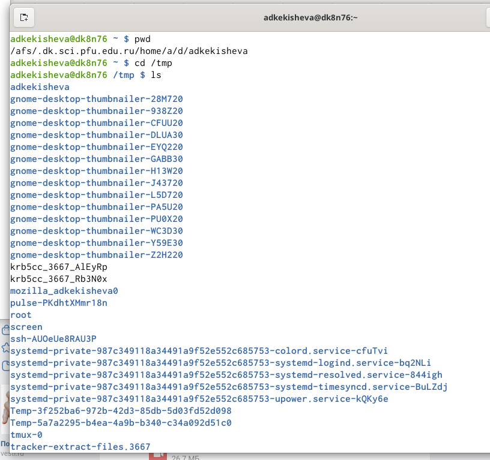{ #fig:001 width=70% }

## Вывод содержимого каталога /tmp
### ls -a: вывод скрытых файлов

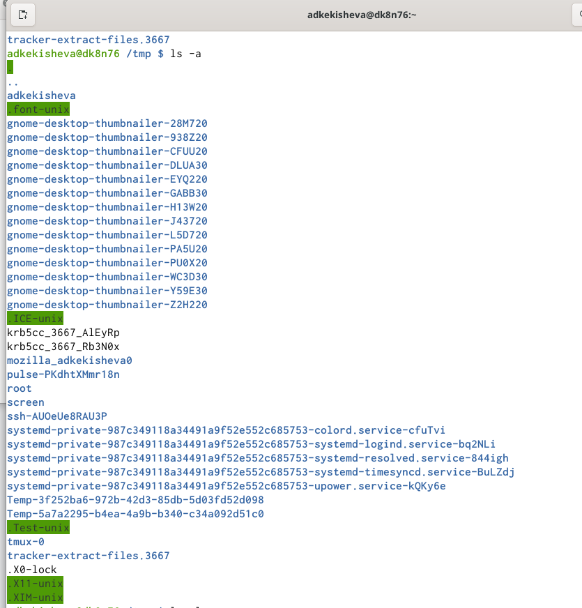{ #fig:001 width=70% }

## ls -l: вывод полной информации о файлах и каталогов.

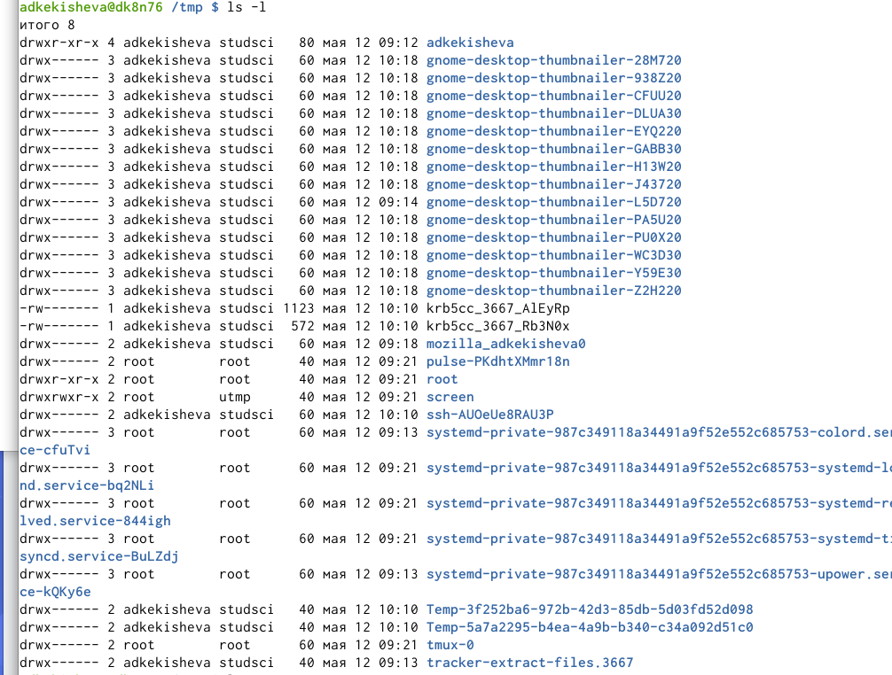{ #fig:001 width=70% }

## ls -F: вывод информации о типах файлов (вывод символа, который определяет тип файла: каталог, исполняемый файл, ссылка)
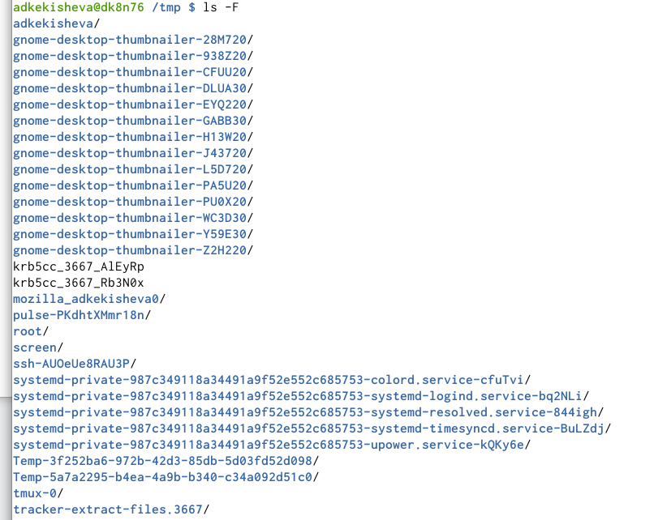{ #fig:001 width=70% }

## Проверка существования подкаталога cron и вывод содержимого домашнего каталога

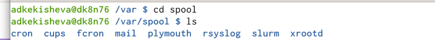{ #fig:001 width=70% }

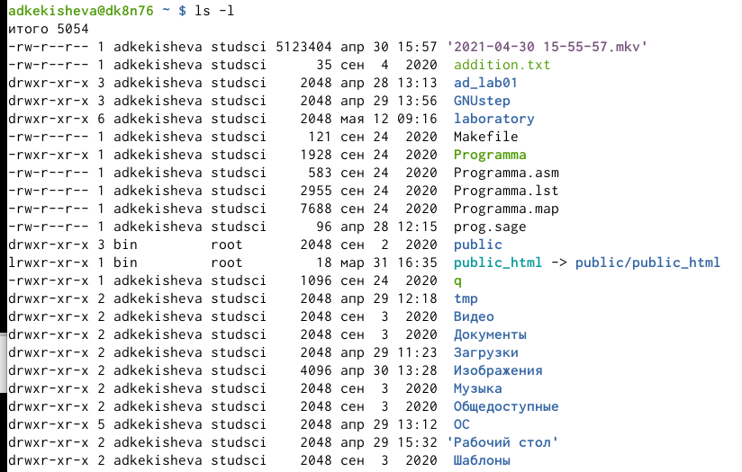{ #fig:001 width=70% }

## Создание нового каталога с именем newdir и в нём каталога с именем morefun.

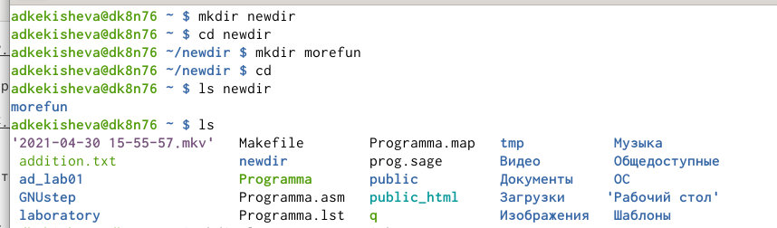{ #fig:001 width=70% }

## Cоздание и удаление трёх каталогов letters,memos,misk. 

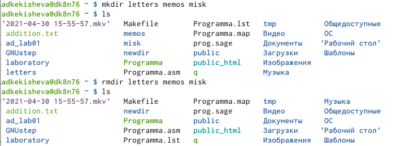{ #fig:001 width=70% }

## Удаление каталога ~/newdir командой rm и удаление каталога ~/newdir/morefun из домашнего каталога.

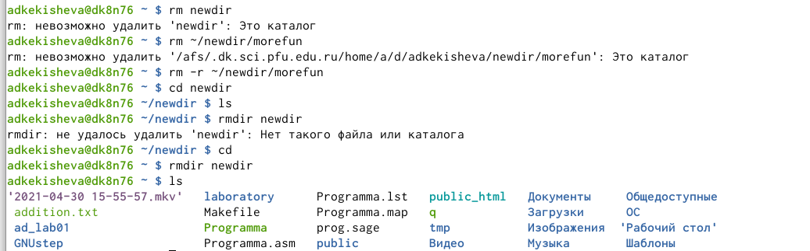{ #fig:001 width=70% }

## ls -R: просмотр содержимого не только указанного каталога, но и подкаталогов

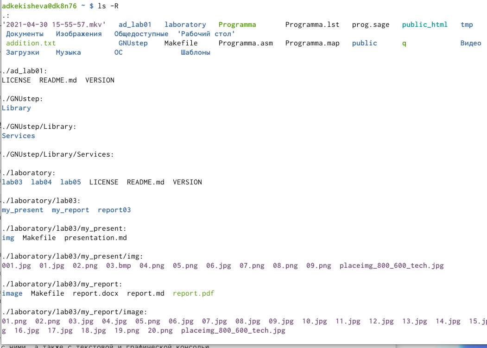{ #fig:001 width=70% }

## ls -c -lt: сортировка по времени последнего изменения выводимого списока содержимого каталога с развёрнутым описанием файлов.

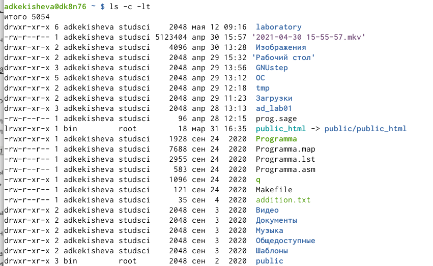{ #fig:001 width=70% }

## Команда man для просмотра описания следующих команд:cd,pwd,mkdir,rmdir,rm.

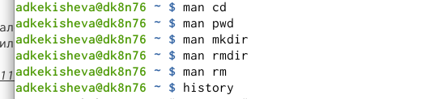{ #fig:001 width=70% }

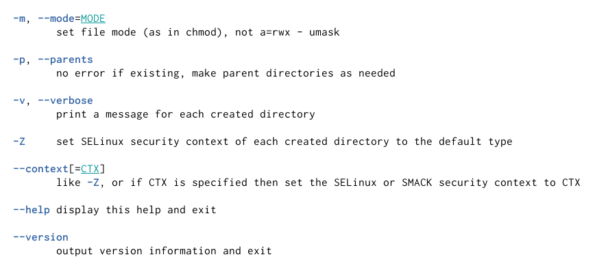{ #fig:001 width=70% }

## Вывод
Я приобрела практические навыкы взаимодействия пользователя с системой посредством командной строки. Повторила различные команды и узнала их опции и поработала с ними.

