---
# Front matter
lang: ru-RU
title: "Отчёт к лабораторной работе №5"
subtitle: "Основы интерфейса взаимодействия пользователя с системой Unix на уровнекомандной строки"
author: "Кекишева Анастасия Дмитриевна"

# Formatting
toc-title: "Содержание"
toc: true # Table of contents
toc_depth: 2
lof: true # List of figures
lot: true # List of tables
fontsize: 12pt
linestretch: 1.5
papersize: a4paper
documentclass: scrreprt
polyglossia-lang: russian
polyglossia-otherlangs: english
mainfont: PT Serif
romanfont: PT Serif
sansfont: PT Sans
monofont: PT Mono
mainfontoptions: Ligatures=TeX
romanfontoptions: Ligatures=TeX
sansfontoptions: Ligatures=TeX,Scale=MatchLowercase
monofontoptions: Scale=MatchLowercase
indent: true
pdf-engine: lualatex
header-includes:
  - \linepenalty=10 # the penalty added to the badness of each line within a paragraph (no associated penalty node) Increasing the value makes tex try to have fewer lines in the paragraph.
  - \interlinepenalty=0 # value of the penalty (node) added after each line of a paragraph.
  - \hyphenpenalty=50 # the penalty for line breaking at an automatically inserted hyphen
  - \exhyphenpenalty=50 # the penalty for line breaking at an explicit hyphen
  - \binoppenalty=700 # the penalty for breaking a line at a binary operator
  - \relpenalty=500 # the penalty for breaking a line at a relation
  - \clubpenalty=150 # extra penalty for breaking after first line of a paragraph
  - \widowpenalty=150 # extra penalty for breaking before last line of a paragraph
  - \displaywidowpenalty=50 # extra penalty for breaking before last line before a display math
  - \brokenpenalty=100 # extra penalty for page breaking after a hyphenated line
  - \predisplaypenalty=10000 # penalty for breaking before a display
  - \postdisplaypenalty=0 # penalty for breaking after a display
  - \floatingpenalty = 20000 # penalty for splitting an insertion (can only be split footnote in standard LaTeX)
  - \raggedbottom # or \flushbottom
  - \usepackage{float} # keep figures where there are in the text
  - \floatplacement{figure}{H} # keep figures where there are in the text
---

# Цель работы
Приобретение практических навыков взаимодействия пользователя с системойпосредством командной строки.

# Задание
**Выполнить данныые пункты и ответить на вопросы:**

1. Определите полное имя вашего домашнего каталога. 
2. Выполните следующие действия:
- Перейдите в каталог/tmp.
- Выведите на экран содержимое каталога/tmp. 
- Определите, есть ли в каталоге /var/spool подкаталог с именем cron?
- Перейдите в Ваш домашний каталог и выведите на экран его содержимое.Определите, кто является владельцем файлов и подкаталогов?
3. Выполните следующие действия:
- В домашнем каталоге создайте новый каталог с именемnewdir.
- В каталоге ~/newdir создайте новый каталог с именем morefun.
- В домашнем каталоге создайте одной командой три новых каталога с именами letters,memos,misk. Затем удалите эти каталоги одной командой.
- Попробуйте удалить ранее созданный каталог~/newdir командой rm. Проверьте, был ли каталог удалён.
- Удалите каталог ~/newdir/morefun из домашнего каталога. Проверьте,был ли каталог удалён.
4. С помощью командыmanопределите, какую опцию командыlsнужно исполь-зовать для просмотра содержимое не только указанного каталога, но и подката-логов, входящих в него.
5. С помощью командыmanопределите набор опций команды ls, позволяющий от-сортировать по времени последнего изменения выводимый список содержимогокаталога с развёрнутым описанием файлов.
6. Используйте командуmanдля просмотра описания следующих команд:cd,pwd,mkdir,rmdir,rm. Поясните основные опции этих команд.
7. Используя информацию, полученную при помощи команды history, выполните модификацию и исполнение нескольких команд из буфера команд.

# Выполнение лабораторной работы

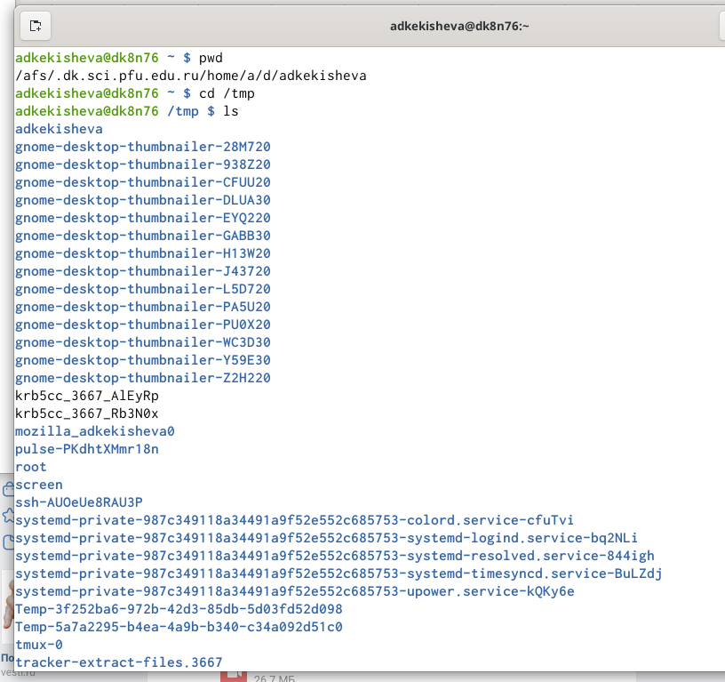{ #fig:001 width=70% }

1. Определила полное имя домашнего каталога  с помощью pwd и получила абсолютное имя текущего каталога пользователя adkekisheva.

2. Перешла в каталог/tmp с помощью команды cd. Вывела на экран содержимое каталога/tmp командой ls.

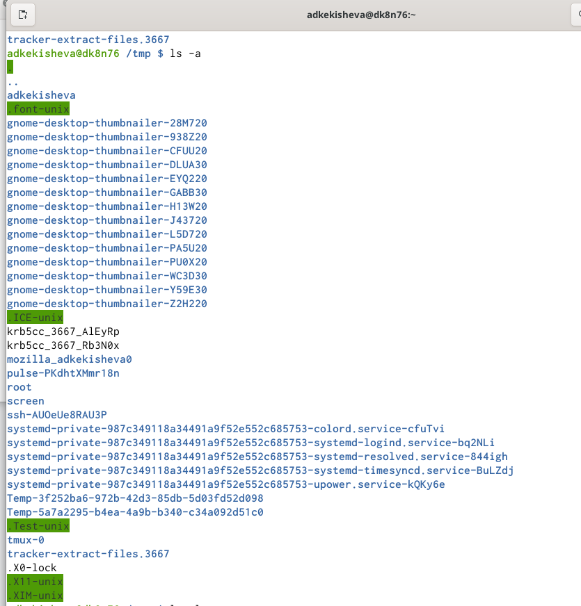{ #fig:001 width=70% }

Также, я использовала команду ls с различными опциями.Например, ls с опцией a, которая показывает  скрытые файлы.

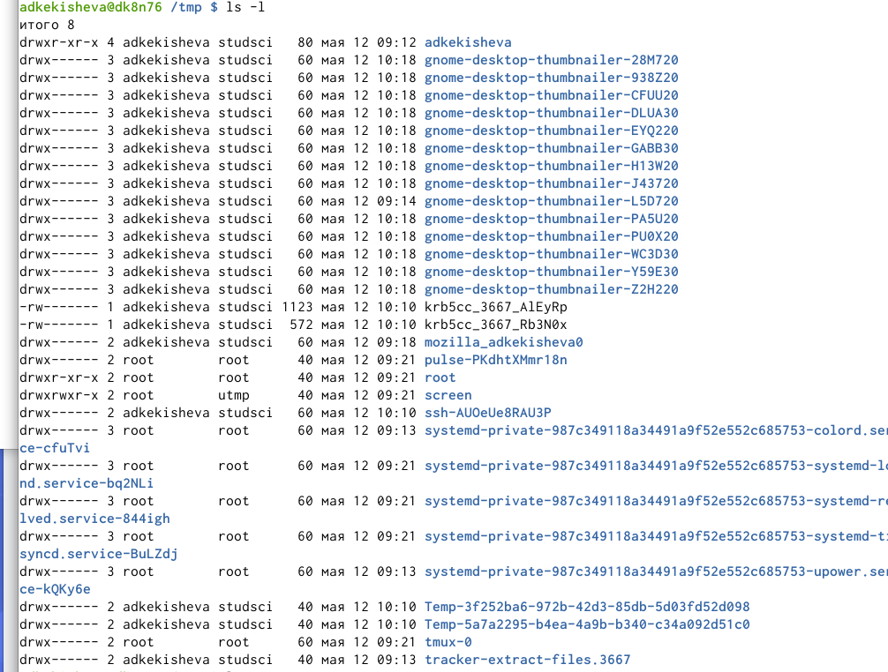{ #fig:001 width=70% }

Команда ls -l, которая вывод полную информацию о файлах и каталогов.

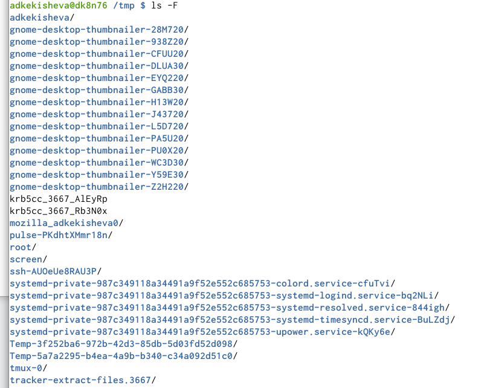{ #fig:001 width=70% }

Команда ls с опцией F, выдаёт информацию о типах файлов (каталог, исполняемый файл, ссылка) и выводит символ, который определяет тип файла.

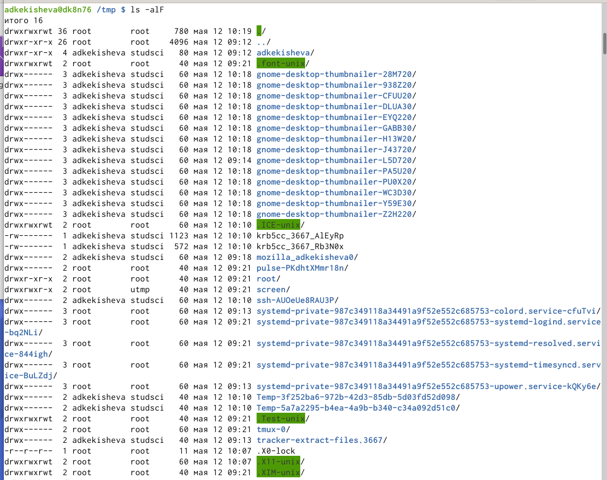{ #fig:001 width=70% }

Команда ls с опцией alF, выдаёт полную информацию о файлах и каталогах, включающее функции опций a, l, F. 

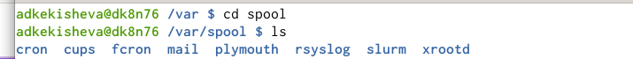{ #fig:001 width=70% }

Далее, я определила, есть ли в каталоге /var/spool подкаталог с именем cron. Да, он есть.

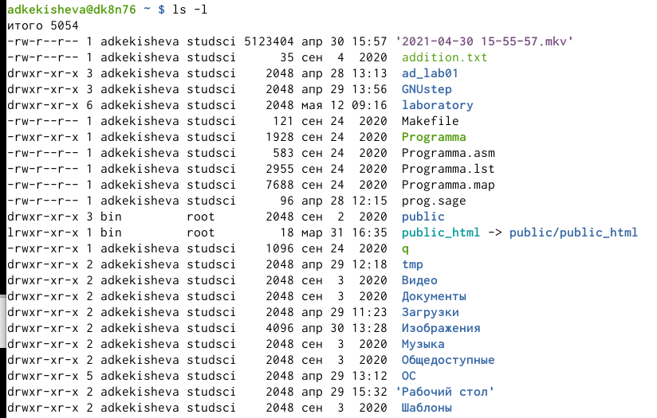{ #fig:001 width=70% }

После перешла в домашний каталог и вывела на экран его содержимое и чтобы определить владельца я использовала опцию l. Владельцами двух файлов является пользователь root, имеющий права администрации, а владельцем остальных файлов являюсь я.

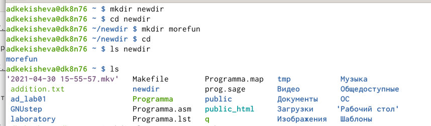{ #fig:001 width=70% }

В домашнем каталоге с помощью команды mkdir создала новый каталог с именем newdir. И далле в нём создала новый каталог morefun.Проверила, что каталоги создались.

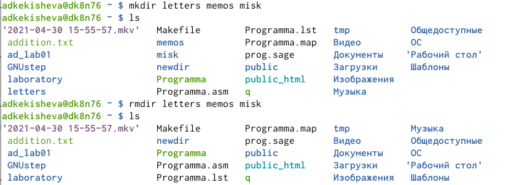{ #fig:001 width=70% }

В домашнем каталоге создала одной командой три новых каталога с именами letters,memos,misk. Затем удалила эти каталоги одной командой, так как катологи пусты, я использовала команду rmdir, можно также было использовать rm -r.

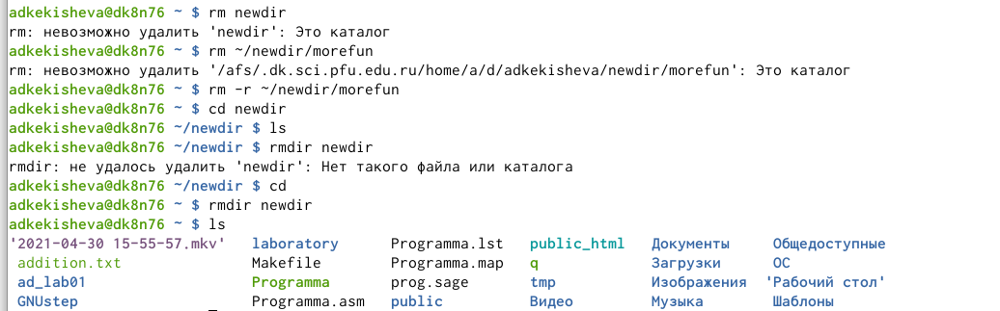{ #fig:001 width=70% }

Попробовала удалить ранее созданный каталог ~/newdir командой rm. Каталог не был удалён, так как это каталог и для его удаления необходимо воспользоваться командой с опцией: rm -r.

Далее, удалила каталог ~/newdir/morefun из домашнего каталога с помощью команды rm -r.. Проверила, каталог удалён.
И далее также удалила каталог newdir.

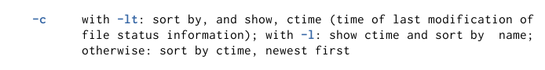{ #fig:001 width=70% }

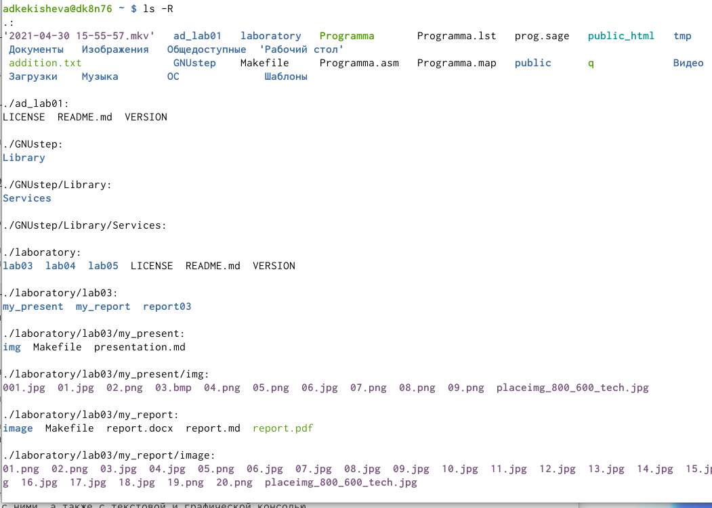{ #fig:001 width=70% }

4. С помощью команды man определила, какую опцию команды ls нужно использовать для просмотра содержимое не только указанного каталога, но и подката-логов, входящих в него. Это ls -R.

{ #fig:001 width=70% }

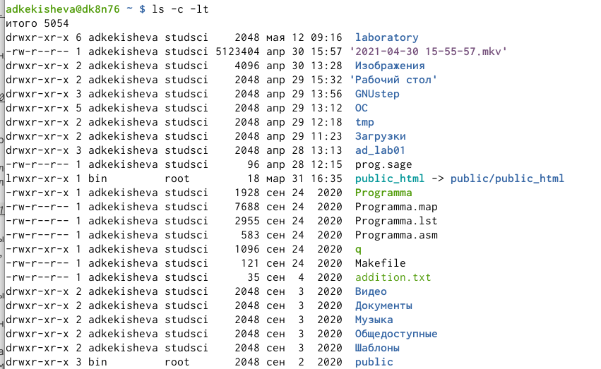{ #fig:001 width=70% }

5. После определила с помощью команды man опцию команды ls, позволяющую отсортировать по времени последнего изменения выводимый список содержимогокаталога с развёрнутым описанием файлов.Это ls -c -lt.

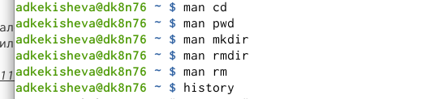{ #fig:001 width=70% }

6. Использовала команду man для просмотра описания следующих команд:cd,pwd,mkdir,rmdir,rm. Приложу несколько скриншотов с описанием основных опций этих команд.

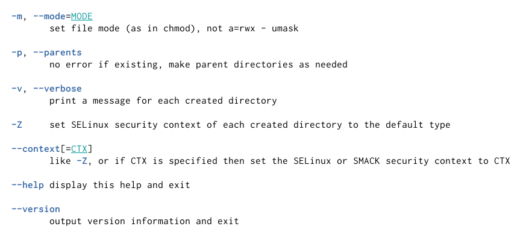{ #fig:001 width=70% }

Опции команды mkdir

**Опции команды mkdir:**

m=MODE или --mode=MODE: устанавливает права доступа для создаваемой директории. Синтаксис MODE такой же как у команды chmod;

-p или --parents: cоздать все директории, которые указаны внутри пути. Если какая-либо директория существует, то предупреждение об этом не выводится;

-v или --verbose: выводить сообщение о каждой создаваемой директории;

-Z: установить контекст SELinux для создаваемой директории по умолчанию; 

**Опции команды ls были описаны ранее.**

**Опции команды rm:**

-f или --force: игнорировать несуществующие файлы и аргументы. Никогда не выдавать запросы на подтверждение удаления.

-i:выводить запрос на подтверждение удаления каждого файла.

-r или -R или --recursive: удаление директорий и их содержимого. Рекурсивное удаление.

-d или --dir: удалять пустые директории. 

**Опции команды pwd:**

-L или --logicalе: не разыменовывать символические ссылки. Если путь содержит символические ссылки, то выводить их без преобразования в исходный путь.

-P или --physical: преобразовывать символические ссылки в исходные имена. Если путь содержит символические ссылки, то они будут преобразованы в названия исходных директорий, на которые они указывают.

**Опции команды rmdir:**

-p: позволяет удалить каталог и вышележащие каталоги, оказавшиеся пустыми. На стандартный вывод выдается сообщение об удалении всех указанных в маршруте каталогов или о сохранении части из них по каким-либо причинам.

-s: подавление сообщения, выдаваемого при действии опции -p.

**Опции команды cd:**

-P: позволяет следовать по символическим ссылкам перед тем, как будут обработаны все переходы "..";

-L: переходит по символическим ссылкам только после того, как были обработаны "..";

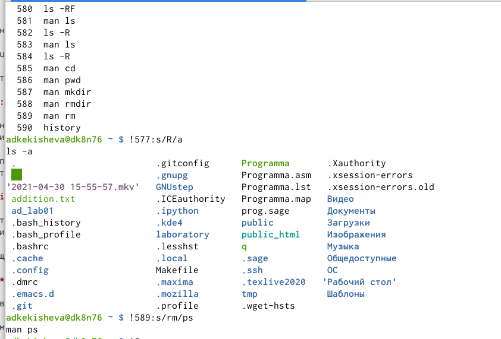{ #fig:001 width=70% }

7. Используя информацию, полученную при помощи команды history, выполнила модификацию и исполнение нескольких команд из буфера команд.

# Вывод
Я приобрела практические навыкы взаимодействия пользователя с системойпосредством командной строки. Повторила различные команды и узнала их опции и поработала с ними.

**Контрольные вопросы:**

1. Командная строка – это специальная программа, которая позволяет управлять компьютером путем ввода текстовых команд с клавиатуры.

2. При помощи команды pwd. Пример: если мы находимся в домашнем каталоге и набёрём команду pwd, то он выведет нам абсолютный путь до домашней папки: /afs/dk.sci.pfu.edu.ru/home

3. При помощи команды ls и её опции F. Ls покажет только имена файлов в текущем каталоге, а ls -F только тип файлов.

4. Файлы, название которых начинается с точки, считаются скрытыми. Получить информацию о скрытых файлах можно командой ls с опцией a: ls -a. Пример можно привести из лабораторной, там, где мы применяли различные опции данной команды, в том числе и -а (рисунок ).

5. Файл и каталог можно удалить при помощи команды rm -r. Но если файл мы сможем удалить просто командой rm без опций, то для удаления каталога нам обязательно необходима опция, без неё удаление невозможно. Пустой же каталог можно удалить командой rmdir.

6. Необходимо воспользоваться командой history.

7. Можно модифицировать команду из выведенного на экран списка при помощи следующей конструкции: !<номер команды>:s/<что меняем>/<на что меняем>. Например, у нас была команда ls -F и мы хотим изменить её на ls -t, то прописываем в конструкции : !<номер команды>:s/F/a.

8. Можно в одной строке записать несколько команд. Для для этого используется символ точка с запятой Пример: cd; ls.

9. Что такое символ экранирования - \ (обратный слэш). Его используют, когда с в заданном контексте конструкции ( !<номер команды>:s/<что меняем>/<на что меняем>) встречаются специальные символы (типа «.», «/», «*» и т.д.), надо перед ними поставить символ экранирования.

10. ls – l выводит подробную информацию о файлах и каталогах. Будет выведена следующая информация: тип файла, право доступа, число ссылок, владелец, размер, дата последней ревизии, имя файла или каталога.

11. Относительный путь linux - это путь к файлу относительно текущей папки, он не содержит "/" в начале. Так, если мы сначала переместимся в /usr: $ cd /usr, то затем мы можем использовать относительный путь local/bin, чтобы попасть в директорию /usr/local/bin: $ pwd: /usr/local/bin/

12. Информацию об интересующей нас команде можно получить командой man <название команды>. Например, man ls, man pc.

13. Клавиша Tab. 
 

