---
## Front matter
lang: ru-RU
title: Лабораторная работа №6. Анализ файловой системы Linux.Команды для работы с файлами и каталогами.

author: 
	Кекишева Анастасия Дмитриевна, НБИ-01-20, \inst{}

institute: |
	\inst{1}RUDN University, Moscow, Russian Federation
date: 30 апреля, 2021

## Formatting
toc: false
slide_level: 2
theme: metropolis
header-includes: 
 - \metroset{progressbar=frametitle,sectionpage=progressbar,numbering=fraction}
 - '\makeatletter'
 - '\beamer@ignorenonframefalse'
 - '\makeatother'
aspectratio: 43
section-titles: true
---

## Цель работы
Ознакомление с файловой системой Linux, её структурой, именами и содержанием каталогов. Приобретение практических навыков по применению команд дляработы с файлами и каталогами, по управлению процессами (и работами), по проверке использования диска и обслуживанию файловой системы.

## Выполнение примеров из лабораторной работы.
### Слайд 1
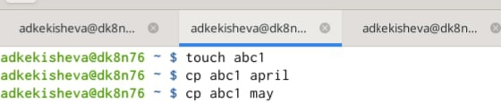{ #fig:001 width=70% }

С помощью команды cp скопировала файл ~/abc1 в файл april и в файл may.

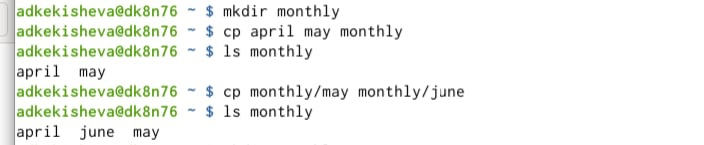{ #fig:001 width=70% }

Скопировала файлы april и may в каталог monthly и проверила правильность выполнения команды.

## Слайд 2
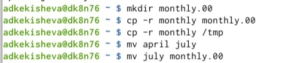{ #fig:001 width=70% }

Далее, скопировала командаc pс опцией r (она позволяет копировать каталоги вместе с входящими в них файлами и каталогами) каталог monthly в каталог monthly.00. А также скопировала  каталог monthly.00 в каталог /tmp.

## Слайд 3
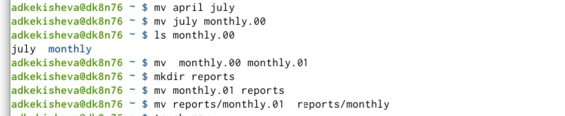{ #fig:001 width=70% }

После я изменила название файла april на july в домашнем каталоге. Переместила файл july в каталог monthly.00.
Переименовала  каталог monthly.00 в monthly.01. Переместила каталог monthly.01 в каталог reports и переименовала каталога, который не является текущим, это reports/monthly.01 в reports/monthly.

## Слайд 4
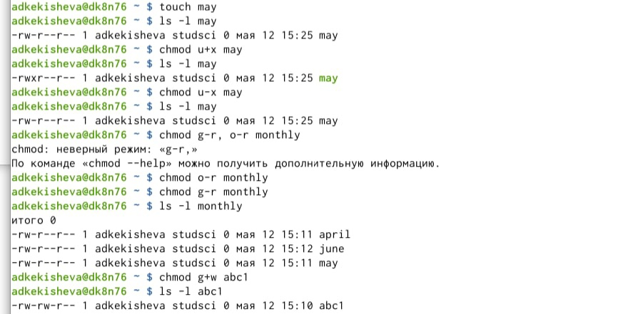{ #fig:001 width=70% }

## Слайд 5
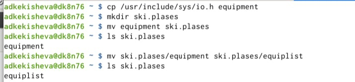{ #fig:001 width=70% }

Скопировала файл /usr/include/sys/io.h в домашний каталог применяя команду cp и назвола его equipment.
Далее, в домашнем каталоге создала директорию ~/ski.plases. И переименовала файл ~/ski.plases/equipment в ~/ski.plases/equiplist с помощью команды mv.

## Слайд 6
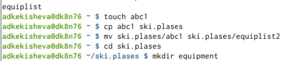{ #fig:001 width=70% }

Создала командой touch в домашнем каталоге файл abc1 и скопировала его в каталог ~/ski.plases, с помощью команды mv назвала его equiplist2. И в каталоге ski.plasas создала католог equipment.

## Слайд 7
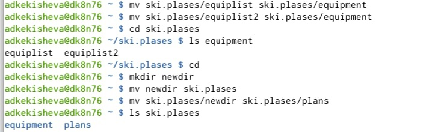{ #fig:001 width=70% }

Переместила командой mv файлы ~/ski.plases/equiplist и equiplist2 в каталог ~/ski.plases/equipment. Далее создала newdir и переместила его ski.plases и назволе его plans, проверила.

## Слайд 8: лишение и присвоение прав
Определила опции команды chmod, необходимые для того, чтобы присвоить заданные заданием права доступа. 

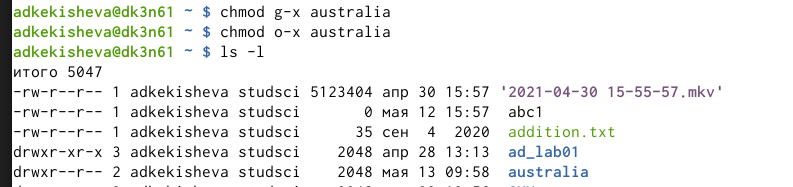{ #fig:001 width=70%}

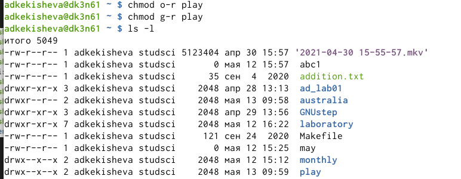{ #fig:001 width=70% }

## Слайд 9
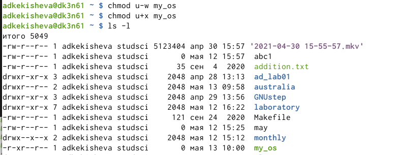{ #fig:001 width=70% }

Для файла my_os это лишение владельца прав на запись и присвоение ему права на выполнение.

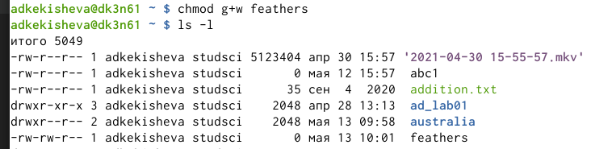{ #fig:001 width=70% }

Для feathers это присвоение прав на запись группе.

## Слайд 10
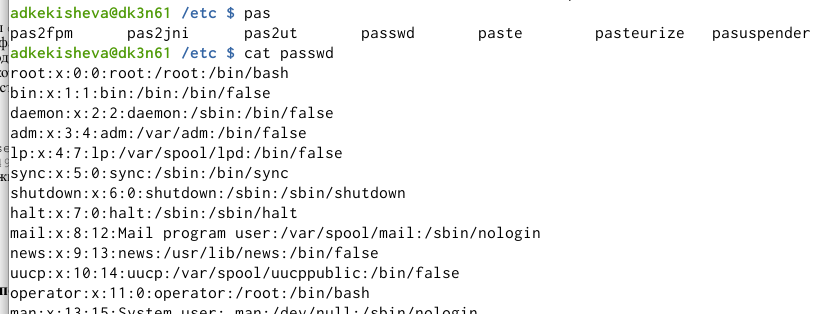{ #fig:001 width=70% }

Файла password у меня неоказалось, поэтому я просмотрела содержимое файла passwd с помощью команды cat.

## Слайд 11
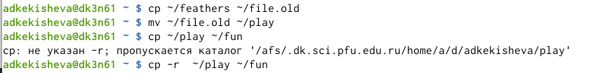{ #fig:001 width=70% }

Командой cp скопировала файл ~/feathers в файл ~/file.old. Командой mv переместила файл ~/file.old в каталог ~/play.Командой cp -r cкопировала каталог ~/play в каталог ~/fun.

## Слайд 12
{ #fig:001 width=70% }

Командой mv переместила каталог ~/fun  в каталог ~/play и переименовала fun в games.

## Слайд 13
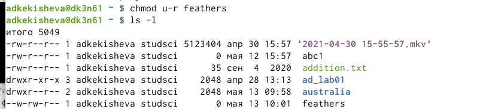{ #fig:001 width=70% }

Командой chmod с опцией u-r лишила владельца файла ~/feathers права на чтение.

## Слайд 14
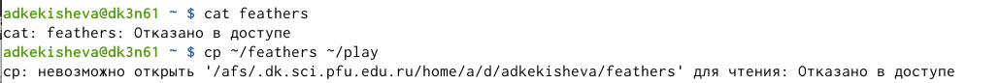{ #fig:001 width=70% }

Попыталась просмотреть файл ~/feathers командой cat, мне было отказано в доступе. Далее попыталась скопировать файл ~/feathers в файл play, также было отказано в доступе.

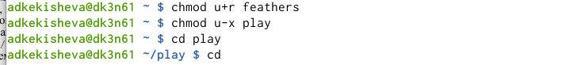{ #fig:001 width=70% }

Дала владельцу файла ~/feathers право на чтение. А владельца каталога ~/play лишила права на выполнение.
Потом перейдите в каталог ~/play.Переход выполнился.

## Слайд 14
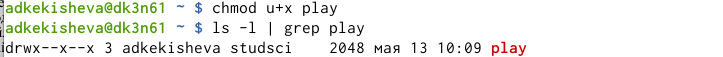{ #fig:001 width=70% }

Дала владельцу каталога ~/play право на выполнение.

## Слайд 15
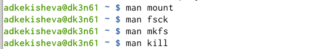{ #fig:001 width=70% }

Прочитала man по командам mount,fsck,mkfs,kill. 

Основная характеристика команд:
- mount применяется для монтирования файловых систем.
- fsck восстанавливает повреждённую файловую систему или проверяет на целостность.
- mkfs создаёт новую файловую систему.
- kill используется для принудительного завершения работы приложений.

## Вывод
Я ознакомилась с файловой системой Linux, её структурой, именами и содержанием каталогов. Приобрела практические навыки по применению команд для работы с файлами и каталогами, по управлению процессами. Научилась копировать, перемещать, перреименовывать файлы и каталоги.

