---
# Front matter
lang: ru-RU
title: "Отчёт к лабораторной работе №6"
subtitle: "Лабораторная работа №6. Анализ файловой системы Linux.Команды для работы с файлами и каталогами"
author: "Кекишева Анастасия Дмитриевна"

# Formatting
toc-title: "Содержание"
toc: true # Table of contents
toc_depth: 2
lof: true # List of figures
lot: true # List of tables
fontsize: 12pt
linestretch: 1.5
papersize: a4paper
documentclass: scrreprt
polyglossia-lang: russian
polyglossia-otherlangs: english
mainfont: PT Serif
romanfont: PT Serif
sansfont: PT Sans
monofont: PT Mono
mainfontoptions: Ligatures=TeX
romanfontoptions: Ligatures=TeX
sansfontoptions: Ligatures=TeX,Scale=MatchLowercase
monofontoptions: Scale=MatchLowercase
indent: true
pdf-engine: lualatex
header-includes:
  - \linepenalty=10 # the penalty added to the badness of each line within a paragraph (no associated penalty node) Increasing the value makes tex try to have fewer lines in the paragraph.
  - \interlinepenalty=0 # value of the penalty (node) added after each line of a paragraph.
  - \hyphenpenalty=50 # the penalty for line breaking at an automatically inserted hyphen
  - \exhyphenpenalty=50 # the penalty for line breaking at an explicit hyphen
  - \binoppenalty=700 # the penalty for breaking a line at a binary operator
  - \relpenalty=500 # the penalty for breaking a line at a relation
  - \clubpenalty=150 # extra penalty for breaking after first line of a paragraph
  - \widowpenalty=150 # extra penalty for breaking before last line of a paragraph
  - \displaywidowpenalty=50 # extra penalty for breaking before last line before a display math
  - \brokenpenalty=100 # extra penalty for page breaking after a hyphenated line
  - \predisplaypenalty=10000 # penalty for breaking before a display
  - \postdisplaypenalty=0 # penalty for breaking after a display
  - \floatingpenalty = 20000 # penalty for splitting an insertion (can only be split footnote in standard LaTeX)
  - \raggedbottom # or \flushbottom
  - \usepackage{float} # keep figures where there are in the text
  - \floatplacement{figure}{H} # keep figures where there are in the text
---

# Цель работы
Ознакомление с файловой системой Linux, её структурой, именами и содержанием каталогов. Приобретение практических навыков по применению команд дляработы с файлами и каталогами, по управлению процессами (и работами), по про-верке использования диска и обслуживанию файловой системы.

# Задание
**Выполнить данныые пункты и ответить на вопросы:**

1. Выполните все примеры, приведённые в первой части описания лабораторной работы.
2. Выполните следующие действия, зафиксировав в отчёте по лабораторной работе используемые при этом команды и результаты их выполнения:
- Скопируйте файл/usr/include/sys/io.hв домашний каталог и назовите его equipment. Если файла io.h нет, то используйте любой другой файл в каталоге /usr/include/sys/ вместо него.
- В домашнем каталоге создайте директорию ~/ski.plases.
Переместите файлequipmentв каталог ~/ski.plases.
- Переименуйтефайл~/ski.plases/equipmentв~/ski.plases/equiplist.
- Создайте в домашнем каталоге файлabc1и скопируйте его в каталог~/ski.plases, назовите егоequiplist2.
- Создайте каталог с именемequipmentв каталоге~/ski.plases.
- Переместите файлы ~/ski.plases/equiplist и equiplist2 в каталог ~/ski.plases/equipment.
- Создайте и переместите каталог~/newdirв каталог~/ski.plases и назовите егоplans.
3. Определите опции команды chmod, необходимые для того, чтобы присвоить перечисленным ниже файлам выделенные права доступа, считая, что в начале таких прав нет:
- drwxr--r--   ...   australia3.
- drwx--x--x   ...   play.
- -r-xr--r--   ...   my_os3.
- -rw-rw-r--   ...   feathers.
4. Проделайте приведённые ниже упражнения, записывая в отчёт по лабораторнойработе используемые при этом команды:
- Просмотрите содержимое файла /etc/password.
- Скопируйте файл ~/feathers в файл ~/file.old.
- Переместите файл ~/file.old в каталог ~/play.
- Скопируйте каталог ~/playв каталог~/fun.
- Переместите каталог ~/fun  в каталог ~/play и назовите егоgames.
- Лишите владельца файла ~/feathers права на чтение.
- Что произойдёт, если вы попытаетесь просмотреть файл ~/feathers командой cat?
- Что произойдёт, если вы попытаетесь скопировать файл ~/feathers?
- Дайте владельцу файла ~/feathers право на чтение.
- Лишите владельца каталога ~/play права на выполнение.
- Перейдите в каталог ~/play. Что произошло?
- Дайте владельцу каталога ~/play право на выполнение.
5. Прочитайте man по командам mount,fsck,mkfs,killи кратко их охарактеризуйте, приведя примеры.

# Выполнение лабораторной работы

1. Во-первых, я выполнила все примеры, приведённые в первой части описания лабораторной работы.

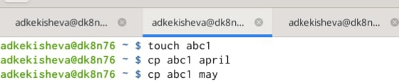{ #fig:001 width=70% }

С помощью команды cp скопировала файл ~/abc1 в файл april и в файл may.

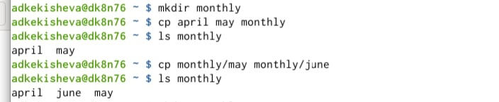{ #fig:001 width=70% }

Скопировала файлы april и may в каталог monthly и проверила правильность выполнения команды.

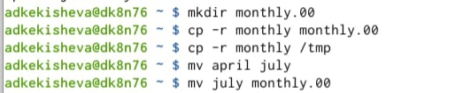{ #fig:001 width=70% }

Далее, скопировала командаc pс опцией r (она позволяет копировать каталоги вместе с входящими в них файлами и каталогами) каталог monthly в каталог monthly.00. А также скопировала  каталог monthly.00 в каталог /tmp.

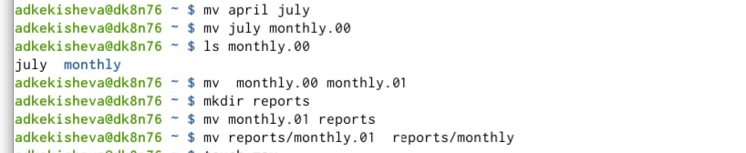{ #fig:001 width=70% }

После я изменила название файла april на july в домашнем каталоге. Переместила файл july в каталог monthly.00.
Переименовала  каталог monthly.00 в monthly.01. Переместила каталог monthly.01 в каталог reports и переименовала каталога, который не является текущим, это reports/monthly.01 в reports/monthly.

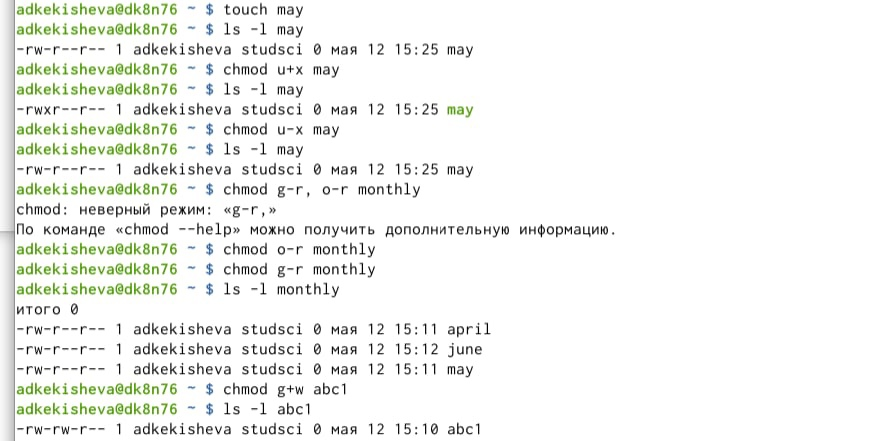{ #fig:001 width=70% }

Далее командой touch создала файл ~/may с правом выполнения для владельца (maychmod u+x may), после лишила владельца файла ~/may права на выполнение (chmod u-x may).Создала каталог monthly с запретом на чтение для членов группы и всех остальных пользователей (chmod g-r monthly и chmod o-r monthly). Далее, создала ещё один файл abc1 и наделила группу правом назапись (chmod g+w abc1).

2. 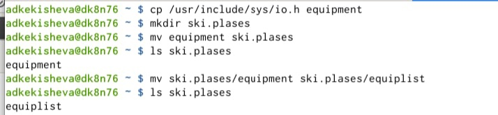{ #fig:001 width=70% }

Скопировала файл /usr/include/sys/io.h в домашний каталог применяя команду cp и назвола его equipment.
Далее, в домашнем каталоге создала директорию ~/ski.plases. И переименовала файл ~/ski.plases/equipment в ~/ski.plases/equiplist с помощью команды mv.

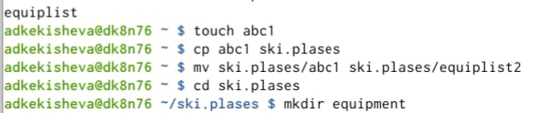{ #fig:001 width=70% }

Создала командой touch в домашнем каталоге файл abc1 и скопировала его в каталог ~/ski.plases, с помощью команды mv назвала его equiplist2. И в каталоге ski.plasas создала католог equipment.

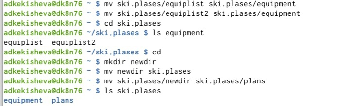{ #fig:001 width=70% }

Переместила командой mv файлы ~/ski.plases/equiplist и equiplist2 в каталог ~/ski.plases/equipment. Далее создала newdir и переместила его ski.plases и назволе его plans, проверила.

3. 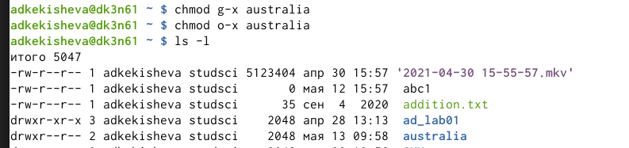{ #fig:001 width=70% }

Определила опции команды chmod, необходимые для того, чтобы присвоить заданные заданием права доступа. Для australia это лишение прав на выполнение для группы и остальных пользователей.

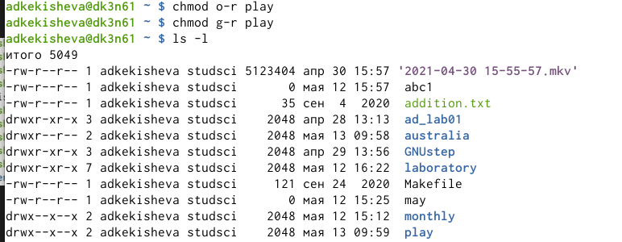{ #fig:001 width=70% }

Для play это лишение прав на чтение для группы и остальных пользователей.

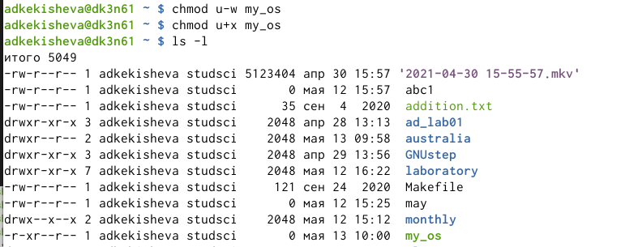{ #fig:001 width=70% }

Для файла my_os это лишение владельца прав на запись и присвоение ему права на выполнение.

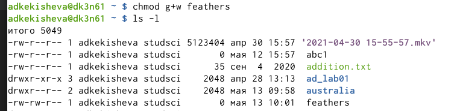{ #fig:001 width=70% }

Для feathers это присвоение прав на запись группе.

4. Попыталась посмотреть содержимое файла /etc/password.
{ #fig:001 width=70% }

Но файла password у меня неоказалось, поэтому я просмотрела содержимое файла passwd с помощью команды cat.

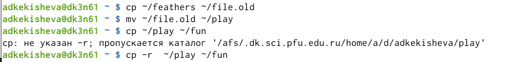{ #fig:001 width=70% }

Командой cp скопировала файл ~/feathers в файл ~/file.old. Командой mv переместила файл ~/file.old в каталог ~/play.Командой cp -r cкопировала каталог ~/play в каталог ~/fun.

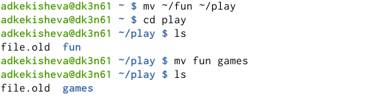{ #fig:001 width=70% }

Командой mv переместила каталог ~/fun  в каталог ~/play и переименовала fun в games.

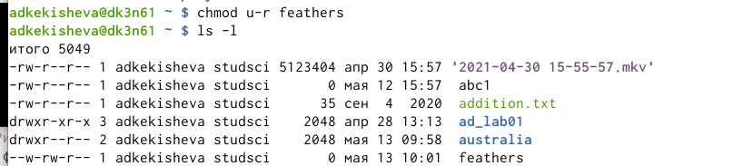{ #fig:001 width=70% }

Командой chmod с опцией u-r лишила владельца файла ~/feathers права на чтение.

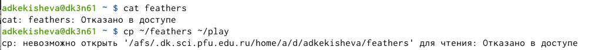{ #fig:001 width=70% }

Попыталась просмотреть файл ~/feathers командой cat, мне было отказано в доступе. Далее попыталась скопировать файл ~/feathers в файл play, также было отказано в доступе.

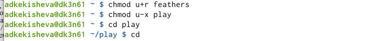{ #fig:001 width=70% }

Дала владельцу файла ~/feathers право на чтение. А владельца каталога ~/play лишила права на выполнение.
Потом перейдите в каталог ~/play.Переход выполнился.

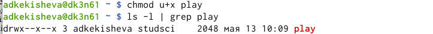{ #fig:001 width=70% }

Дала владельцу каталога ~/play право на выполнение.

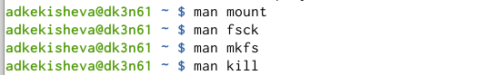{ #fig:001 width=70% }

5. Прочитала man по командам mount,fsck,mkfs,kill. 

Основная характеристика команд:
- mount применяется для монтирования файловых систем.
- fsck восстанавливает повреждённую файловую систему или проверяет на целостность.
- mkfs создаёт новую файловую систему.
- kill используется для принудительного завершения работы приложений.

# Вывод
Я ознакомилась с файловой системой Linux, её структурой, именами и содержанием каталогов. Приобрела практические навыки по применению команд для работы с файлами и каталогами, по управлению процессами. Научилась копировать, перемещать, перреименовывать файлы и каталоги.

 
**Контрольные вопросы:**

1. Характеристика файловой системы, которая использовалась в данной лабораторной работе: Файлы: abc1, april, may, june, july, isdv4.h, equipment, equiplist, equiplist2, my_os, feathers, file.old. Каталоги: monthly, monthly.00, tmp, monthly.01, reports, usr, include, xorg, ski.plases, equipment, newdir, plans, australia, play, etc, fun, games.

2. Пример общей структуры файловой системы: /home/adkekisheva/monthly/april, где /home/adkekisheva – домашний каталог, /monthly – каталог, находящийся в домашнем и содержащий файл, /аpril – файл, находящийся в каталоге.

3. Чтобы содержимое некоторой файловой системы было доступно операционной системе должно быть выполнено монтирование тома.

4. Основные причины нарушения целостности файловой системы: - Один блок адресуется несколькими mode (принадлежит нескольким файлам). - Блок помечен как свободный, но в то же время занят (на него ссылается onode). - Блок помечен как занятый, но в то же время свободен (ни один inode на него не ссылается). - Неправильное число ссылок в inode (недостаток или избыток ссылающихся записей в каталогах). - Несовпадение между размером файла и суммарным размером адресуемых inode блоков. - Недопустимые адресуемые блоки (например, расположенные за пределами файловой системы). - "Потерянные" файлы (правильные inode, на которые не ссылаются записи каталогов). - Недопустимые или неразмещенные номера inode в записях каталогов. Чтобы устранить повреждения файловой системы используется команда fsck.

5. Команда mkfs создаёт новую файловую систему. Например, создать файловую систему linux, семейства ext, на устройстве можно с помощью команды mkfs. Ее синтаксис выглядит следующим образом: sudo mkfs -t тип устройство.

6. Для просмотра небольших файлов применяется команда cat. Для просмотра больших файлов используют команду less — она позволяет осуществлять постраничный просмотр файлов (длина страницы соответствует размеру экрана). Для просмотра начала файла существует командой head (по умолчанию она выводит первые 10 строк файла). Формат команды: head [-n] имя-файла, где n — количество выводимых строк. А команда tail выводит несколько (по умолчанию 10) последних строк файла. Формат команды: tail [-n] имя-файла, где n — количество выводимых строк.

7. Основные возможности команды cp: - копирование файла в текущем каталоге. - копирование нескольких файлов в каталог. - копирование файлов в произвольном каталоге.

сp- команда копирования файлов и каталогов. Формат команды: cp [-опции] исходный_файл целевой_файл Например, нам необходимо скопировать файл abc1, находящийся в домашней папке в файл abc2 для этого: cp abc1 abc2.

8. mv - перемещение (переименование) файлов. Она перемещает (переименовывает) файл1 в целевой_файл. Файл1 не должен совпадать с целевым_файлом. Если целевой файл является каталогом, то файл1, файл2, ..., перемещаются в него под своими именами.

mvdir перемещает каталоги в пределах файловой системы. Если целевой_каталог не существует, он создается; в противном случае создается каталог с именем целевой_каталог/исходный_каталог. Исходный и целевой каталоги не могут лежать на одном маршруте, то есть ни один из них не может быть прямым или косвенным подкаталогом другого.

9. Каждый файл и каждая папка имеют три уровня доступа: право на чтение (обозначается буквой r), право на запись (т. е. редактирование и удаление файла; w) и право на исполнение (запуск) скрипта (x).

Права доступа к файлу или каталогу можно изменить, воспользовавшись командой chmod. Сделать это может владелец файла (или каталога) или пользователь с правами администратора. Формат команды: chmod режим имя_файла
 

