---
## Front matter
lang: ru-RU
title: Лабораторная работа №7.Поиск файлов. Перенаправление ввода-вывода. Просмотр запущенных процессов"

author: 
	Кекишева Анастасия Дмитриевна, НБИ-01-20, \inst{}

institute: |
	\inst{1}RUDN University, Moscow, Russian Federation
date: 30 апреля, 2021

## Formatting
toc: false
slide_level: 2
theme: metropolis
header-includes: 
 - \metroset{progressbar=frametitle,sectionpage=progressbar,numbering=fraction}
 - '\makeatletter'
 - '\beamer@ignorenonframefalse'
 - '\makeatother'
aspectratio: 43
section-titles: true
---

## Цель работы
Ознакомление с инструментами поиска файлов и фильтрации текстовых дан-ных. Приобретение практических навыков: по управлению процессами (и заданиями), по проверке использования диска и обслуживанию файловых систем.

## Выполнение лабораторной работы

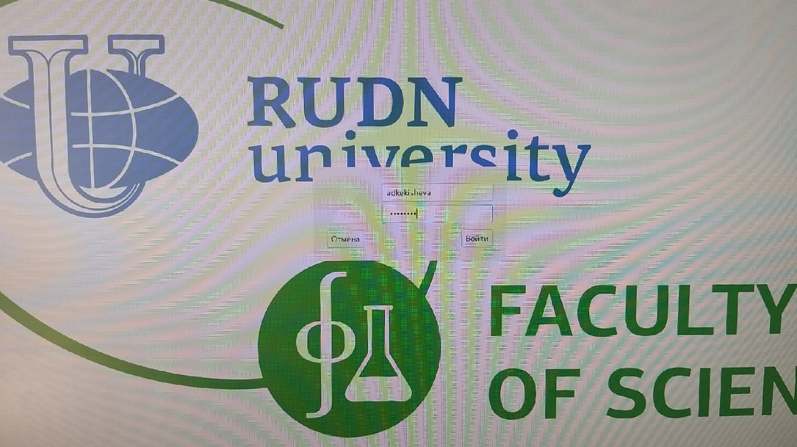{ #fig:001 width=70% }

Осуществила вход в систему, используя соответствующее имя пользователя.

## Запись в файл file.txt
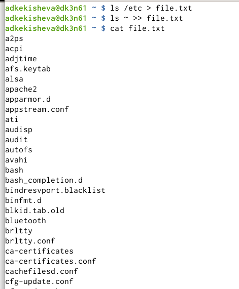{ #fig:001 width=70% }

## Вывела имена всех файлов из file.txt, имеющих расширение.conf
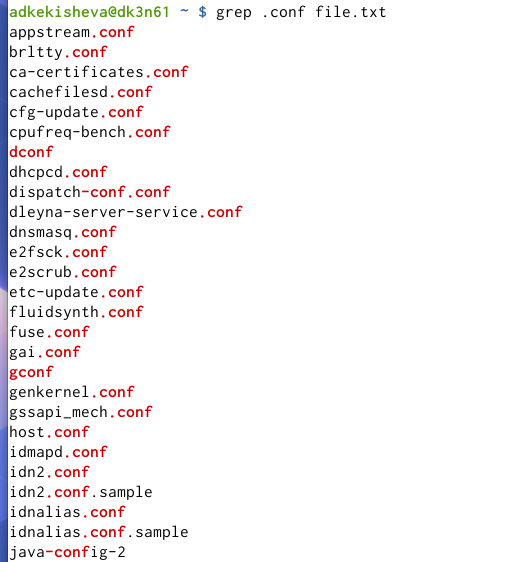{ #fig:001 width=70% }

## Записала их в новый текстовой файл conf.txt 
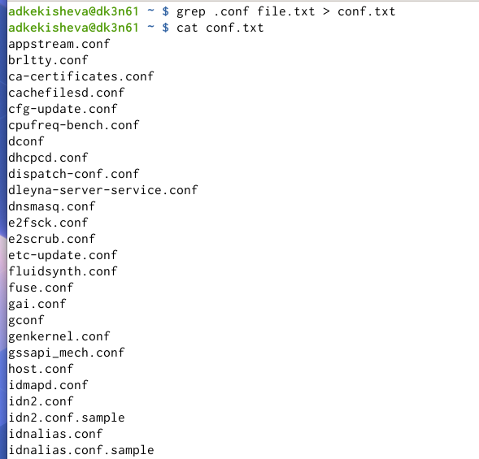{ #fig:001 width=70% }

## 3 способа найти файлы, начинающиеся с символа c.
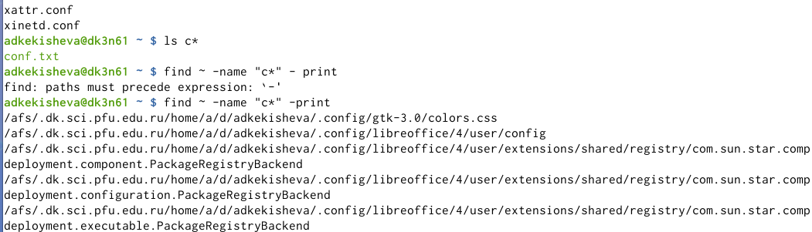{ #fig:001 width=70% }

## Файлы из каталога /etc, начинающиеся с символа h. 
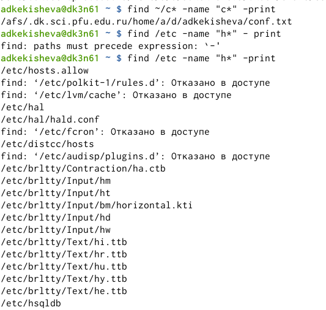{ #fig:001 width=70% }

## Слайд 7
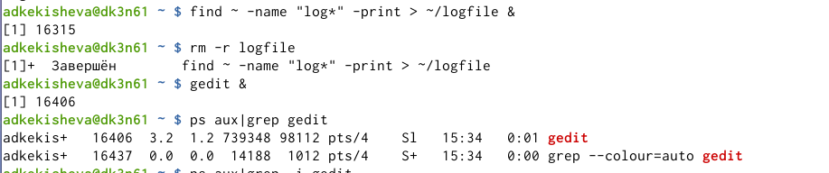{ #fig:001 width=70% }

## Справка команды kill и завершение процесса gedit
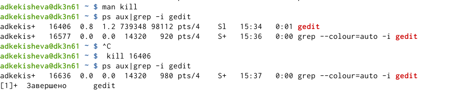{ #fig:001 width=70% }

## Команда df
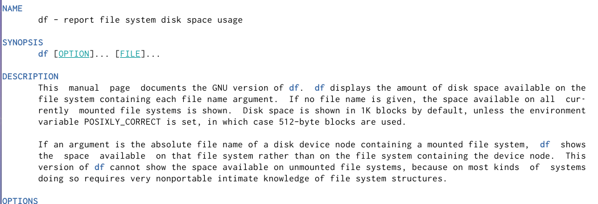{ #fig:001 width=70% }

## Часть 2
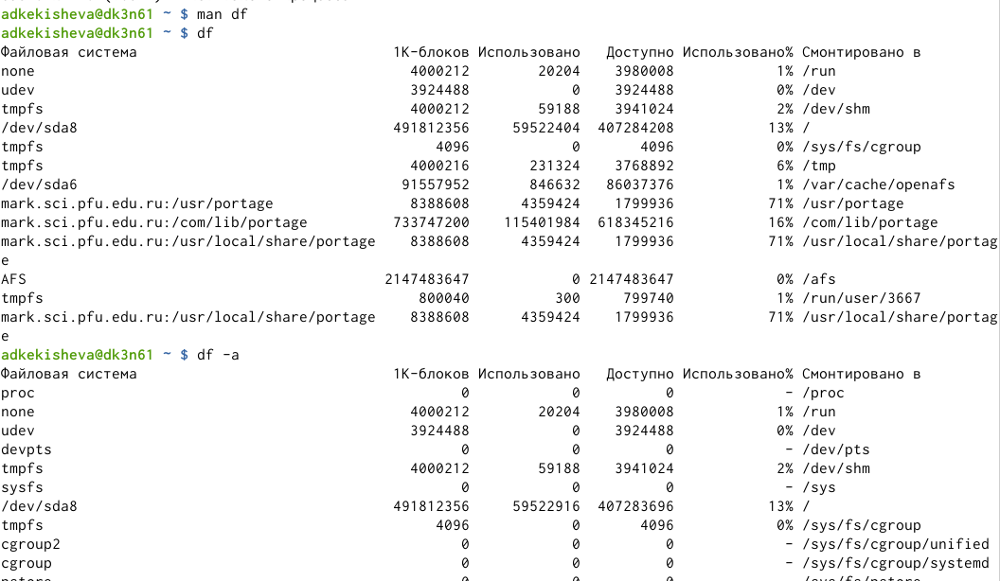{ #fig:001 width=70% }

Получила подробную информацию о командах  df и du. df выдаёт список подключенных устройств и информацию о занятом месте, а также  точку монтирования.А с опцией a она выдаёт более полную информацию.

## Команда du
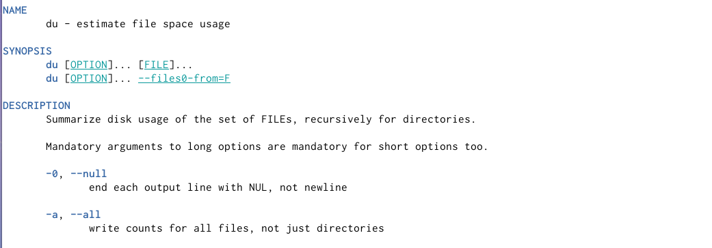{ #fig:001 width=70% }

## Часть 2
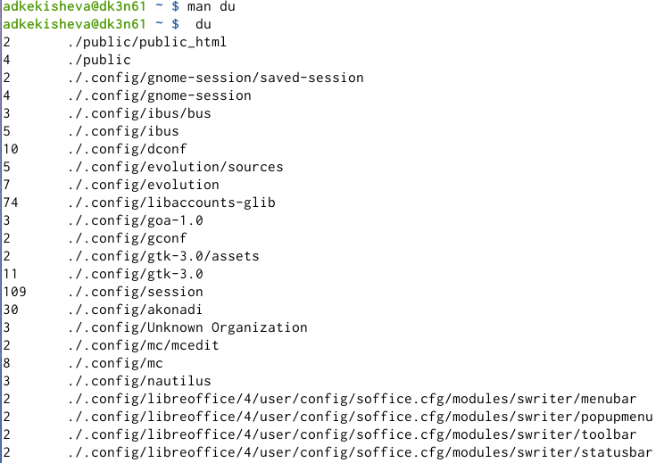{ #fig:001 width=70% }

Также команда du. Она позволяет вывести размер всех файлов в определённой папке в байтах или в более удобном формате.

## Команда find
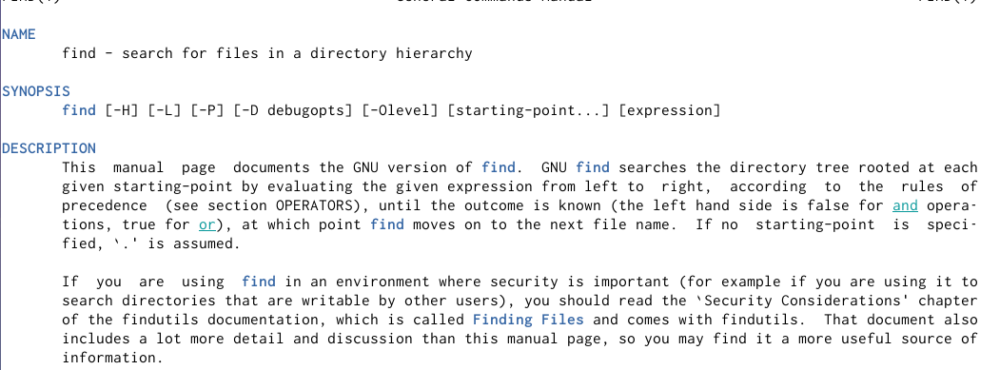{ #fig:001 width=70% }

## Часть 2
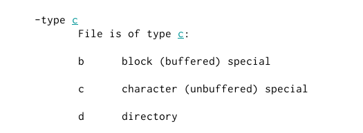{ #fig:001 width=70% }

## Часть 3
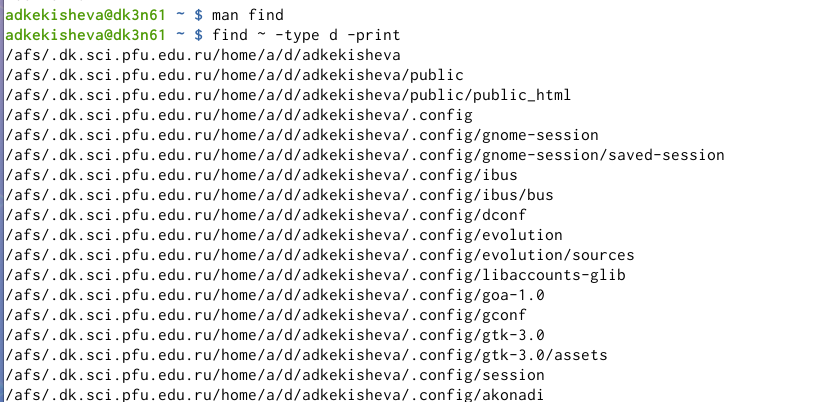{ #fig:001 width=70% }

## Вывод
Я ознакомилась с инструментами поиска файлов и фильтрации текстовых данных. Приобрела практические навыки: по управлению процессами (и заданиями), по проверке использования диска и обслуживанию файловых систем, по поиску файлов в каталоге. Изучила конвеер, команды find, grep, df, du.
 
