---
## Front matter
lang: ru-RU
title: Лабораторная работа №9. Текстовый редактор vi.

author: 
	Кекишева Анастасия Дмитриевна, НБИ-01-20, \inst{}

institute: |
	\inst{1}RUDN University, Moscow, Russian Federation
date: 30 апреля, 2021

## Formatting
toc: false
slide_level: 2
theme: metropolis
header-includes: 
 - \metroset{progressbar=frametitle,sectionpage=progressbar,numbering=fraction}
 - '\makeatletter'
 - '\beamer@ignorenonframefalse'
 - '\makeatother'
aspectratio: 43
section-titles: true
---

## Цель работы
Получить практические навыки работы с редактором vi, установленным по умолчанию практически во всех дистрибутивах.

## Задание 1. Создание нового файла с использованием vi

1. Создайте каталог с именем ~/work/os/lab06.
2. Перейдите во вновь созданный каталог.
3. Вызовите vi и создайте файлhello.shvi hello.sh
4. Нажмите клавишу i и вводите следующий текст.
5. Нажмите клавишу Esc для перехода в командный режим после завершения ввода текста.
6. Нажмите:для перехода в режим последней строки и внизу вашего экрана появится приглашение в виде двоеточия.
7. Нажмите w(записать) и q(выйти), а затем нажмите клавишу Enter для сохранения вашего текста и завершения работы.
8. Сделайте файл исполняемым chmod +x hello.sh

## Задание 2. Редактирование существующего файла

1. Вызовите vi на редактирование файлаvi ~/work/os/lab06/hello.sh 
2. Установите курсор в конец слова HELL второй строки.
3. Перейдите в режим вставки и замените на HELLO. Нажмите Esc для возврата в командный режим.
4. Установите курсор на четвертую строку и сотрите слово LOCAL.
5. Перейдите в режим вставки и наберите следующий текст:local, нажмите Esc для возврата в командный режим.
6. Установите курсор на последней строке файла. Вставьте после неё строку, содержащую следующий текст:echo $HELLO.
7. Нажмите Esc для перехода в командный режим.
8. Удалите последнюю строку.
9. Введите команду отмены изменений u для отмены последней команды.
10. Введите символ:для перехода в режим последней строки. Запишите произведённые изменения и выйдите из vi.

# Выполнение лабораторной работы
## Задание 1. Создание нового файла с использованием vi

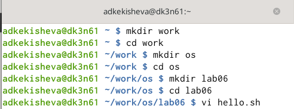{ #fig:001 width=70% }

## Ввод текста
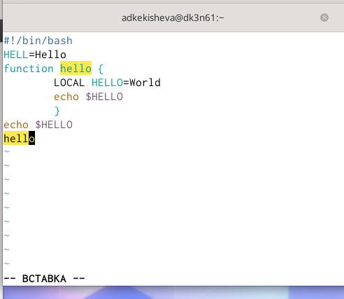{ #fig:001 width=70% }

## Переход в командный режим
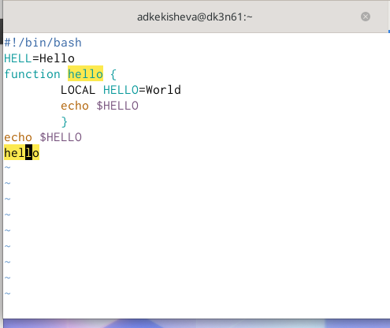{ #fig:002 width=70% }

## Сохранение и завершение работы
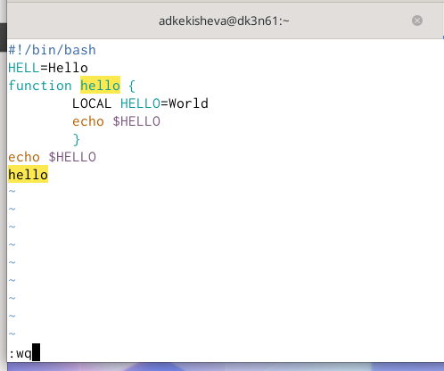{ #fig:003 width=70% }

## Присвоение права на исполнение
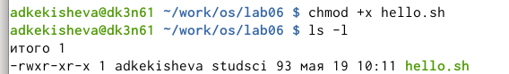{ #fig:004 width=70% }

# Задание 2.Редактирование существующего файла

## Вызов редактора vi
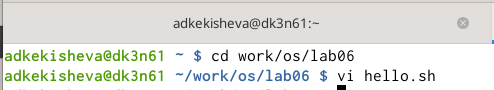{ #fig:005 width=70% }

## Установка курсора в конец слова HELL
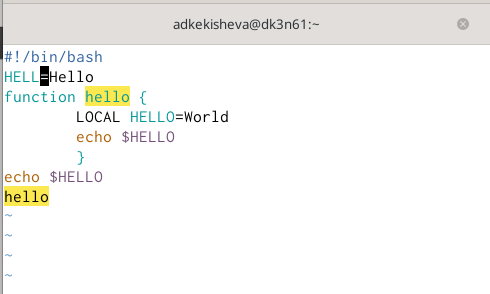{ #fig:006 width=70% }

## Замена HELL на HELLO
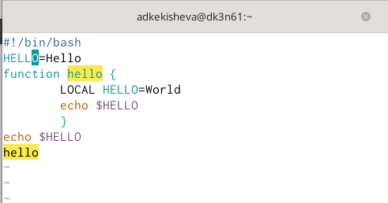{ #fig:007 width=70% }

## Установка курсора на 4 строку
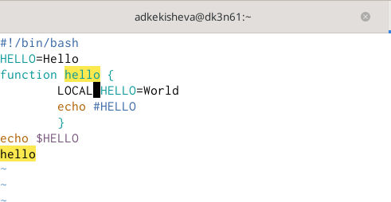{ #fig:008 width=70% }

Клавиша 4+G 

## Удаление слова LOCAL
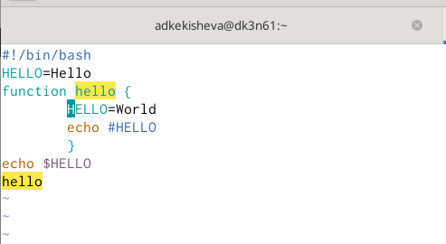{ #fig:009 width=70% }

Удаление LOCAL клавишами d+w.

## Ввод слова local
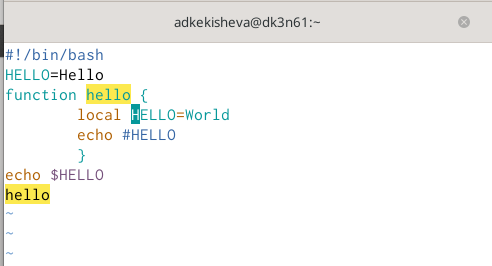{ #fig:010 width=70% }

## Установка курсора на последнюю строку
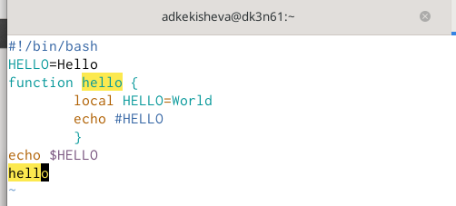{ #fig:011 width=70% }

Клавиша G - переход конц строки клавишой $. 

## Вставка строки: 2 способа
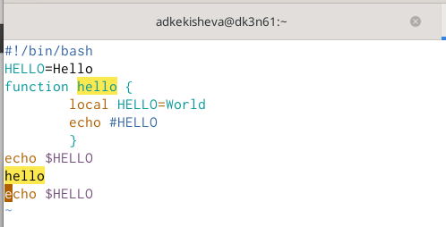{ #fig:012 width=70% }

## Удаление строки
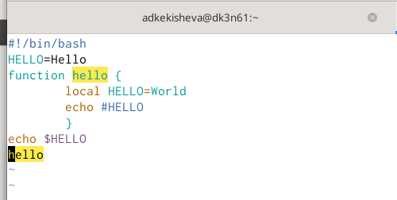{ #fig:013 width=70% }

Двойное нажатие клавиши d (dd) удаление последней строки.

## Отмена последней команды
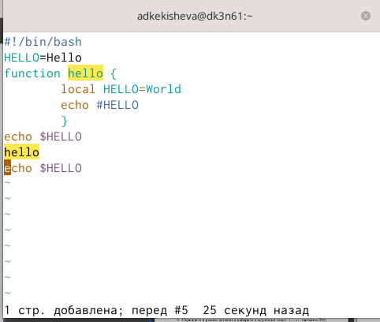{ #fig:014 width=70% }

Клавиша u - отмена последней команды.

## Сохранение и выход из редактора vi
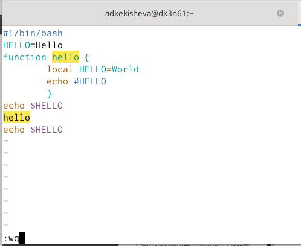{ #fig:015 width=70% }

## Вывод
Я получила практические навыки работы с редактором vi, изучила основные группы команд редактора,команды редактирования и команды редактирования в режиме командной строки.

 
