---
# Front matter
lang: ru-RU
title: "Отчёт к лабораторной работе №9"
subtitle: "Текстовый редактор vi"
author: "Кекишева Анастасия Дмитриевна, НБИ-01-20"

# Formatting
toc-title: "Содержание"
toc: true # Table of contents
toc_depth: 2
lof: true # List of figures
lot: true # List of tables
fontsize: 12pt
linestretch: 1.5
papersize: a4paper
documentclass: scrreprt
polyglossia-lang: russian
polyglossia-otherlangs: english
mainfont: PT Serif
romanfont: PT Serif
sansfont: PT Sans
monofont: PT Mono
mainfontoptions: Ligatures=TeX
romanfontoptions: Ligatures=TeX
sansfontoptions: Ligatures=TeX,Scale=MatchLowercase
monofontoptions: Scale=MatchLowercase
indent: true
pdf-engine: lualatex
header-includes:
  - \linepenalty=10 # the penalty added to the badness of each line within a paragraph (no associated penalty node) Increasing the value makes tex try to have fewer lines in the paragraph.
  - \interlinepenalty=0 # value of the penalty (node) added after each line of a paragraph.
  - \hyphenpenalty=50 # the penalty for line breaking at an automatically inserted hyphen
  - \exhyphenpenalty=50 # the penalty for line breaking at an explicit hyphen
  - \binoppenalty=700 # the penalty for breaking a line at a binary operator
  - \relpenalty=500 # the penalty for breaking a line at a relation
  - \clubpenalty=150 # extra penalty for breaking after first line of a paragraph
  - \widowpenalty=150 # extra penalty for breaking before last line of a paragraph
  - \displaywidowpenalty=50 # extra penalty for breaking before last line before a display math
  - \brokenpenalty=100 # extra penalty for page breaking after a hyphenated line
  - \predisplaypenalty=10000 # penalty for breaking before a display
  - \postdisplaypenalty=0 # penalty for breaking after a display
  - \floatingpenalty = 20000 # penalty for splitting an insertion (can only be split footnote in standard LaTeX)
  - \raggedbottom # or \flushbottom
  - \usepackage{float} # keep figures where there are in the text
  - \floatplacement{figure}{H} # keep figures where there are in the text
---

# Цель работы
Получить практические навыки работы с редактором vi, установленным по умолчанию практически во всех дистрибутивах.

# Задание
**Выполнить данные пункты и ответить на вопросы:**

**Задание 1. Создание нового файла с использованием vi**

1. Создайте каталог с именем ~/work/os/lab06.
2. Перейдите во вновь созданный каталог.
3. Вызовите vi и создайте файлhello.shvi hello.sh
4. Нажмите клавишуiи вводите следующий текст.

>#!/bin/bash

>HELL=Hello

>function hello {

>LOCAL HELLO=World
	
>echo $HELLO
	
>}
	
>echo $HELLO

>hello

5. Нажмите клавишу Esc для перехода в командный режим после завершения ввода текста.
6. Нажмите:для перехода в режим последней строки и внизу вашего экрана появится приглашение в виде двоеточия.
7. Нажмите w(записать) и q(выйти), а затем нажмите клавишу Enter для сохранения вашего текста и завершения работы.
8. Сделайте файл исполняемым chmod +x hello.sh

**Задание 2. Редактирование существующего файла**

1. Вызовите vi на редактирование файлаvi ~/work/os/lab06/hello.sh 
2. Установите курсор в конец слова HELL второй строки.
3. Перейдите в режим вставки и замените на HELLO. Нажмите Esc для возврата в командный режим.
4. Установите курсор на четвертую строку и сотрите слово LOCAL.
5. Перейдите в режим вставки и наберите следующий текст:local, нажмите Esc для возврата в командный режим.
6. Установите курсор на последней строке файла. Вставьте после неё строку, содержащую следующий текст:echo $HELLO.
7. Нажмите Esc для перехода в командный режим.
8. Удалите последнюю строку.
9. Введите команду отмены изменений u для отмены последней команды.
10. Введите символ:для перехода в режим последней строки. Запишите произведённые изменения и выйдите из vi.

# Выполнение лабораторной работы
Перед выполнением лабораторной работы я хорошо ознакомилась с теоритическим материалом для её выполнения
[Ссылка 1](https://esystem.rudn.ru/pluginfile.php/1142511/mod_resource/content/2/006-lab_vi.pdf)

## Задание 1. Создание нового файла с использованием vi

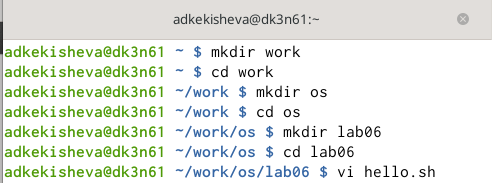{ #fig:001 width=70% }

Во-первых, я создала необходимые каталоги, так как у меня их не было. Перешла в вновь созданный каталог lab06. И вызвола редактор vi, создавая при этом файл hello.sh.

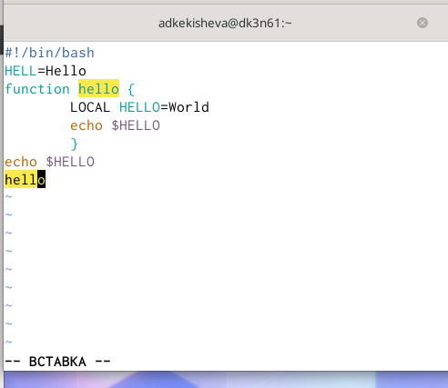{ #fig:001 width=70% }

Нажала клавишу i для перехода в режим вставки и ввела необходимый текст.

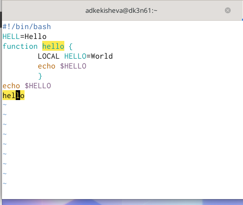{ #fig:002 width=70% }

Нажала клавишу Esc для перехода в командный режим после завершения ввода текста.

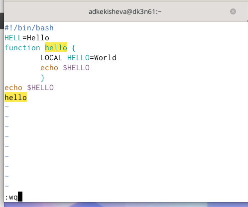{ #fig:003 width=70% }

Нажала : (двоеточие) для перехода в режим последней строки и внизу экрана появилось приглашение в виде двоеточия.Далее, нажала клавиши w(записать) и q(выйти), а затем клавишу Enter для сохранения вашего текста и завершения работы

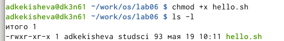{ #fig:004 width=70% }

Командой chmod +x сделала файл hello.sh исполняемым, проверила.

## Задание 2. Редактирование существующего файла

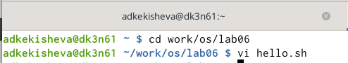{ #fig:005 width=70% }

Снова вызвала редактор vi для последующего редактирования.

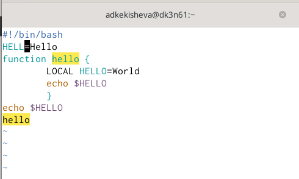{ #fig:006 width=70% }

С помощью клавиш 2+G установила курсор на начало второй строки и далее клавишей w устоновила курсор в конец слова HELL второй строки, также для передвижения можно воспользоваться стрелками.

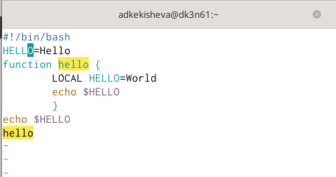{ #fig:007 width=70% }

Перейдите в режим вставки, нажав i и замените на HELL на HELLO.Далее нажала Esc для возврата вкомандный режим.

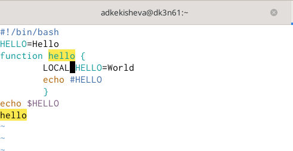{ #fig:008 width=70% }

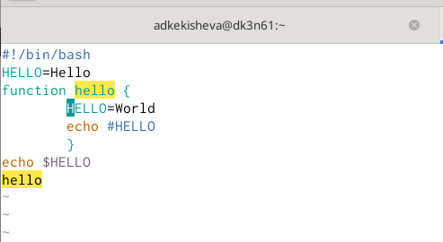{ #fig:009 width=70% }

Установите курсор на четвертую строку. Для это нажала клавиши 4+G и стёрла слово LOCAL клавишами d+w.

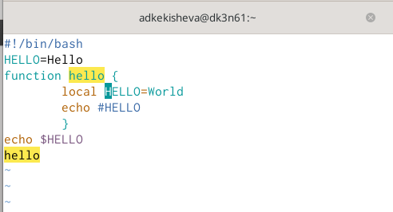{ #fig:010 width=70% }

Далее перешла в режим вставки и набрала local, после нажала Esc для возврата в командный режим.

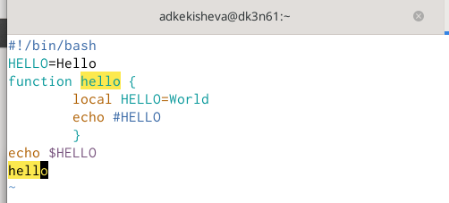{ #fig:011 width=70% }

Установила курсор на последней строке файла, набрав G и перейдя в конц строки клавишой $. После необходимо было вставить после неё строку, содержащую следующий текст: echo $HELLO. Это можно выполнить двумя способами:

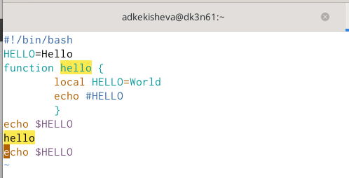{ #fig:012 width=70% }

- Первый: в командном режиме клавишами. Сначала перейти на строку с нужным текстом и скопировать его клашишей Y,а потом перейти в конец строки и вставить клавишей p.
- Второй: в режиме вставки, здесь просто копируем вставляем и возвращаемся в командый режим. 

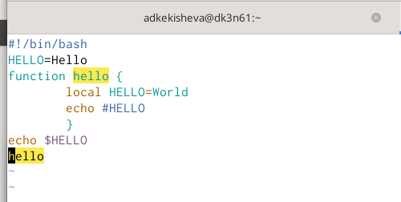{ #fig:013 width=70% }

Далее, двойным нажанием клавиши d (dd) удалила последнюю строку.

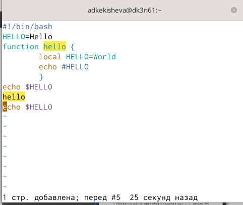{ #fig:014 width=70% }

Ввела команду отмены изменений u для отмены последней команды.

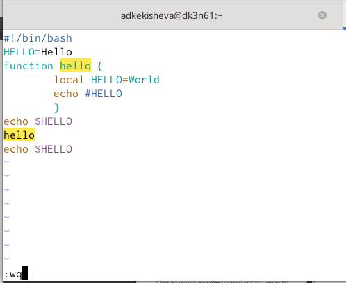{ #fig:015 width=70% }

Ввела символ : (двоеточие) для перехода в режим последней строки. Записала w произведённые изменения и завершила работу q и нажав enter вышла из vi

# Вывод
Я получила практические навыки работы с редактором vi, изучила основные группы команд редактора,команды редактирования и команды редактирования в режиме командной строки.

# Библиография
1. [Ссылка 1](https://esystem.rudn.ru/pluginfile.php/1142511/mod_resource/content/2/006-lab_vi.pdf)

**Контрольные вопросы:**

1. Дайте краткую характеристику режимам работы редактора vi.

Редактор vi имеет три режима работы:
- командный режим — предназначен для ввода команд редактирования и навигации по редактируемому файлу;
- режим вставки — предназначен для ввода содержания редактируемого файла;
- режим последней (или командной) строки — используется для записи изменений
в файл и выхода из редактора.

2. Как выйти из редактора, не сохраняя произведённые изменения?

Если требуется выйти из редактора без сохранения, нужно набрать символ q (или q!).

3. Назовите и дайте краткую характеристику командам позиционирования.
Команды позиционирования:
- 0 (ноль) — переход в начало строки;
- $ — переход в конец строки;
- G — переход в конец файла;
- n G — переход на строку с номером n.

4. Что для редактора vi является словом?

Редактор vi предполагает, что слово - это строка символов, которая может включать в себя буквы, цифры и символы подчеркивания. В редакторе vi существует 6 команд позиционирования: w, b, e, W, B и E. Команды w, b, e рассматривают любой символ, отличный от буквы, цифры или подчеркивания, как разделитель, означающий начало или конец слова. Пунктуация до или после пустого пространства является разделителем слов. Символ начала или конца строки также является разделителем.

5. Каким образом из любого места редактируемого файла перейти в начало (конец) файла?
Нажать клавишу shift +:
- gg - перейти в начало файла;
- G - перейти в конец файла;

6. Назовите и дайте краткую характеристику основным группам команд редактирования.
Команды редактировани:
Вставка текста:
- а — вставить текст после курсора;
- А — вставить текст в конец строки;
- i — вставить текст перед курсором;
- n i — вставить текст n раз;
- I — вставить текст в начало строки.
Вставка строки:
- о — вставить строку под курсором;
- О — вставить строку над курсором.
Удаление текста:
- x — удалить один символ в буфер;
- d w — удалить одно слово в буфер;
- d $ — удалить в буфер текст от курсора до конца строки;
- d 0 — удалить в буфер текст от начала строки до позиции курсора;
- d d — удалить в буфер одну строку;
- n d d — удалить в буфер n строк.
Отмена и повтор произведённых изменений:
- u — отменить последнее изменение;
- . — повторить последнее изменение.
Копирование текста в буфер:
- Y — скопировать строку в буфер;
- n Y — скопировать n строк в буфер;
- y w — скопировать слово в буфер.
Вставка текста из буфера:
- p — вставить текст из буфера после курсора;
- P — вставить текст из буфера перед курсором.
Замена текста:
- c w — заменить слово;
- n c w — заменить n слов;
- c $ — заменить текст от курсора до конца строки;
- r — заменить слово;
- R — заменить текст.
Поиск текста:
- / текст — произвести поиск вперёд по тексту указанной строки символов
текст;
- ? текст — произвести поиск назад по тексту указанной строки символов
текст.

7. Необходимо заполнить строку символами $. Каковы ваши действия? 
Я воспользуюсь командой выставки n раз: n $— вставить текст n раз, пока строка не будет заполнена.

8. Как отменить некорректное действие, связанное с процессом редактирования?
Это можно сделать это с помощью клавиши u — отменить последнее изменение;

9. Назовите и дайте характеристику основным группам команд режима последней строки.

Команды редактирования в режиме командной строки:
Копирование и перемещение текста:
– : n,m d — удалить строки с n по m;
– : i,j m k — переместить строки с i по j, начиная со строки k;
– : i,j t k — копировать строки с i по j в строку k;
– : i,j w имя-файла — записать строки с i по j в файл с именем имя-файла.
Запись в файл и выход из редактора:
– : w — записать изменённый текст в файл, не выходя из vi;
– : w имя-файла — записать изменённый текст в новый файл с именем имя-
файла;
– : w ! имя-файла — записать изменённый текст в файл с именем имя-
файла;
– : w q — записать изменения в файл и выйти из vi;
– : q — выйти из редактора vi;
– : q ! — выйти из редактора без записи;
– : e ! — вернуться в командный режим, отменив все изменения произведённые со времени последней записи.   

10. Как определить, не перемещая курсора, позицию, в которой заканчивается строка?

Определить, не перемещая курсора, позицию, в которой заканчивается строка, можно используя клавишу $ (переход в конец строки).

11. Выполните анализ опций редактора vi (сколько их, как узнать их назначение и т.д.)
Опции:
Опции редактора vi позволяют настроить рабочую среду. Для задания опций используется команда set (в режиме последней строки):
- : set all — вывести полный список опций;
- : set nu — вывести номера строк;
- : set list — вывести невидимые символы;
- : set ic — не учитывать при поиске, является ли символ прописным или строчным. Также, если мы хотим отказаться от использования опции, то в команде set перед именем опции надо поставить no. 

12. Как определить режим работы редактора vi?
   
Определить режим работы редактора vi можно по последней командной строке.

13. Взаимосвязь режимов работы редактора vi:

    «Командный режим» - «Режим вставки»

            |                  |

           «Режим командной строки»

