---
## Front matter
lang: ru-RU
title: Лабораторная работа №10. Текстовый редактор emacs.

author: 
	Кекишева Анастасия Дмитриевна, НБИ-01-20, \inst{}

institute: |
	\inst{1}RUDN University, Moscow, Russian Federation
date: 30 апреля, 2021

## Formatting
toc: false
slide_level: 2
theme: metropolis
header-includes: 
 - \metroset{progressbar=frametitle,sectionpage=progressbar,numbering=fraction}
 - '\makeatletter'
 - '\beamer@ignorenonframefalse'
 - '\makeatother'
aspectratio: 43
section-titles: true
---

## Цель работы
Продолжить знакомство с операционной системой Linux. Получить практические навыки работы с редактором Emacs.

## Задачи
1. Открыть emacs.
2. Создать файл lab07.sh с помощью комбинации Ctrl-x Ctrl-f (C-x C-f).
4. Сохранить файл с помощью комбинации Ctrl-x Ctrl-s (C-x C-s).
5. Проделать с текстом стандартные процедуры редактирования, каждое действие должно осуществляться комбинацией клавиш.
6. Научиться использовать команды по перемещению курсора. 
7. Научиться управлять буферами.
8. Научиться управлять окнами.
9. Освоить режим поиска.
    

# Выполнение лабораторной работы
## Открытие emacs
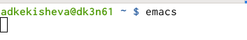{ #fig:001 width=70% }

## Создание файла lab07.sh
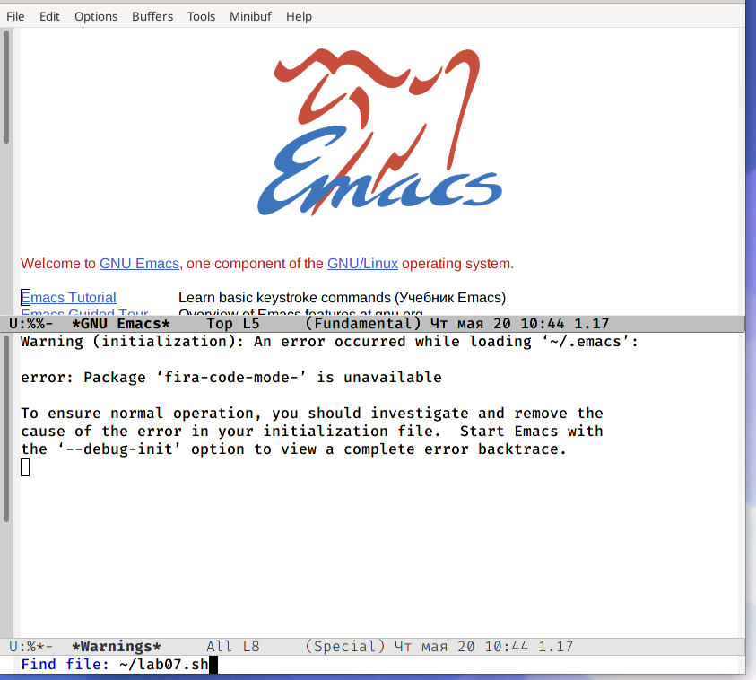{ #fig:002 width=70% }

## Ввод текста
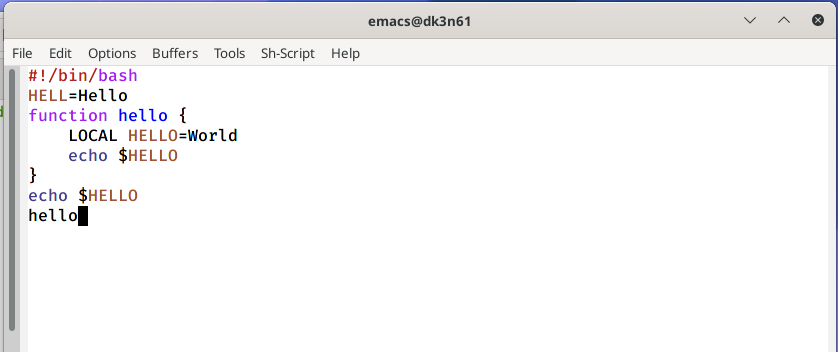{ #fig:003 width=70% }

# Стандартные процедуры редактирования
## Вырезание строки С-k
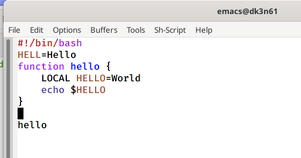{ #fig:004 width=70% }

## Вставка строки С-y
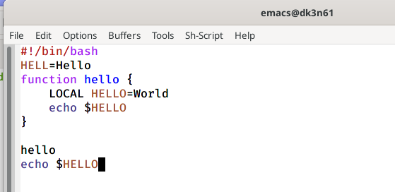{ #fig:005 width=70% }

## Выделение области C-space
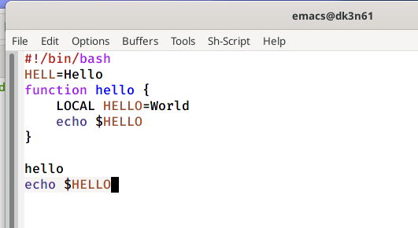{ #fig:006 width=70% }

## Копирование и вставка области M-w
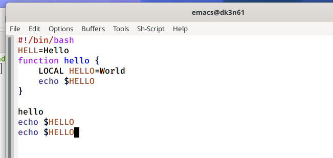{ #fig:007 width=70% }

## Вырезание выделенной области C-w
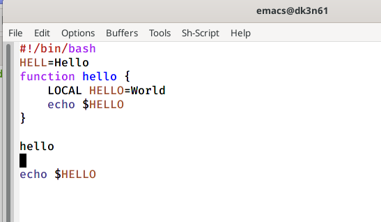{ #fig:008 width=70% }

## Отмена последнего действия C-/
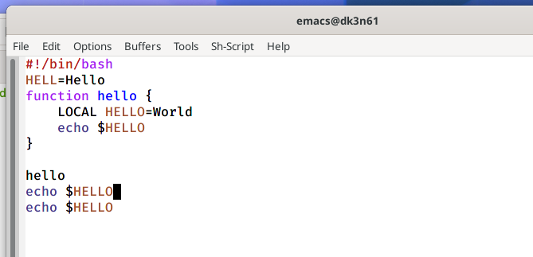{ #fig:009 width=70% }

# Команды по перемещению курсора
## Курсор в начало строки C-a
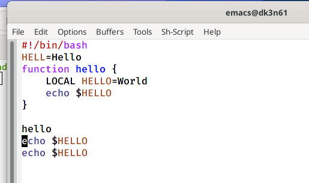{ #fig:010 width=70% }

## Курсор в начало строки C-e
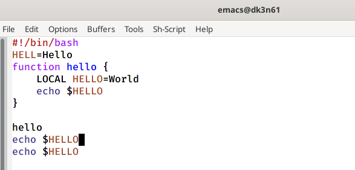{ #fig:011 width=70% }

## Курсор в начало буфера  M-<
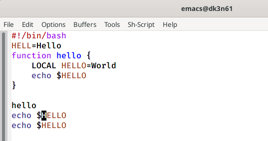{ #fig:012 width=70% }

## Курсор в конец буфера  M-> 
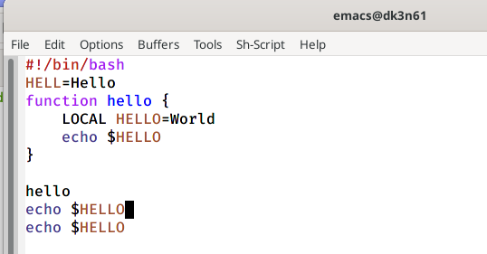{ #fig:013 width=70% }

# Команды по упралению буфером
## Список активных буферов C-x C-b
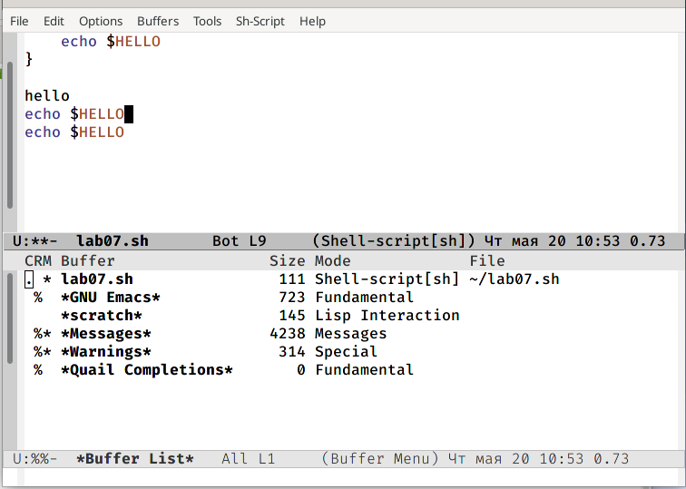{ #fig:014 width=70% }

## Перемещение в окно буферов C-x o
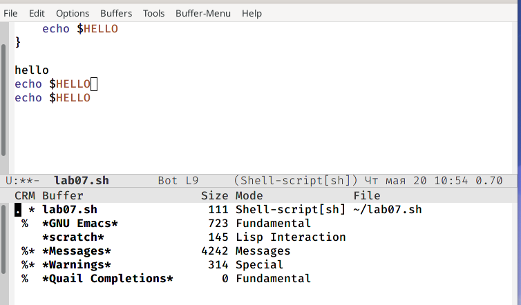{ #fig:015 width=70% }

## Закрытие окна C-x 0
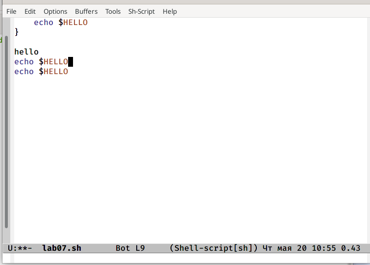{ #fig:016 width=70% }

## Перемещение между буферами C-x b
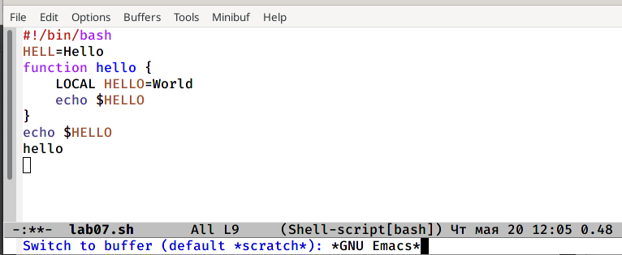{ #fig:017 width=70% }

# Управление окнами
## Деление фрейма на 4 части(по вертикали C-x 3 и по горизонтали C-x 2)
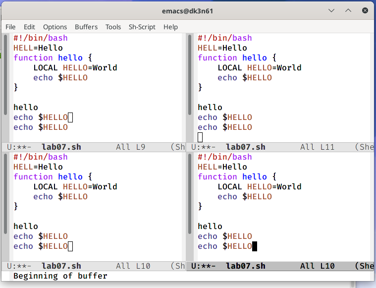{ #fig:018 width=70% }

## Создание нового буфера
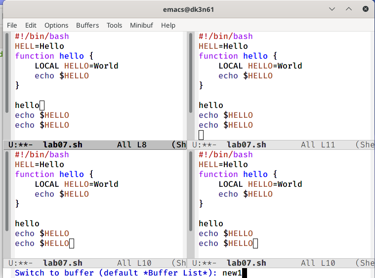{ #fig:019 width=70% }

# Режим поиска
## Поиск слова C-s
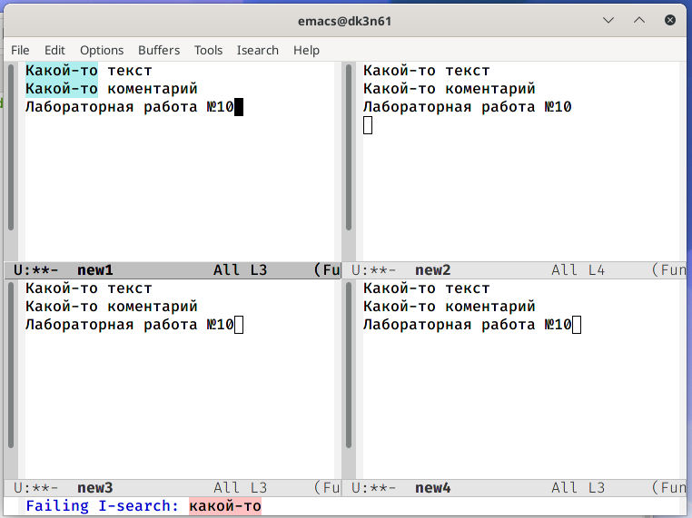{ #fig:021 width=70% }

## Переключение между результатами поиска C-s 
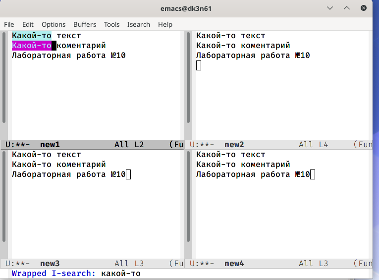{ #fig:022 width=70% }

## Выход из режима поиска C-g
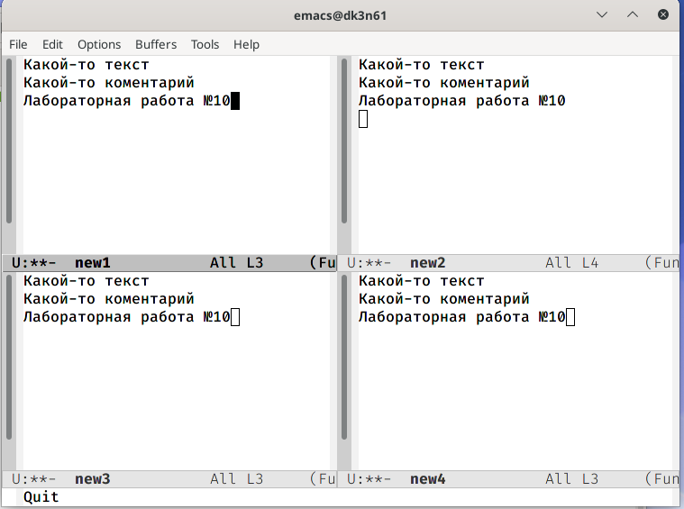{ #fig:023 width=70% }

## Поиск и замена слова M-%
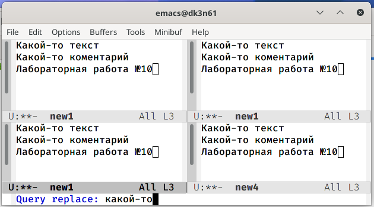{ #fig:024 width=70% }

## Часть 2
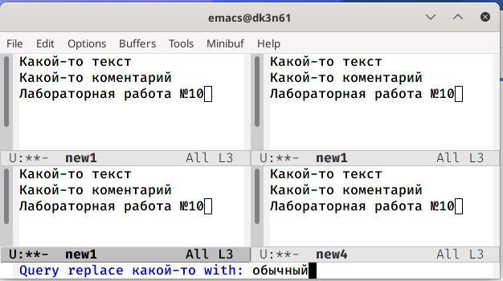{ #fig:025 width=70% }

## Часть 3
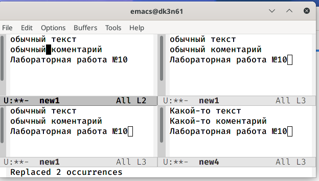{ #fig:026 width=70% }

## Режим поиска (M-s)
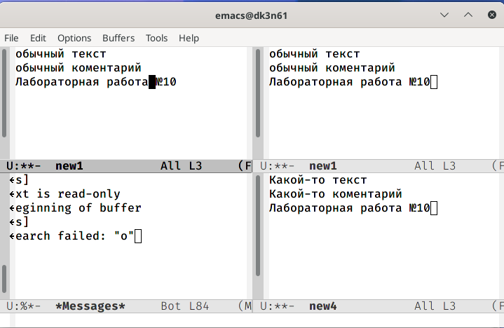{ #fig:027 width=70% }

# Вывод

Я получила практические навыки работы с редактором Emacs. Изучила стандартные процедуры редактирования, команды по перемещению курсора, управление буфером, окнами, а также узнала, как производить поиск.

## Библиография
1. [Ссылка 1](https://esystem.rudn.ru/pluginfile.php/1142514/mod_resource/content/3/007-lab_emacs.pdf)
2. [Ссылка 2](http://reangdblog.blogspot.com/2015/04/emacs_13.html)
