---
# Front matter
lang: ru-RU
title: "Отчёт к лабораторной работе №10"
subtitle: "Текстовой редактор emacs"
author: "Кекишева Анастасия Дмитриевна, НБИ-01-20"

# Formatting
toc-title: "Содержание"
toc: true # Table of contents
toc_depth: 2
lof: true # List of figures
lot: true # List of tables
fontsize: 12pt
linestretch: 1.5
papersize: a4paper
documentclass: scrreprt
polyglossia-lang: russian
polyglossia-otherlangs: english
mainfont: PT Serif
romanfont: PT Serif
sansfont: PT Sans
monofont: PT Mono
mainfontoptions: Ligatures=TeX
romanfontoptions: Ligatures=TeX
sansfontoptions: Ligatures=TeX,Scale=MatchLowercase
monofontoptions: Scale=MatchLowercase
indent: true
pdf-engine: lualatex
header-includes:
  - \linepenalty=10 # the penalty added to the badness of each line within a paragraph (no associated penalty node) Increasing the value makes tex try to have fewer lines in the paragraph.
  - \interlinepenalty=0 # value of the penalty (node) added after each line of a paragraph.
  - \hyphenpenalty=50 # the penalty for line breaking at an automatically inserted hyphen
  - \exhyphenpenalty=50 # the penalty for line breaking at an explicit hyphen
  - \binoppenalty=700 # the penalty for breaking a line at a binary operator
  - \relpenalty=500 # the penalty for breaking a line at a relation
  - \clubpenalty=150 # extra penalty for breaking after first line of a paragraph
  - \widowpenalty=150 # extra penalty for breaking before last line of a paragraph
  - \displaywidowpenalty=50 # extra penalty for breaking before last line before a display math
  - \brokenpenalty=100 # extra penalty for page breaking after a hyphenated line
  - \predisplaypenalty=10000 # penalty for breaking before a display
  - \postdisplaypenalty=0 # penalty for breaking after a display
  - \floatingpenalty = 20000 # penalty for splitting an insertion (can only be split footnote in standard LaTeX)
  - \raggedbottom # or \flushbottom
  - \usepackage{float} # keep figures where there are in the text
  - \floatplacement{figure}{H} # keep figures where there are in the text
---

# Цель работы
Продолжить знакомство с операционной системой Linux. Получить практические навыки работы с редактором Emacs.

# Задание
**Выполнить данные пункты и ответить на вопросы:**

1. Открыть emacs.
2. Создать файл lab07.sh с помощью комбинации Ctrl-x Ctrl-f (C-x C-f).
3. Наберите текст:

>#!/bin/bash

>HELL=Hello

>function hello {

>LOCAL HELLO=World
	
>echo $HELLO
	
>}
	
>echo $HELLO

>hello

4. Сохранить файл с помощью комбинации Ctrl-x Ctrl-s (C-x C-s).
5. Проделать с текстом стандартные процедуры редактирования, каждое действие должно осуществляться комбинацией клавиш.
    5.1. Вырезать одной командой целую строку (С-k).
    5.2. Вставить эту строку в конец файла (C-y). 
    5.3. Выделить область текста (C-space).
    5.4. Скопировать область в буфер обмена (M-w).
    5.5. Вставить область в конец файла.
    5.6. Вновь выделить эту область и на этот раз вырезать её (C-w).5.7.Отмените последнее действие (C-/).
6. Научитесь использовать команды по перемещению курсора.
    6.1. Переместите курсор в начало строки (C-a).
    6.2. Переместите курсор в конец строки (C-e).
    6.3. Переместите курсор в начало буфера (M-<).
    6.4. Переместите курсор в конец буфера (M->).
7. Управление буферами.
    7.1. Вывести список активных буферов на экран (C-x C-b).
    7.2. Переместитесь во вновь открытое окно (C-x) o со списком открытых буфе-ров и переключитесь на другой буфер.
    7.3. Закройте это окно (C-x 0).
    7.4. Теперь вновь переключайтесь между буферами, но уже без вывода их спискана экран (C-x b).
8. Управление окнами.
    8.1. Поделите фрейм на 4 части: разделите фрейм на два окна по вертикали(C-x 3), а затем каждое из этих окон на две части по горизонтали (C-x 2)
    8.2. В каждом из четырёх созданных окон откройте новый буфер (файл) и вве-дите несколько строк текста.
9. Режим поиска.
    9.1.Переключитесьврежимпоиска(C-s)инайдитенесколькослов,присутству-ющих в тексте.
    9.2.Переключайтесь между результатами поиска, нажимаяC-s.
    9.3.Выйдите из режима поиска, нажавC-g.
    9.4.Перейдите в режим поиска и замены (M-%), введите текст, который следуетнайти и заменить, нажмите Enter, затем введите текст для замены. После того как будут подсвечены результаты поиска, нажмите!для подтверждения замены.
    9.5.Испробуйте другой режим поиска, нажав M-s. Объясните, чем он отличается от обычного режима?

# Выполнение лабораторной работы
Перед выполнением лабораторной работы я хорошо ознакомилась с теоритическим материалом для её выполнения
[Ссылка 1](https://esystem.rudn.ru/pluginfile.php/1142514/mod_resource/content/3/007-lab_emacs.pdf)

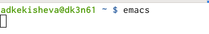{ #fig:001 width=70% }

Во-первых, я открыла экранный редактор текста emacs, набрав в терминале emacs.

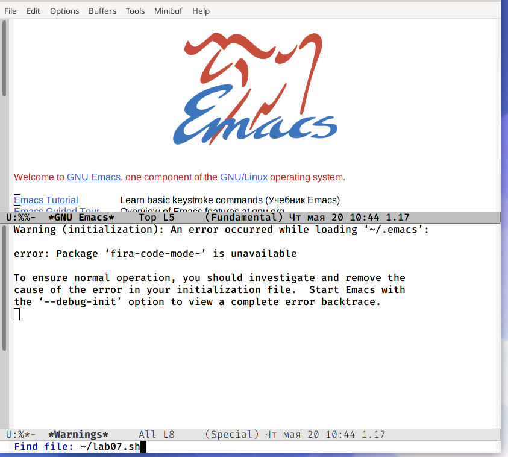{ #fig:002 width=70% }

Далее создала файл lab07.sh с помощью комбинации Ctrl-x Ctrl-s, нажала enter и перешла в этот файл.

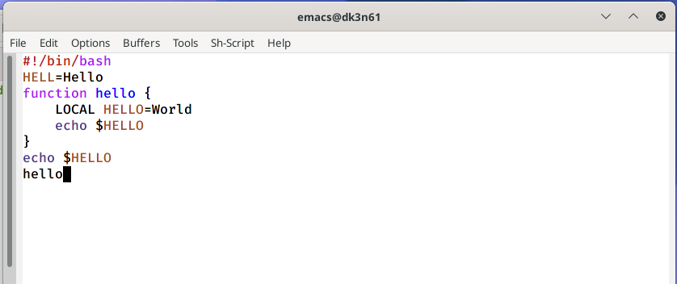{ #fig:003 width=70% }

Ввела необходимый текст.

### Стандартные процедуры редактирования

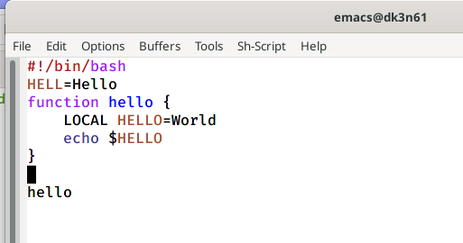{ #fig:004 width=70% }

Вырезала одну строку сочетанием клавиш С-k.

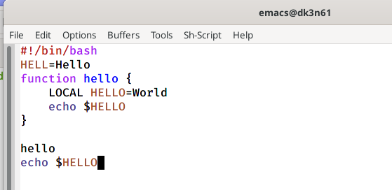{ #fig:005 width=70% }

После вставила эту строку в конец файла сочетанием клавиш C-y. 

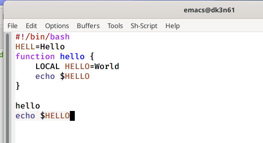{ #fig:006 width=70% }

Выделить область текста сочетанием клавиш C-space и стелкой передвигала до конца области копирования.

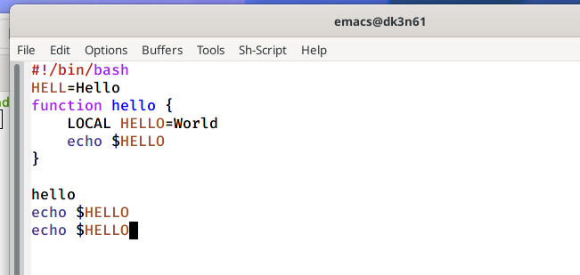{ #fig:007 width=70% }

Далее, скопировала эту область в буфер обмена сочетанием клавиш M-w.И вставила область в конец файла клавишами C-y.

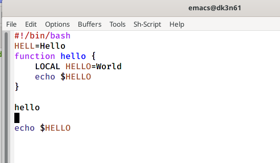{ #fig:008 width=70% }

Вновь выделила эту область и на этот раз вырезать её сочетанием клавиш C-w.

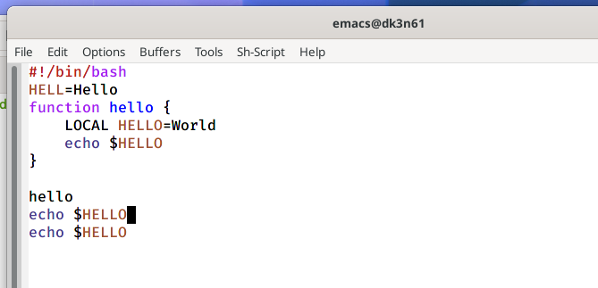{ #fig:009 width=70% }

Отменила последнее действие C-/.

### Команды по перемещению курсора

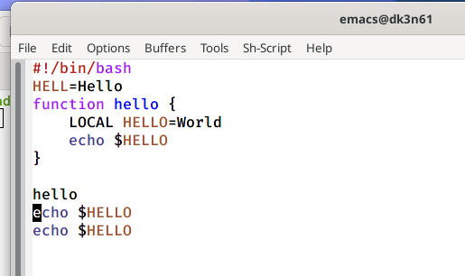{ #fig:010 width=70% }

Сочетанием клавиш C-a переместила курсор в начало строки.
    
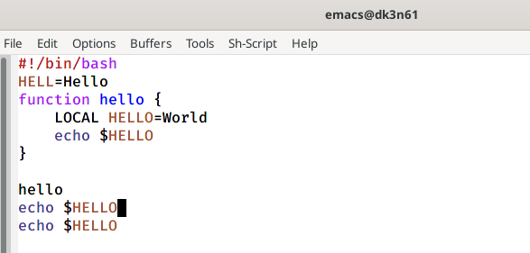{ #fig:011 width=70% }

Сочетанием клавиш C-e переместите курсор в конец строки.

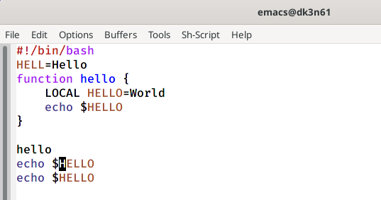{ #fig:012 width=70% }

Сочетанием M-< переместила курсор в начало буфера.

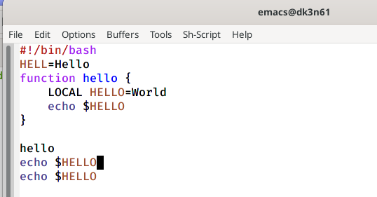{ #fig:013 width=70% }

Сочетанием клавиш M-> переместила курсор в конец буфера.

### Команды по упралению буфером

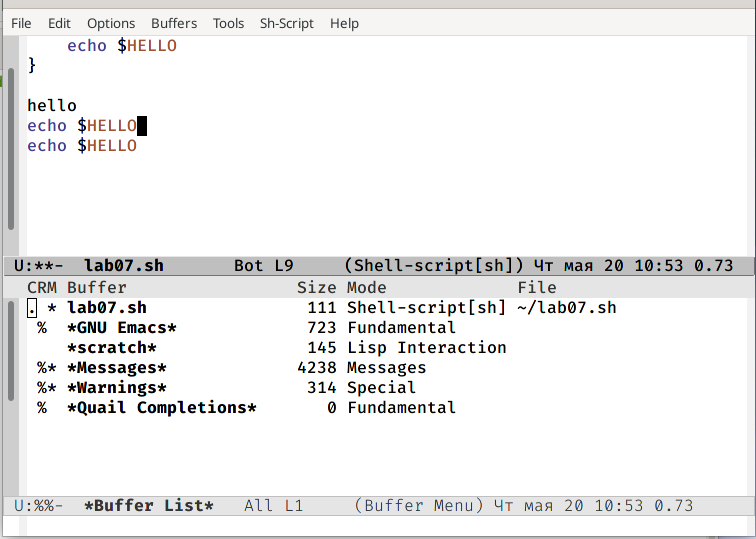{ #fig:014 width=70% }

Вывела список активных буферов на экран сочетанием клавиш (C-x C-b).

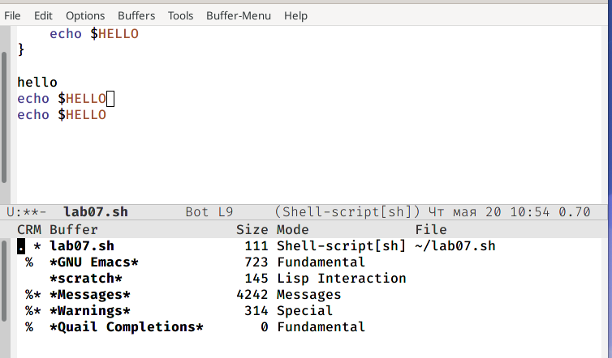{ #fig:015 width=70% }

Переместитесь во вновь открытое окно со списком открытых буферов  сочетанием клавиш (C-x o) и переключилась на другой буфер.

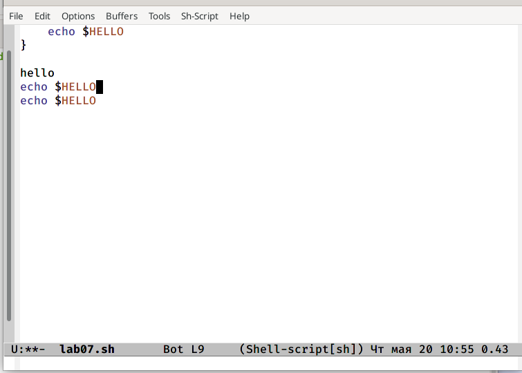{ #fig:016 width=70% }

Закрыла это окно сочетанием клавиш (C-x 0).

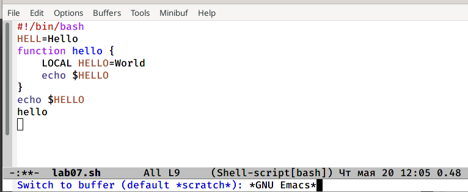{ #fig:017 width=70% }

Переключалась между буферами, но уже без вывода их спискана экран с помощью сочетания клавиш (C-x b).

### Управление окнами

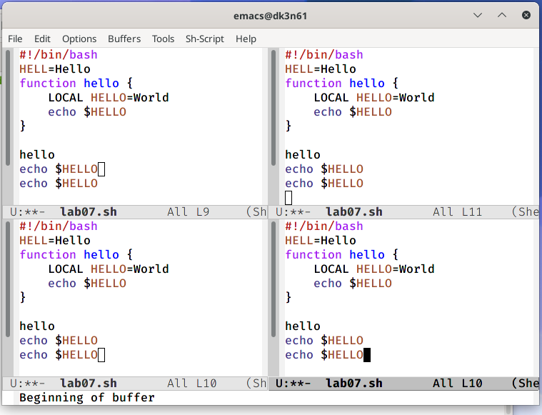{ #fig:018 width=70% }

Поделила фрейм на 4 части. Для этого разделила фрейм на два окна по вертикали (C-x 3), а затем каждое из этих окон на две части по горизонтали (C-x 2).

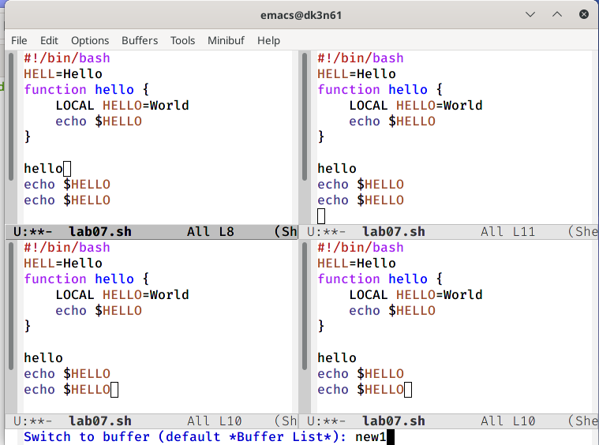{ #fig:019 width=70% }

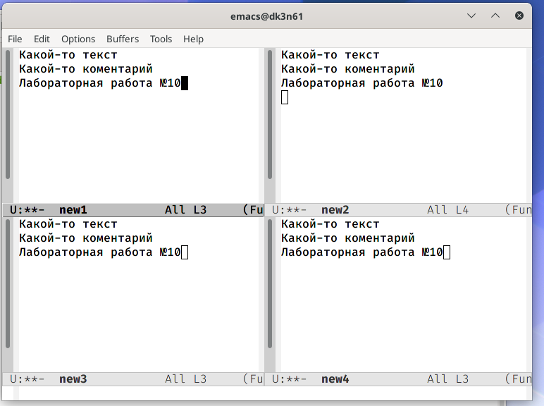{ #fig:020 width=70% }

В каждом из четырёх созданных окон открыла новый буфер, нажав сочетание клавиш C-x b и введя название нового буфера.  И ввела несколько строк текста.

### Режим поиска

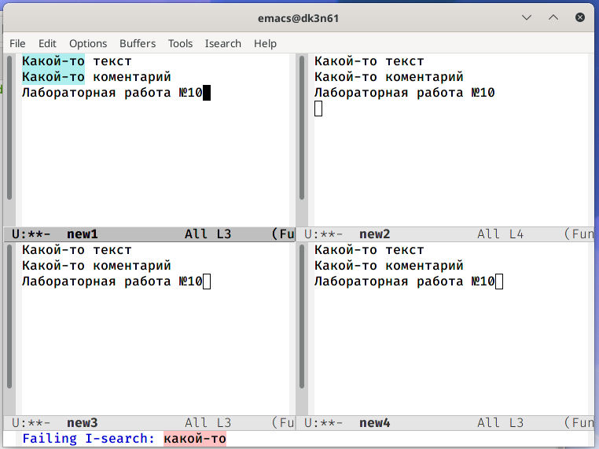{ #fig:021 width=70% }

Переключилась в режим поиска сочетанием клавиш (C-s) и искала слово какой-то, оно подсветилось.

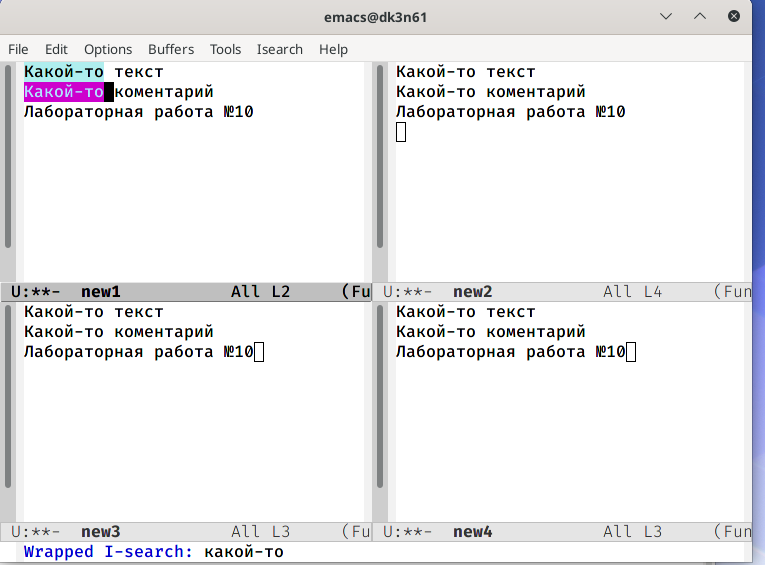{ #fig:022 width=70% }

Переключалась между результатами поиска, нажимая C-s. 

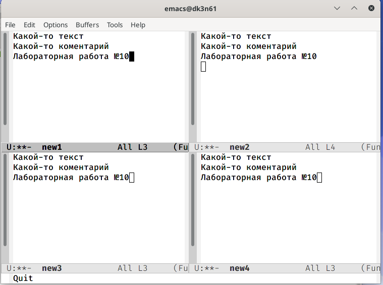{ #fig:023 width=70% }

Вышла из режима поиска, нажав C-g.

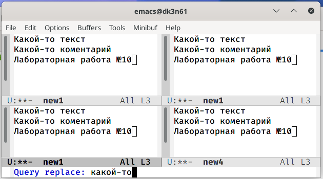{ #fig:024 width=70% }

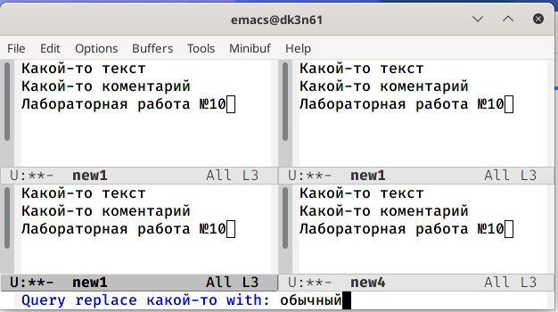{ #fig:025 width=70% }

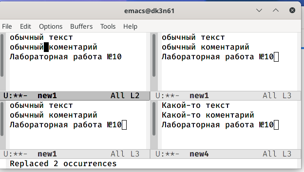{ #fig:026 width=70% }

Перешла в режим поиска и замены (M-%) и ввела текст для поиска и замены, после чего  нажала Enter.Затем ввела текст для замены. После того как были подсвечены результаты поиска, нажала !для подтверждения замены. 

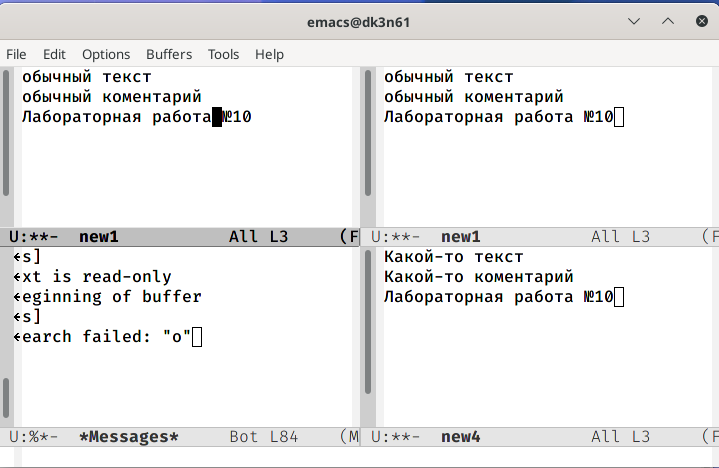{ #fig:027 width=70% }

Попробовала другой режим поиска, нажав сочетание клавиш M-s. Я искала слово работа и данный режим слово, в отличие от того режима, не подсвечивает слово, а ставит курсор на конец искомого слова.

# Вывод

Я получила практические навыки работы с редактором Emacs. Изучила стандартные процедуры редактирования, команды по перемещению курсора, управление буфером, окнами, а также узнала, как производить поиск.

# Библиография
1. [Ссылка 1](https://esystem.rudn.ru/pluginfile.php/1142514/mod_resource/content/3/007-lab_emacs.pdf)
2. [Ссылка 2](http://reangdblog.blogspot.com/2015/04/emacs_13.html)

**Контрольные вопросы:**
1. Emacs представляет собой мощный экранный редактор текста, написанный на
языке высокого уровня Elisp.

2. Особенность данного редактора в том, что аждый перестраивает радактор под себя, и часто настолько кардинально, что другой пользователь того же редактора может его не узнать. Emacs обростал новыми фичами последние 15 лет, и в этом одна из проблем Emacs: дать готовый конфиг в руки начинающему. Но, начинаещему это этого проку мало, потому что скорее всего он сможет сделать только две вещи (из которых скорее всего не будет делать ни одну, по причине изначальной лени): 1. взять конфиг целиком со всеми кастомными наворотами и дополнениями; 2. попытаться надёргать рецептов из нескольких конфигов разных вендоров — а это долго и утомляюще.

3. Буфер — объект, представляющий какой-либо текст. Буфер может содержать что угодно, например, из результатов компиляции программы или встроенных подсказок. И посредством буферов происходит практически всё взаимодействие с пользователем, в том числе интерактивное.

4. Можно.

5. Буферы, которые создаються по умолчанию: Warnings, Messages, scratch, GNU Emacs и Quail Completions.

6. Какие клавиши вы нажмёте, чтобы ввести следующую комбинацию C-c | и C-c C-|? Я нажму клавишу ctrl+c, отпущу и далее нажму |. Для  C-c C-| зажму ctrl и поочерёдно нажму с и |.

7. Поделить окно горизонтально можно сочетанием клавиш (C-x 2), а вертикально  (C-x 3).

8. Настройки emacs хранятся в файле .emacs, который хранится в домашней дирректории пользователя. Кроме этого файла есть ещё папка .emacs.d, где хранятся дополнительные файлы настроек, подключаемые модули, временные файлы emacs и т.п.

9. Клавиши выполняют рутиные операции, так как это удобнее. Переназначить можно, но это требует написание собственного скрипта и порой это трудоёмкая задача. [Ссылка 2](http://reangdblog.blogspot.com/2015/04/emacs_13.html)

10. Какой редактор вам показался удобнее в работе vi или emacs? Поясните почему. Я думаю, что удобнее для меня был редактор emacs, так как не нужно было переключаться в режим вставки, тут можно редактировать кликнув мышкой. Также, набирая код, он автоматически ставит табуляцию, что тоже показалось мне удобным. В принципе, на мой взгляд работается в них примерно одинаково, так как в основном редактирование и другие необходимые действия осуществяються нажатием клавиш.

