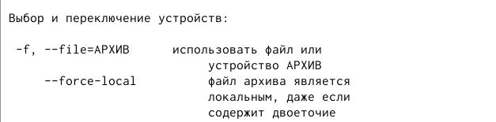

---
## Front matter
lang: ru-RU
title: Лабораторная работа №11. Программирование в командном процессоре ОС UNIX. Командные файлы.

author: 
	Кекишева Анастасия Дмитриевна, НБИ-01-20, \inst{}

institute: |
	\inst{1}RUDN University, Moscow, Russian Federation
date: 30 апреля, 2021

## Formatting
toc: false
slide_level: 2
theme: metropolis
header-includes: 
 - \metroset{progressbar=frametitle,sectionpage=progressbar,numbering=fraction}
 - '\makeatletter'
 - '\beamer@ignorenonframefalse'
 - '\makeatother'
aspectratio: 43
section-titles: true
---

## Цель работы
Изучить основы программирования в оболочке ОС UNIX/Linux. Научиться писать небольшие командные файлы.

## Задачи
1. Написать скрипт, который при запуске будет делать резервную копию самого себя;
2. Написать пример командного файла, обрабатывающего любое произвольноечисло аргументов командной строки, в том числепревышающее десять. 
3. Написать командный файл — аналог команды ls (без использования самой этойкоманды и команды dir).Требуется, чтобы он выдавал информацию о нужном каталоге и выводил информацию о возможностях доступа к файлам этого каталога.
4. Написать командный файл, который получает в качестве аргумента командной строки формат файла (.txt,.doc,.jpg,.pdfи т.д.) и вычисляет количество таких файлов в указанной директории.
    

# Выполнение 1-го пункта задания 
## Справка tar
{ #fig:001 width=70% }

## Опция -c - создание
{ #fig:002 width=70% }
 
## Опция -f - применеие файла или устройство АРХИВ
{ #fig:003 width=70% }

## Написание скрипта
{ #fig:004 width=70% }

## Результат работы скрипта
{ #fig:006 width=70% }

# Выполнение 2-го пункта задания 
## 1 способ
1. Воспользоваться head -(количество строк для обработки)

{ #fig:007 width=70% }

## Результат
{ #fig:008 width=70% }

## 2 Способ
2. Ввести $*, что означает что вызывая командый файл нам не выйдет предложение ввести символы, их мы будем должны ввести сами в командной строке.
{ #fig:009 width=70% }

## Результат
{ #fig:010 width=70% }

# Выполнение 3-го пункта задания 
## Командый файл, выводящий информацию о правах доступа

{ #fig:011 width=70% }

## Результат выполнения командного файла
{ #fig:012 width=70% }

# Выполнение 4-го пункта задания 
## Командный файл, который получает в качестве аргумента командной строки формат файла  и вычисляет количество таких файлов в указанной директории
{ #fig:013 width=70% }

## Результат выполнения командного файла
{ #fig:014 width=70% }

## Вывод

Я изучила основы программирования в оболочке ОС UNIX/Linux, научилась писать командные файлы и скрипты.

## Библиография
1. [Ссылка 1](https://vk.com/im?peers=311102850&sel=c80)
2. [Ссылка 2](https://losst.ru/komanda-wc-v-linux)

