---
# Front matter
lang: ru-RU
title: "Отчёт к лабораторной работе №11"
subtitle: "абораторная работа № 12. Программирование в командномпроцессоре ОС UNIX. Ветвления и циклы." 
author: "Кекишева Анастасия Дмитриевна"

# Formatting
toc-title: "Содержание"
toc: true # Table of contents
toc_depth: 2
lof: true # List of figures
lot: true # List of tables
fontsize: 12pt
linestretch: 1.5
papersize: a4paper
documentclass: scrreprt
polyglossia-lang: russian
polyglossia-otherlangs: english
mainfont: PT Serif
romanfont: PT Serif
sansfont: PT Sans
monofont: PT Mono
mainfontoptions: Ligatures=TeX
romanfontoptions: Ligatures=TeX
sansfontoptions: Ligatures=TeX,Scale=MatchLowercase
monofontoptions: Scale=MatchLowercase
indent: true
pdf-engine: lualatex
header-includes:
  - \linepenalty=10 # the penalty added to the badness of each line within a paragraph (no associated penalty node) Increasing the value makes tex try to have fewer lines in the paragraph.
  - \interlinepenalty=0 # value of the penalty (node) added after each line of a paragraph.
  - \hyphenpenalty=50 # the penalty for line breaking at an automatically inserted hyphen
  - \exhyphenpenalty=50 # the penalty for line breaking at an explicit hyphen
  - \binoppenalty=700 # the penalty for breaking a line at a binary operator
  - \relpenalty=500 # the penalty for breaking a line at a relation
  - \clubpenalty=150 # extra penalty for breaking after first line of a paragraph
  - \widowpenalty=150 # extra penalty for breaking before last line of a paragraph
  - \displaywidowpenalty=50 # extra penalty for breaking before last line before a display math
  - \brokenpenalty=100 # extra penalty for page breaking after a hyphenated line
  - \predisplaypenalty=10000 # penalty for breaking before a display
  - \postdisplaypenalty=0 # penalty for breaking after a display
  - \floatingpenalty = 20000 # penalty for splitting an insertion (can only be split footnote in standard LaTeX)
  - \raggedbottom # or \flushbottom
  - \usepackage{float} # keep figures where there are in the text
  - \floatplacement{figure}{H} # keep figures where there are in the text
---

# Цель работы
Изучить основы программирования в оболочке ОС UNIX. Научится писать более сложные командные файлы с использованием логических управляющих конструкций и циклов.

# Задание
**Выполнить данныые пункты и ответить на вопросы:**
1. Используя команды getopts grep, написать командный файл, который анализирует командную строку с ключами:
- –-iinputfile— прочитать данные из указанного файла;
- –-ooutputfile— вывести данные в указанный файл;
- –-pшаблон— указать шаблон для поиска;
- –-C— различать большие и малые буквы;
- –-n— выдавать номера строк.а затем ищет в указанном файле нужные строки, определяемые ключом-p.
2. Написать на языке Си программу, которая вводит число и определяет, являетсяли оно больше нуля, меньше нуля или равно нулю. Затем программа завершаетсяс помощью функции exit(n), передавая информацию в о коде завершения в оболочку. Командный файл должен вызывать эту программу и, проанализировавс помощью команды $?, выдать сообщение о том, какое число было введено. 
3. Написать командный файл, создающий указанное число файлов, пронумерован-ных последовательно от1до N(например1.tmp,2.tmp,3.tmp,4.tmpи т.д.).Число файлов, которые необходимо создать, передаётся в аргументы команднойстроки. Этот же командный файл должен уметь удалять все созданные им файлы(если они существуют).
4. Написать командный файл, который с помощью команды tar запаковывает вархив все файлы в указанной директории. Модифицировать его так, чтобы запа-ковывались только те файлы, которые были изменены менее недели тому назад(использовать команду find)

# Выполнение лабораторной работы
Перед выполнением лабораторной работы я хорошо ознакомилась с теоритическим материалом для её выполнения [Ссылка 1](https://vk.com/im?peers=311102850&sel=c80)

## Выполнение 1-го пункта задания 

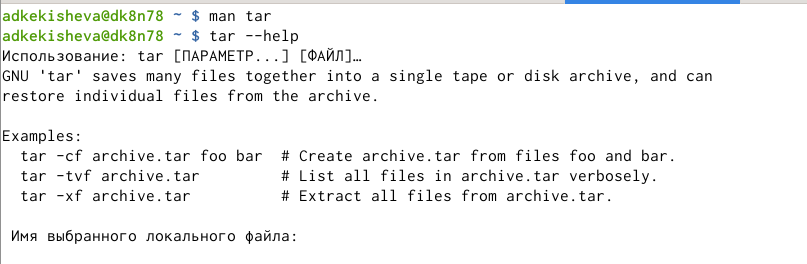{ #fig:001 width=70% }

Во-первых, я изучила справку по способу использования tar. (рис. -@fig:001)  И нашла необходимые опции для выполнения задания (рис. -@fig:002) (рис. -@fig:003) :

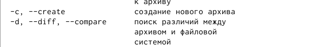{ #fig:002 width=70% }

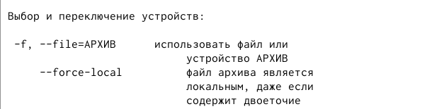{ #fig:003 width=70% }

{ #fig:004 width=70% }

Для написания первого скрипта, я создала файл с раширение .sh, так как я буду работать в emacs. Наделила это файл правом на выполнения и присткпила к написанию. (рис. -@fig:004)

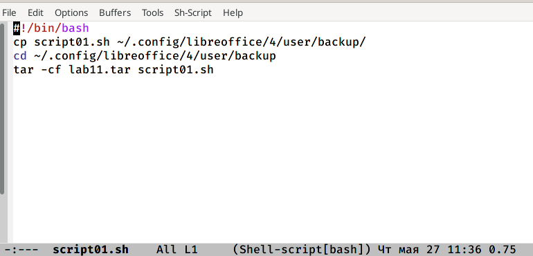{ #fig:005 width=70% }

Написала скрипт (рис. -@fig:005) , который при запуске будет делать резервную копию самого себя в директорию backup. Для это я нашла путь к каталогу backup. В первой строке мы обязательно пишем #!/bin/bash. Далее применила команду копирования cp  и скопировала скрипт в каталог backup. Далее перешла в этот каталог и после командой архивирования tar  с опциями -cf сделала архив файла со скриптом с именем lab11.tar. 
 
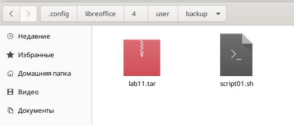{ #fig:006 width=70% }

Запустила скрипт ./(название файла) (рис. -@fig:004) и проверила результат (рис. -@fig:006)

## Выполнение 2-го пункта задания 

Написала пример командного файла, обрабатывающего любое произвольное число аргументов командной строки, в том числе превышающее десять. На мой взляд, это можно сделать двумя способами:

1. Воспользоваться head -(количество строк для обработки) (рис. -@fig:007) (рис. -@fig:008).

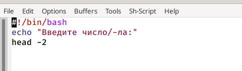{ #fig:007 width=70% }

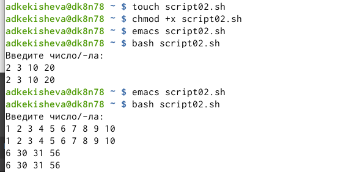{ #fig:008 width=70% }

2. Ввести $*, что означает что вызывая командый файл нам не выйдет предложение ввести символы, их мы будем должны ввести сами в командной строке (рис. -@fig:009) (рис. -@fig:010).

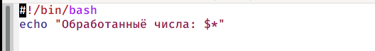{ #fig:009 width=70% }

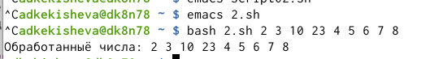{ #fig:010 width=70% }

## Выполнение 3-го пункта задания 

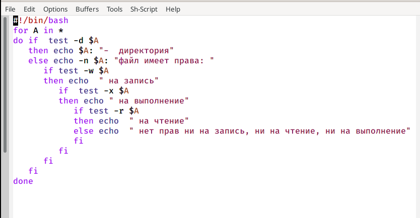{ #fig:011 width=70% }

Далее написала командный файл — аналог команды ls (без использования самой этойкоманды и команды dir), который выдаёт информацию о нужном каталоге и выводил информацию о возможностях доступа к файлам этого каталога (рис. -@fig:011). Для это я воспользовалась циклом for в котором переменная А будет принимать значения, равные именам этих файлов. И потом в помощью операторов условия if проверяем файл это или директория. Если директория просто выводим, что это директория, если файл, то проверяем его, на наличие прав на чтение  test -r, на запись -w, на выполнение -x, в противном случае у файла нет прав. Test проверяет на истину. (рис. -@fig:012)

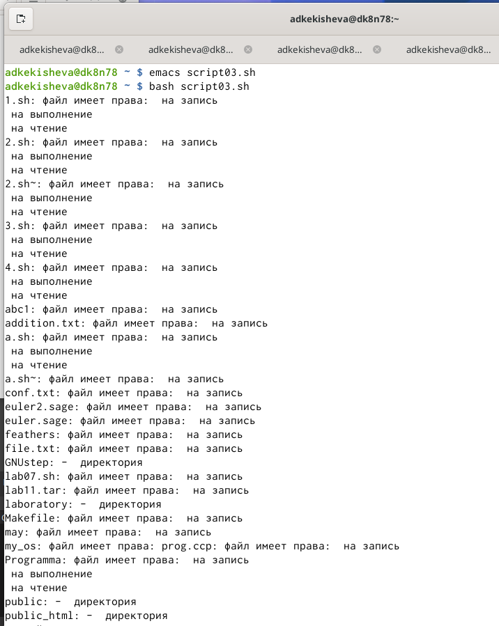{ #fig:012 width=70% }

## Выполнение 4-го пункта задания 

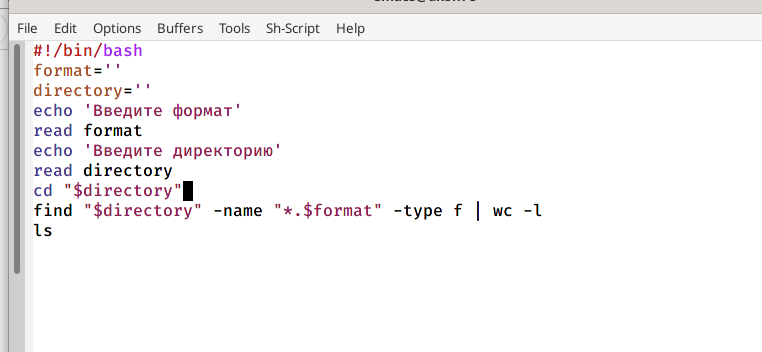{ #fig:013 width=70% }

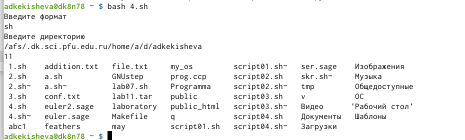{ #fig:014 width=70% }

Написала командный файл, который получает в качестве аргумента командной строки формат файла (.txt,.doc,.jpg,.pdfи т.д.) и вычисляет количество таких файлов в указанной директории. Путь к директории также передаётся ввиде аргумента командной строки (рис. -@fig:013) (рис. -@fig:014) . Здесь, я создала переменные, считывала их командой read и применяла команду find  для поиска файлов с определённым расширением, а также конвеер и команду wc с опцией -l. Команда wc -l выводит количество строк в объекте.[Ссылка 2](https://losst.ru/komanda-wc-v-linux)

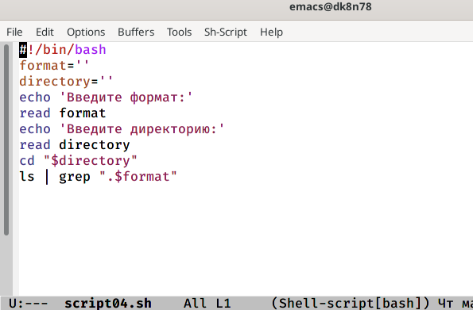{ #fig:015 width=70% }

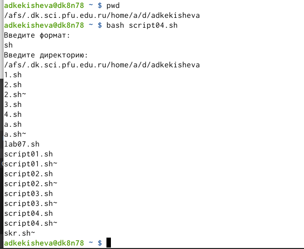{ #fig:016 width=70% }

Также в начале работы у меня получалось так, что командный файл выводил имена файлов, но он не вычислял количество файлов (рис. -@fig:015) (рис. -@fig:016)

# Вывод

Я изучила основы программирования в оболочке ОС UNIX/Linux, научилась писать командные файлы и скрипты.

# Библиография
1. [Ссылка 1](https://vk.com/im?peers=311102850&sel=c80)
2. [Ссылка 2](https://losst.ru/komanda-wc-v-linux)

**Контрольные вопросы:**
1. Объясните понятие командной оболочки. Приведите примеры командных оболочек. Чем они отличаются?

Командная оболочка— это программа, позволяющая пользователю взаимодействовать с операционной системой компьютера. В операционных системах типа UNIX/Linux наиболее часто используются следующие реализации командных оболочек:

– оболочка Борна (Bourne shell или sh) — стандартная командная оболочка UNIX/Linux, содержащая базовый, но при этом полный набор функций;

– С-оболочка (или csh) — надстройка на оболочкой Борна, использующая Сподобный синтаксис команд с возможностью сохранения истории выполнения команд;

– оболочка Корна (или ksh) — напоминает оболочку С, но операторы управления программой совместимы с операторами оболочки Борна;

– BASH — сокращение от Bourne Again Shell (опять оболочка Борна), в основе своей совмещает свойства оболочек С и Корна (разработка компании Free Software Foundation).

2. Что такое POSIX?

POSIX (Portable Operating System Interface for Computer Environments) — набор стандартов описания интерфейсов взаимодействия операционной системы и прикладных программ.

3. Как определяются переменные и массивы в языке программирования bash?

Командный процессор bash обеспечивает возможность использования переменных типа строка символов. Имена переменных могут быть выбраны пользователем. Пользователь имеет возможность присвоить переменной значение некоторой строки символов.

Для создания массива используется команда set с флагом -A. За флагом следует имя переменной, а затем список значений, разделённых пробелами. Например, set -A states Delaware Michigan "New Jersey".

4. Каково назначение операторов let и read?

Команда let является показателем того, что последующие аргументы представляют собой выражение, подлежащее вычислению. Команда let берет два операнда и присваивает их переменной. Положительным моментом команды let можно считать то, что для идентификации переменной ей не нужен знак доллара;

Команда read позволяет читать значения переменных со стандартного ввода.

5. Какие арифметические операции можно применять в языке программирования bash?

Сложение, вычитание, умножение, деление, а также эти же операции с присваиванием значения переменной, также операция отрицания, остаток от деления, побитовый сдвиг, побитовое дополнение и другие.

6. Что означает операция (( ))?

Операция применяется для записи условия. Далее, можно осуществлять присвоение результатов условных выражений переменным, также как и использовать результаты арифметических вычислений в качестве условий.

7. Какие стандартные имена переменных Вам известны?

-PATH (т.е. $РАТН) - список каталогов, в которых командный процессор осуществляет поиск программы или команды, указанной в командной строке, в том случае, если указанное имя программы или команды не содержит ни одного символа /.

– HOME — имя домашнего каталога пользователя. Если команда cd вводится без аргументов, то происходит переход в каталог, указанный в этой переменной.

– IFS — последовательность символов, являющихся разделителями в командной строке, например, пробел, табуляция и перевод строки (new line).

– MAIL — командный процессор каждый раз перед выводом на экран промптера проверяет содержимое файла, имя которого указано в этой переменной, и если содержимое этого файла изменилось с момента последнего ввода из него, то перед тем как вывести на терминал промптер, командный процессор выводит на терминал сообщение You have mail (у Вас есть почта).

– TERM — тип используемого терминала.

– LOGNAME — содержит регистрационное имя пользователя, которое устанавливается автоматически при входе в систему. В командном процессоре Си имеется ещё несколько стандартных переменных. Значение всех переменных можно просмотреть с помощью команды set.

8. Что такое метасимволы?

Такие символы, как ' < > * ? | \ " &, являются метасимволами и имеют для командного процессора специальный смысл.

9. Как экранировать метасимволы?

Снятие специального смысла с метасимвола называется экранированием метасимвола. Экранирование может быть осуществлено с помощью предшествующего метасимволу символа \, который, в свою очередь, является метасимволом. Для экранирования группы метасимволов нужно заключить её в одинарные кавычки. Строка, заключённая в двойные кавычки, экранирует все метасимволы, кроме $, ' , \, ". Например:

– echo \* выведет на экран символ *,

– echo ab’*\|*’cd выведет на экран строку ab*\|*cd

10. Как создавать и запускать командные файлы?

Командный файл – это файл, в который помещена последовательность команд. Сначала командный файл можно выполнить по команде: bash командный_файл [аргументы] и чтобы не вводить каждый раз последовательности символов bash, необходимо обеспечить доступ к этому файлу на выполнение (chmod +x имя_файла). Теперь можно вызывать свой командный файл на выполнение, просто вводя его имя с терминала так, как-будто он является выполняемой программой.

11. Как определяются функции в языке программирования bash?

Для опредения функции в bash используется ключевое слово function, после которого следует имя функции и список команд, заключённых в фигурные скобки.

12. Каким образом можно выяснить, является файл каталогом или обычным файлом?

13. Каково назначение команд set, typeset и unset?

Команда set- создание массива, используется команда set с флагом -A

Команда unset c флагом -f – удаление функции.

Команда typeset имеет четыре опции для работы с функциями:

- f — перечисляет определённые на текущий момент функции;

- ft — при последующем вызове функции инициирует её трассировку;

- fx — экспортирует все перечисленные функции в любые дочерние программы оболочек;

- fu — обозначает указанные функции как автоматически загружаемые. Автоматически загружаемые функции хранятся в командных файлах, а при их вызове оболочка просматривает переменную FPATH, отыскивая файл с одноимёнными именами функций, загружает его и вызывает эти функции.

14. Как передаются параметры в командные файлы?

При вызове командного файла на выполнение параметры ему могут быть переданы точно таким же образом, как и выполняемой программе. С точки зрения командного файла эти параметры являются позиционными. Символ $ является метасимволом командного процессора. Он используется, в частности, для ссылки на параметры, точнее, для получения их значений в командном файле. В командный файл можно передать до девяти параметров.

15. Назовите специальные переменные языка bash и их назначение.

Специальных переменные:

– $* — отображается вся командная строка или параметры оболочки;

– $? — код завершения последней выполненной команды;

– $$ — уникальный идентификатор процесса, в рамках которого выполняется командный процессор;

– $! — номер процесса, в рамках которого выполняется последняя вызванная на выполнение в командном режиме команда;

– $- — значение флагов командного процессора;

– ${#*} — возвращает целое число — количество слов, которые были результатом $*;

– ${#name} — возвращает целое значение длины строки в переменной name;

– ${name[n]} — обращение к n-му элементу массива;

– ${name[*]} — перечисляет все элементы массива, разделённые пробелом;

– ${name[@]} — то же самое, но позволяет учитывать символы пробелы в самих переменных;

– ${name:-value} — если значение переменной name не определено, то оно будет заменено на указанное value;

– ${name:value} — проверяется факт существования переменной;

– ${name=value} — если name не определено, то ему присваивается значение value;

– ${name?value} — останавливает выполнение, если имя переменной не определено, и выводит value как сообщение об ошибке;

– ${name+value} — это выражение работает противоположно ${name-value}. Если переменная определена, то подставляется value;

– ${name#pattern} — представляет значение переменной name с удалённым самым коротким левым образцом (pattern);

– ${#name[*]} и ${#name[@]} — эти выражения возвращают количество элементов в массиве name.
