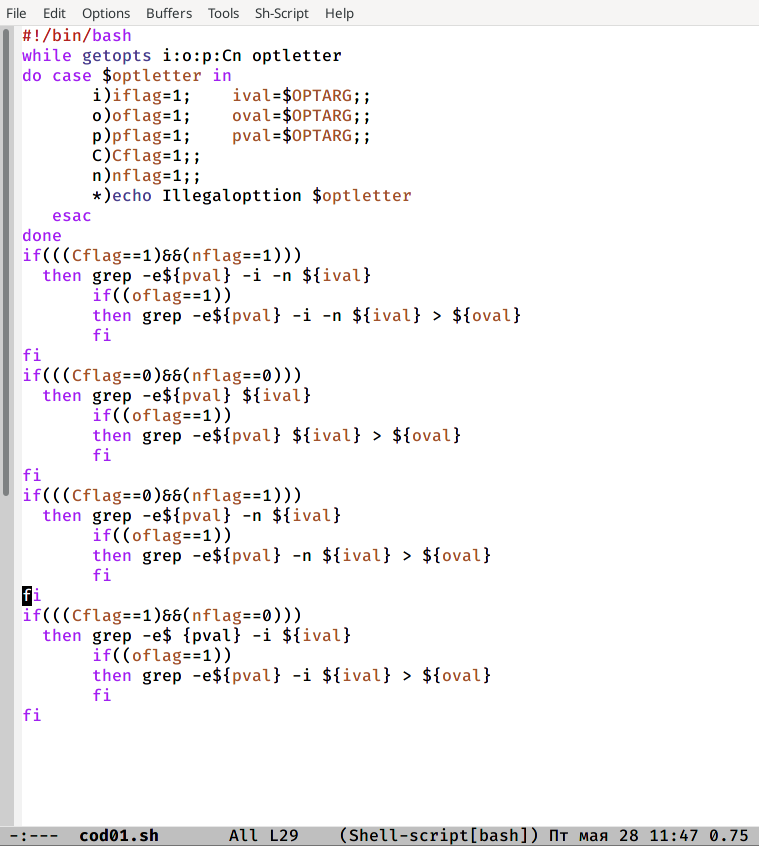
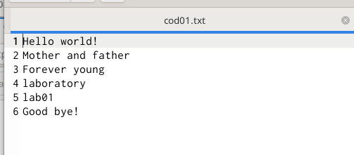
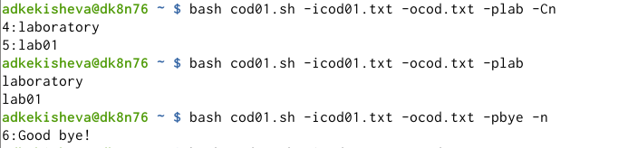
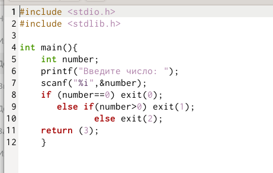
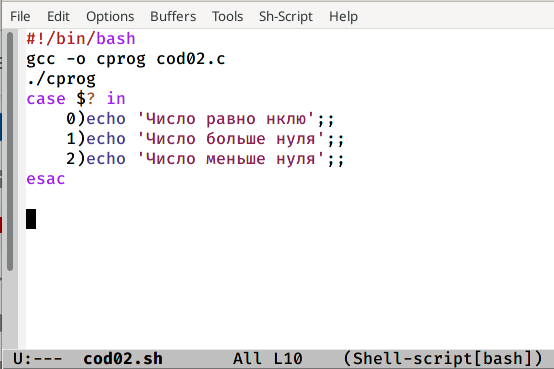
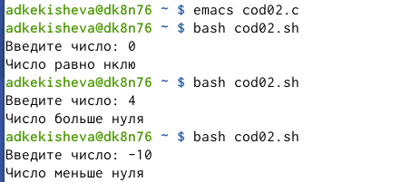
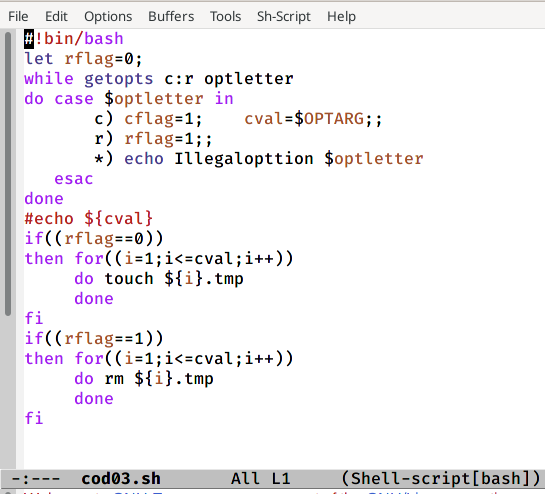
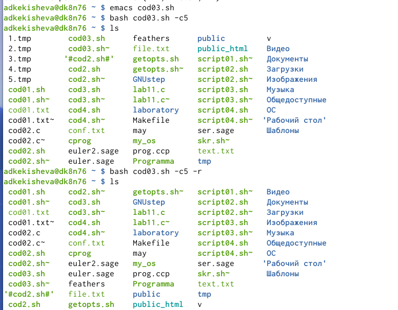
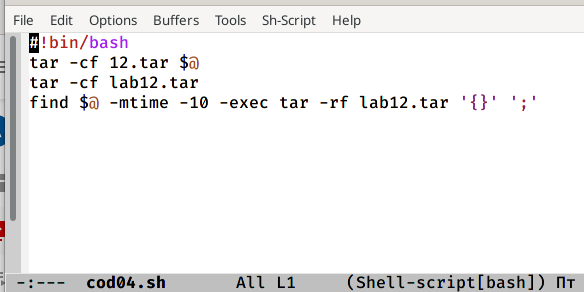
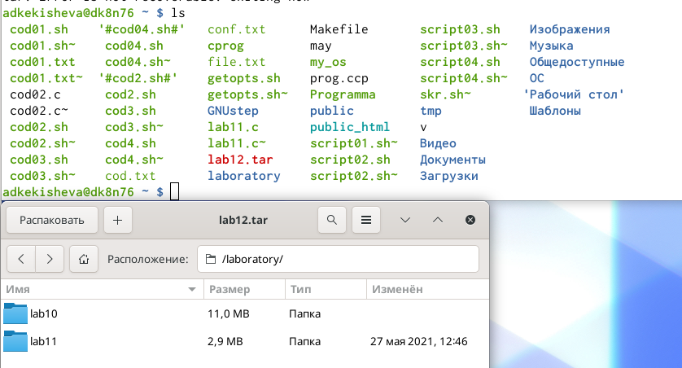

---
## Front matter
lang: ru-RU
title: Лабораторная работа №12. Программирование в командном процессоре ОС UNIX. Программирование в командномпроцессоре ОС UNIX. Ветвления и циклы.

author: 
	Кекишева Анастасия Дмитриевна, НБИ-01-20, \inst{}

institute: |
	\inst{1}RUDN University, Moscow, Russian Federation
date: 30 апреля, 2021

## Formatting
toc: false
slide_level: 2
theme: metropolis
header-includes: 
 - \metroset{progressbar=frametitle,sectionpage=progressbar,numbering=fraction}
 - '\makeatletter'
 - '\beamer@ignorenonframefalse'
 - '\makeatother'
aspectratio: 43
section-titles: true
---

## Цель работы

Изучить основы программирования в оболочке ОС UNIX. Научится писать более сложные командные файлы с использованием логических управляющих конструкций и циклов.

## Задачи

1. Используя командыgetopts grep, написать командный файл, который анализирует командную строку с ключами, а затем ищет в указанном файле нужные строки, определяемые ключом -p.
2. Написать на языке Си программу, которая вводит число и определяет, являетсяли оно больше нуля, меньше нуля или равно нулю.
3. Написать командный файл, создающий указанное число файлов, пронумерованных последовательно от 1 до N. Этот же командный файл должен уметь удалять все созданные им файлы.
4. Написать командный файл, который с помощью командыtarзапаковывает вархив все файлы в указанной директории. 

# Выполнение лабораторной работы
Перед выполнением лабораторной работы я хорошо ознакомилась с теоритическим материалом для её выполнения [Ссылка 1](https://vk.com/im?peers=311102850&sel=c80)

# Выполнение 1-го пункта задания 

## Командный файл, который анали-зирует командную строку с ключами
{ #fig:001 width=70% }

## Текстовый файл
{ #fig:002 width=70% }

## Результат выполнения командного файла
{ #fig:003 width=70% }

# Выполнение 2-го пункта задания

## Программа на языке Си: cod02.c
{ #fig:004 width=70% }

## Командный файл, вызывающий программу cod02.c
{ #fig:005 width=70% }

## Результат работы программ
{ #fig:006 width=70% }

# Выполнение 3-го пункта задания 

## Командный файл, создающий указанное число файлов, пронумерованных последовательно от 1 до N
{ #fig:007 width=70% }

## Результат работы пргораммы: создание и удаление
{ #fig:008 width=70% }

# Выполнение 4-го пункта задания 

## Командный файл, архивирует файлы в указанной директории
{ #fig:009 width=70% }

## Вызов командного файла
{ #fig:010 width=70% }

## Результат работы командного файла
{ #fig:011 width=70% }

## Вывод

Я продолжила изучать основы программирования в оболочке ОС UNIX. Научилась писать более сложные командные файлы с использованием логических управляющих конструкций и циклов.

## Библиография
1. [Ссылка 1](https://vk.com/im?peers=311102850&sel=c80)

