---
# Front matter
lang: ru-RU
title: "Отчёт к лабораторной работе №12"
subtitle: "Программирование в командном процессоре ОС UNIX. Программирование в командномпроцессоре ОС UNIX. Ветвления и циклы." 
author: "Кекишева Анастасия Дмитриевна"

# Formatting
toc-title: "Содержание"
toc: true # Table of contents
toc_depth: 2
lof: true # List of figures
lot: true # List of tables
fontsize: 12pt
linestretch: 1.5
papersize: a4paper
documentclass: scrreprt
polyglossia-lang: russian
polyglossia-otherlangs: english
mainfont: PT Serif
romanfont: PT Serif
sansfont: PT Sans
monofont: PT Mono
mainfontoptions: Ligatures=TeX
romanfontoptions: Ligatures=TeX
sansfontoptions: Ligatures=TeX,Scale=MatchLowercase
monofontoptions: Scale=MatchLowercase
indent: true
pdf-engine: lualatex
header-includes:
  - \linepenalty=10 # the penalty added to the badness of each line within a paragraph (no associated penalty node) Increasing the value makes tex try to have fewer lines in the paragraph.
  - \interlinepenalty=0 # value of the penalty (node) added after each line of a paragraph.
  - \hyphenpenalty=50 # the penalty for line breaking at an automatically inserted hyphen
  - \exhyphenpenalty=50 # the penalty for line breaking at an explicit hyphen
  - \binoppenalty=700 # the penalty for breaking a line at a binary operator
  - \relpenalty=500 # the penalty for breaking a line at a relation
  - \clubpenalty=150 # extra penalty for breaking after first line of a paragraph
  - \widowpenalty=150 # extra penalty for breaking before last line of a paragraph
  - \displaywidowpenalty=50 # extra penalty for breaking before last line before a display math
  - \brokenpenalty=100 # extra penalty for page breaking after a hyphenated line
  - \predisplaypenalty=10000 # penalty for breaking before a display
  - \postdisplaypenalty=0 # penalty for breaking after a display
  - \floatingpenalty = 20000 # penalty for splitting an insertion (can only be split footnote in standard LaTeX)
  - \raggedbottom # or \flushbottom
  - \usepackage{float} # keep figures where there are in the text
  - \floatplacement{figure}{H} # keep figures where there are in the text
---

# Цель работы

Изучить основы программирования в оболочке ОС UNIX. Научится писать более сложные командные файлы с использованием логических управляющих конструкций и циклов.

# Задание
**Выполнить данныые пункты и ответить на вопросы:**

1. Используя командыgetopts grep, написать командный файл, который анализирует командную строку с ключами:
- -iinputfile— прочитать данные из указанного файла;
- -ooutputfile— вывести данные в указанный файл;
- -pшаблон— указать шаблон для поиска;
- -C— различать большие и малые буквы;
- -n— выдавать номера строк.а затем ищет в указанном файле нужные строки, определяемые ключом -p.
2. Написать на языке Си программу, которая вводит число и определяет, являетсяли оно больше нуля, меньше нуля или равно нулю. Затем программа завершаетсяс помощью функции exit(n), передавая информацию в о коде завершения в оболочку. Командный файл должен вызывать эту программу и, проанализировав с помощью команды $?, выдать сообщение о том, какое число было введено.
3. Написать командный файл, создающий указанное число файлов, пронумерован-ных последовательно от 1 до N (например1.tmp,2.tmp,3.tmp,4.tmpи т.д.).Число файлов, которые необходимо создать, передаётся в аргументы команднойстроки. Этот же командный файл должен уметь удалять все созданные им файлы(если они существуют).
4. Написать командный файл, который с помощью командыtarзапаковывает вархив все файлы в указанной директории. Модифицировать его так, чтобы запаковывались только те файлы, которые были изменены менее недели тому назад(использовать команду find)

# Выполнение лабораторной работы
Перед выполнением лабораторной работы я хорошо ознакомилась с теоритическим материалом для её выполнения [Ссылка 1](https://vk.com/im?peers=311102850&sel=c80)

## Выполнение 1-го пункта задания 

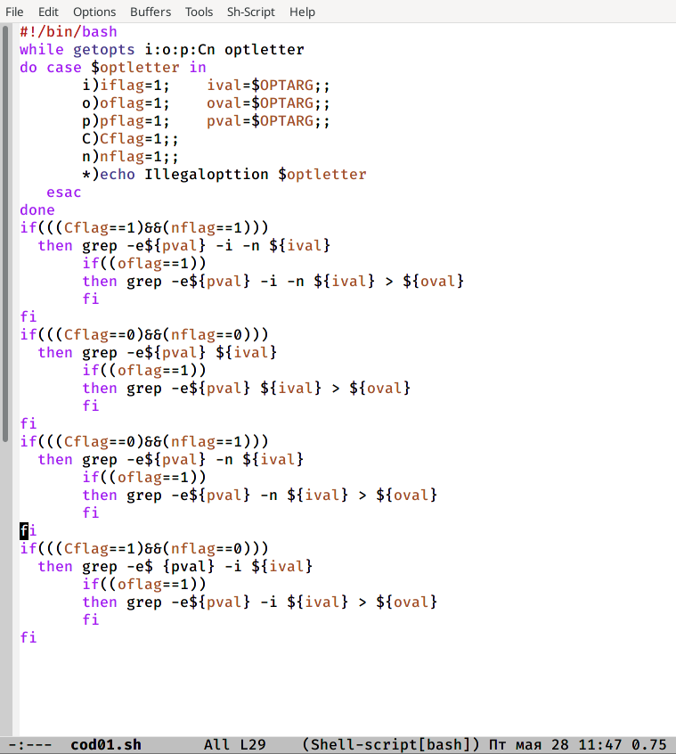{ #fig:001 width=70% }

Используя команды getopts grep, который анализирует командную строку с ключами. Во-первых, в цикле while применила команду getopts, которая будет распознавать аргумент, и если это так вернёт истину. Также для флагов, которые ожидают дополнительное значение, пишем OPTARG, который будет устанавливаться в значение этого аргумента. И в цикле с  помощью оператора case я расписала опрерации, которые необходимо будет выполнить. Также для того чтобы выводить в указанном файле нужные строки, определяемые ключом -p,  я проверяла условия, то есть чему в результате работы case, были равны флаги и после это командой grep, выбирала нужные строки, при этом если Cflag=1 в grep используем опцию -i, а если nflag=1 -n. (рис. -@fig:001)

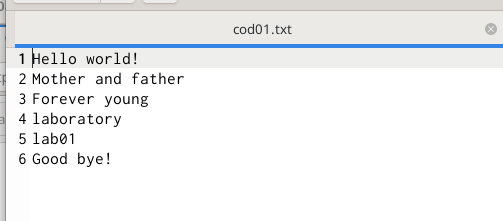{ #fig:002 width=70% }

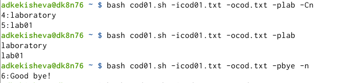{ #fig:003 width=70% }

После написания командного файла, текстовый файл (рис. -@fig:002) , после чего вызвала  командый файл командой bash (командый файл) (новый файл) и далее желаемые опции+название текстового файла(например, -icod01.txt). Я искала в своём тексте lab и bye. (рис. -@fig:003) 

## Выполнение 2-го пункта задания

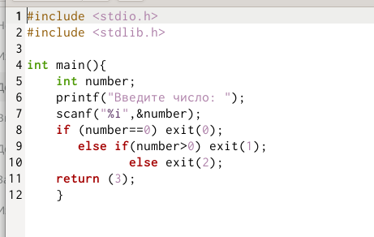{ #fig:004 width=70% }

Написала на языке Си программу, которая вводит число и определяет, является ли оно больше нуля, меньше нуля или равно нулю. Затем программа завершается с помощью функции exit(n), передавая информацию в о коде завершения в оболочку. Если число равно нулю exit(0), если больше нуля - exit(1), если меньше - exit(2). (рис. -@fig:004)

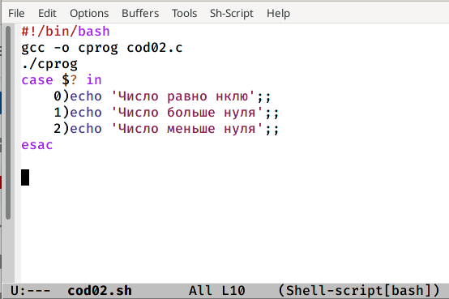{ #fig:005 width=70% }

После написала командный файл, который вызывает эту программу и, анализируя с помощью команды $?, выдаёт сообщение о том, какое число было введено.(рис. -@fig:005)

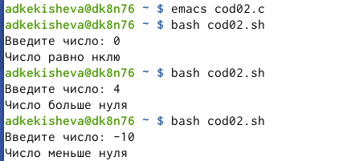{ #fig:006 width=70% }

После, проверила выполнение командного файла, вызвав его командой bash. (рис. -@fig:006)

## Выполнение 3-го пункта задания 
 
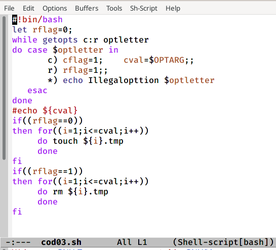{ #fig:007 width=70% }

Написала командный файл, создающий указанное число файлов, пронумерованных последовательно от 1 до N (например1.tmp,2.tmp,3.tmp,4.tmp и т.д.).Число файлов, которые необходимо создать, передаётся в аргументы командной строки.Для этого я воспользовалась командой getopts и у меня получилось два флага c - создание и r - удаление. Напртив cflag пишем OPTARG, так как ожидаются дополнительные значения, так как мы будем создавать файлы. И далее, взависимоти от того, какой файл мы применим, то есть какой будет равен 1 в результате работы case. Если флаг удаление равен нулю мы созаём файлы, количество которых регулируется циклом, там же задаётся расширение, а если флаг удаления равен 1, то удаляем эти файлы.(рис. -@fig:007)

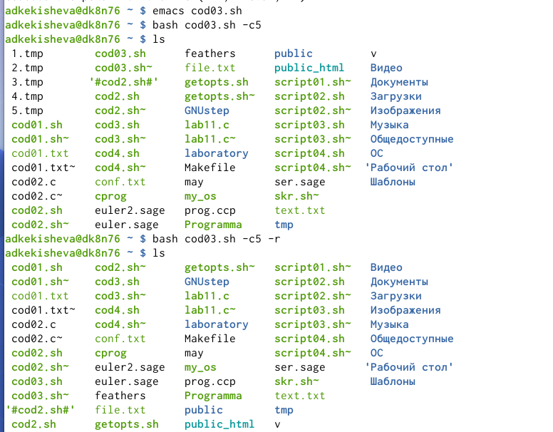{ #fig:008 width=70% }

Вызвала командный файл и попробовала создать 5 файлов, используя для этого опции -с5. И после удалила их той же командой + используя опцию -r. (рис. -@fig:008)

## Выполнение 4-го пункта задания 

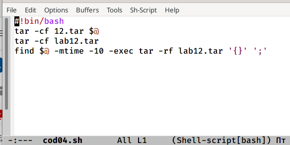{ #fig:009 width=70% }

Написала командный файл, который с помощью команды tar запаковывает в архив все файлы в указанной директории. и модифицировала его так, чтобы запаковывались только те файлы, которые были изменены менее недели тому назад, для этого использовала команду find. Когда я попробовала осуществить это архив создавался пустым, поэтому я решила  сдела 10 дней. Во-первых я создаю архив tar -cf и для выбора директории пишу $@.Все файлы будут архивированны в lab12.tar. После применяю команду find, где указываем директорию, затем -mtime n*24, указываю вместо n=10, далее идёт опция -exec '{}' ';',которая выполняет truе, если  верно условие на дни и запускает указанную команду (tar -f использовать файл или устройство АРХИВ и -r добавление файлов в конец
архива)для выбранных файлов. (рис. -@fig:009)

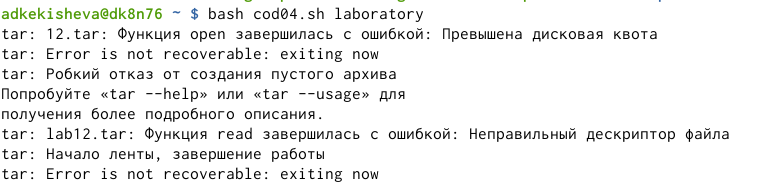{ #fig:010 width=70% }

Запустила командый файл, на этом моменте мне выдалось много ошибок, но в итоге архив создался. (рис. -@fig:010)

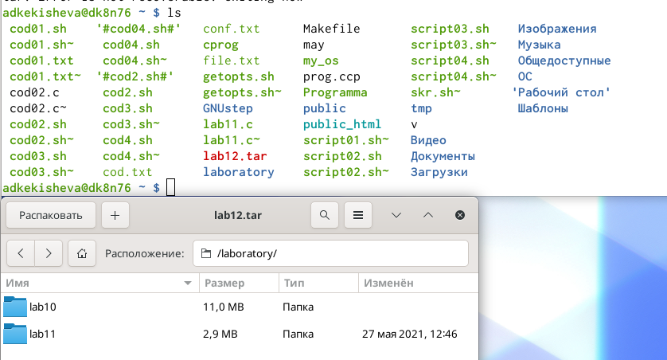{ #fig:011 width=70% }

Результат работы командного файла. (рис. -@fig:011)

# Вывод

Я продолжила изучать основы программирования в оболочке ОС UNIX. Научилась писать более сложные командные файлы с использованием логических управляющих конструкций и циклов.

# Библиография
1. [Ссылка 1](https://vk.com/im?peers=311102850&sel=c80)

**Контрольные вопросы:**

1. Каково предназначение команды getopts?

Команда getopts осуществляет синтаксический анализ командной строки, выделяя флаги, и используется для объявления переменных. Синтаксис команды следующий: getopts option-string variable [arg ... ]

2. Какое отношение метасимволы имеют к генерации имён файлов?

Метасимволы используют при генерации имен, например:

- * произвольная (возможно пустая) последовательность символов;

- ? один произвольный символ;

- [...] любой из символов, указанных в скобках перечислением и/или с указанием диапазона;

- cat f* выдаст все файлы каталога, начинающиеся с "f";

- cat *f* выдаст все файлы, содержащие "f";

- cat program.? выдаст файлы данного каталога с однобуквенными расширениями, скажем "program.c" и "program.o", но не выдаст "program.com";

- cat [a-d]* выдаст файлы, которые начинаются с "a", "b", "c", "d". Аналогичный эффект дадут и команды "cat [abcd]*" и "cat [bdac]*". 

3. Какие операторы управления действиями вы знаете? <, >,

Операторы && и || являются управляющими операторами. Если в командной строке стоит command1 && command2, то command2 выполняется в том, и только в том случае, если статус выхода из команды command1 равен нулю, что говорит об успешном ее завершении. Аналогично, если командная строка имеет вид command1 || command2, то команда command2 выполняется тогда, и только тогда, когда статус выхода из команды command1 отличен от нуля.

4. Какие операторы используются для прерывания цикла?

Для прерывания цикла используются операторы break, continue:

Команда break завершает выполнение цикла, а команда continue завершает данную итерацию блока операторов. Команда break полезна для завершения цикла while в ситуациях, когда условие перестаёт быть правильным. Команда continue используется в ситуациях, когда больше нет необходимости выполнять блок операторов, но вы можете захотеть продолжить проверять данный блок на других условных выражениях

5. Для чего нужны команды false и true?

Команда true всегда возвращает ноль в качестве выходного статуса для индикации успеха. Команда false всегда возвращает не-ноль в качестве выходного статуса для индикации неудачи. Во всех управляющих конструкциях в качестве логического значения используется код возврата из программы, указанной в качестве условия. Код возврата 0 – истина, любое другое значение – ложь. Программа true – всегда завершается с кодом 0, false – всегда завершается с кодом 1.

6. Что означает строка if test -f man$s/$i.$s, встреченная в командном файле?

Введенная строка означает условие существования файла man$s/$i.$s

7. Объясните различия между конструкциями while и until.

Цикл While выполняется до тех пор, пока указанное в нем условие истинно. Когда указанное условие становится ложным - цикл завершается. Цикл Until выполняется до тех пор, пока указанное в нем условие ложно
