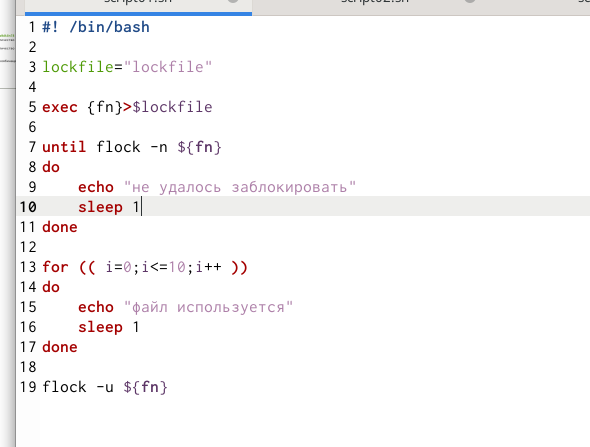
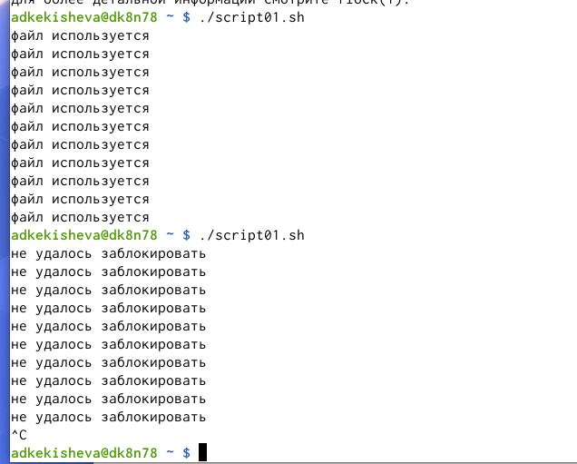
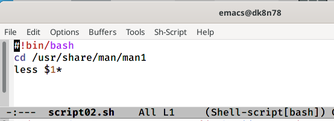
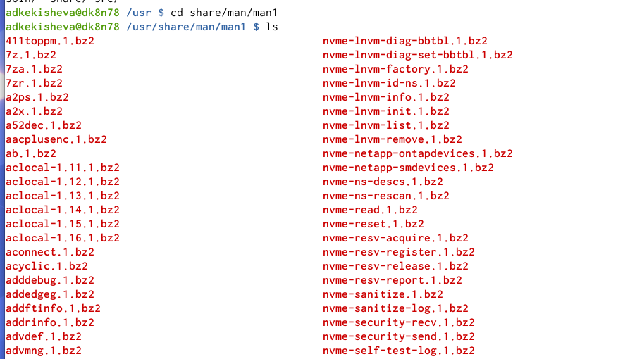
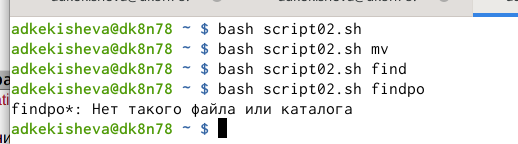
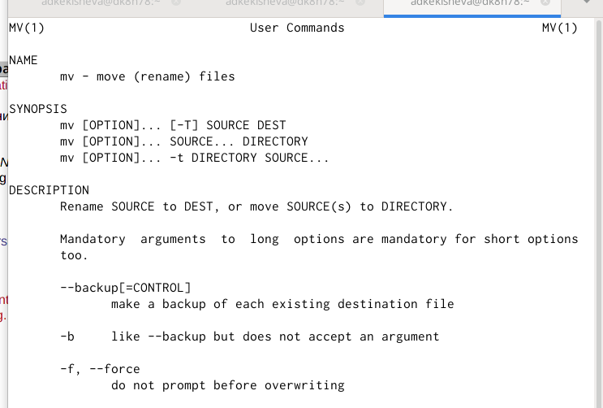
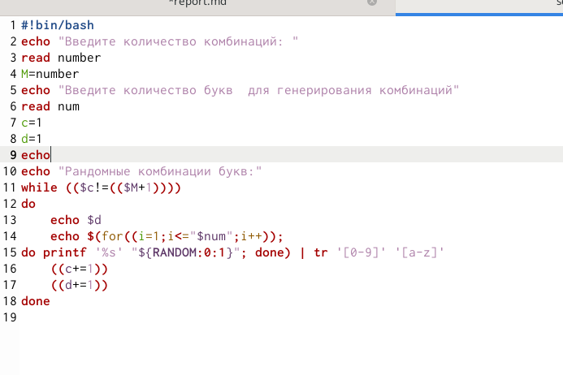
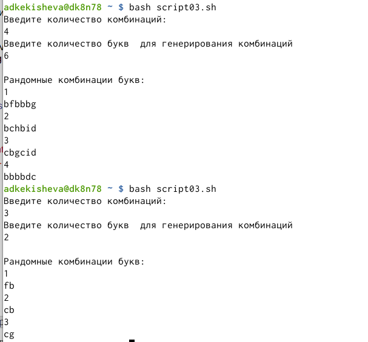

---
## Front matter
lang: ru-RU
title: Лабораторная работа №13. Программирование в командном процессоре ОС UNIX. Расширенное программирование.

author: 
	Кекишева Анастасия Дмитриевна, НБИ-01-20, \inst{}

institute: |
	\inst{1}RUDN University, Moscow, Russian Federation
date: 30 апреля, 2021

## Formatting
toc: false
slide_level: 2
theme: metropolis
header-includes: 
 - \metroset{progressbar=frametitle,sectionpage=progressbar,numbering=fraction}
 - '\makeatletter'
 - '\beamer@ignorenonframefalse'
 - '\makeatother'
aspectratio: 43
section-titles: true
---

## Цель работы

Изучить основы программирования в оболочке ОС UNIX. Научиться писать более сложные командные файлы с использованием логических управляющих конструкций и циклов.

## Задачи

1. Написать командный файл, реализующий упрощённый механизм семафоров. 
2. Реализовать команду man с помощью командного файла. Командный файл должен получать в виде аргумента командной строки название команды и в виде результата выдавать справку об этой команде или сообщение об отсутствии справки, если соответствующего файла нет в каталоге man1.
3. Используя встроенную переменную $RANDOM, напишите командный файл, генерирующий случайную последовательность букв латинского алфавита. 

# Выполнение 1-го пункта задания 

## Командный файл, реализующий упрощённый механизм семафоров
{ #fig:001 width=70% }

## Результат выполнения командного файла
{ #fig:002 width=70% }

# Выполнение 2-го пункта задания
## Командный файл реализующий команду man
{ #fig:003 width=70% }

## Содержимое каталога /usr/share/man/man1
{ #fig:004 width=70% }

## Вызов командного файла программы
{ #fig:005 width=70% }

## Результат работы программы
{ #fig:006 width=70% }

# Выполнение 3-го пункта задания 

## Командный файл, генерирующий случайную последовательность букв латинского алфавита
{ #fig:007 width=70% }

## Результат работы программы
{ #fig:008 width=70% }

## Вывод

Я продолжила изучение основ программирования в оболочке ОС UNIX. Научилась писать более сложные командные файлы с использованием логических управляющих конструкций и циклов.

## Библиография
1. [Ссылка 1](https://esystem.rudn.ru/mod/resource/view.php?id=719019)
2. [Ссылка 2](https://losst.ru/komanda-tr-v-linux)

