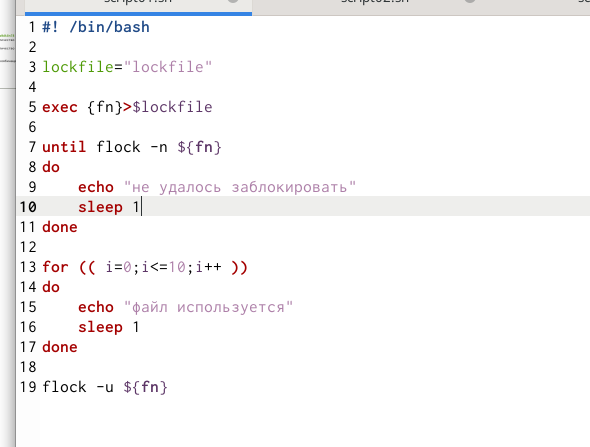
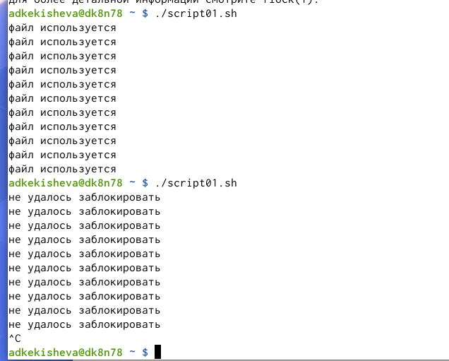
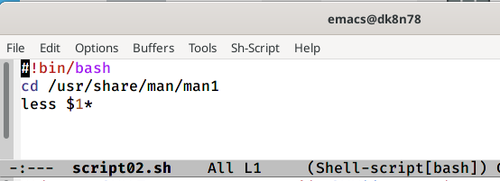
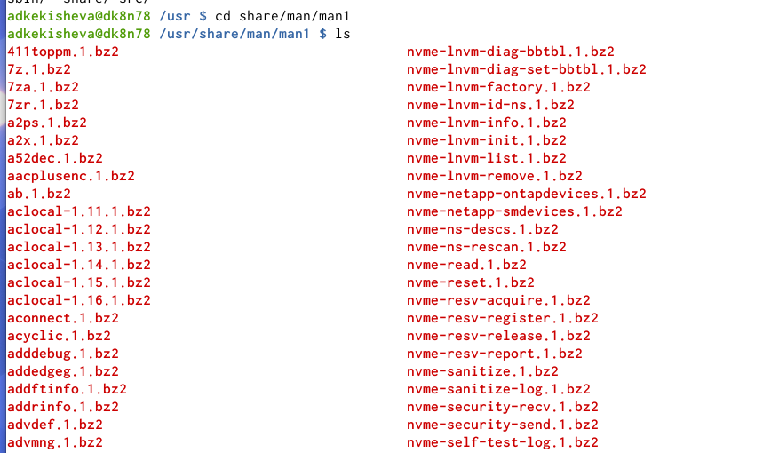
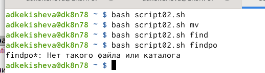
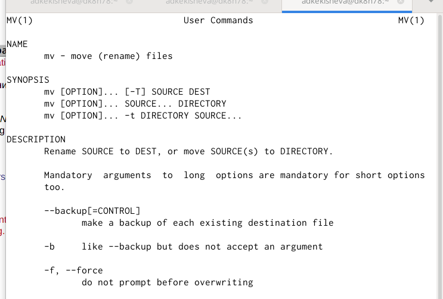
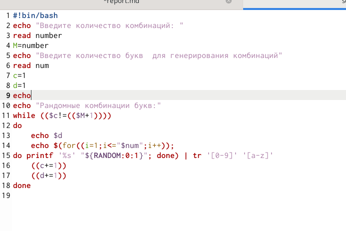
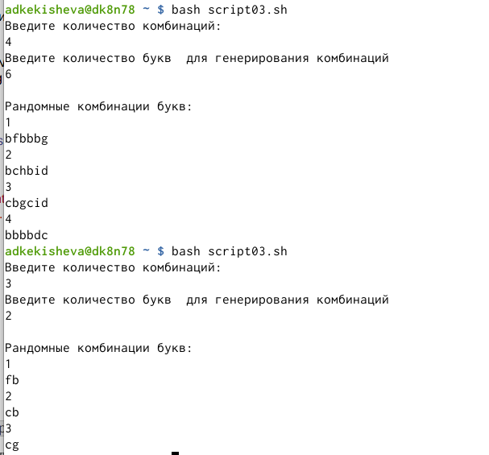

---
# Front matter
lang: ru-RU
title: "Отчёт к лабораторной работе №13"
subtitle: " Программирование в командном процессоре ОС UNIX. Расширенное программирование" 
author: "Кекишева Анастасия Дмитриевна"

# Formatting
toc-title: "Содержание"
toc: true # Table of contents
toc_depth: 2
lof: true # List of figures
lot: true # List of tables
fontsize: 12pt
linestretch: 1.5
papersize: a4paper
documentclass: scrreprt
polyglossia-lang: russian
polyglossia-otherlangs: english
mainfont: PT Serif
romanfont: PT Serif
sansfont: PT Sans
monofont: PT Mono
mainfontoptions: Ligatures=TeX
romanfontoptions: Ligatures=TeX
sansfontoptions: Ligatures=TeX,Scale=MatchLowercase
monofontoptions: Scale=MatchLowercase
indent: true
pdf-engine: lualatex
header-includes:
  - \linepenalty=10 # the penalty added to the badness of each line within a paragraph (no associated penalty node) Increasing the value makes tex try to have fewer lines in the paragraph.
  - \interlinepenalty=0 # value of the penalty (node) added after each line of a paragraph.
  - \hyphenpenalty=50 # the penalty for line breaking at an automatically inserted hyphen
  - \exhyphenpenalty=50 # the penalty for line breaking at an explicit hyphen
  - \binoppenalty=700 # the penalty for breaking a line at a binary operator
  - \relpenalty=500 # the penalty for breaking a line at a relation
  - \clubpenalty=150 # extra penalty for breaking after first line of a paragraph
  - \widowpenalty=150 # extra penalty for breaking before last line of a paragraph
  - \displaywidowpenalty=50 # extra penalty for breaking before last line before a display math
  - \brokenpenalty=100 # extra penalty for page breaking after a hyphenated line
  - \predisplaypenalty=10000 # penalty for breaking before a display
  - \postdisplaypenalty=0 # penalty for breaking after a display
  - \floatingpenalty = 20000 # penalty for splitting an insertion (can only be split footnote in standard LaTeX)
  - \raggedbottom # or \flushbottom
  - \usepackage{float} # keep figures where there are in the text
  - \floatplacement{figure}{H} # keep figures where there are in the text
---

# Цель работы

Изучить основы программирования в оболочке ОС UNIX. Научиться писать более сложные командные файлы с использованием логических управляющих конструкций и циклов.

# Задание
**Выполнить данные пункты:**

1. Написать командный файл, реализующий упрощённый механизм семафоров. Командный файл должен в течение некоторого времени t1 дожидаться освобождения ресурса, выдавая об этом сообщение, а дождавшись его освобождения, использовать его в течение некоторого времени t2<>t1, также выдавая информацию о том, что ресурс используется соответствующим командным файлом (процессом). Запустить командный файл в одном виртуальном терминале в фоновом режиме, перенаправив его вывод в другой (> /dev/tty#, где # — номер терминала куда перенаправляется вывод), в котором также запущен этот файл, ноне фоновом, а в привилегированном режиме. Доработать программу так, чтобы имелась возможность взаимодействия трёх и более процессов.
2. Реализовать команду man с помощью командного файла. Изучите содержимое каталога /usr/share/man/man1. В нем находятся архивы текстовых файлов,содержащих справку по большинству установленных в системе программ и команд. Каждый архив можно открыть командой less сразу же просмотрев содержимое справки. Командный файл должен получать в виде аргумента команднойстроки название команды и в виде результата выдавать справку об этой команде или сообщение об отсутствии справки, если соответствующего файла нет вкаталоге man1.
3. Используя встроенную переменную $RANDOM, напишите командный файл, генерирующий случайную последовательность букв латинского алфавита. Учтите,что $RANDOM выдаёт псевдослучайные числа в диапазоне от 0 до 32767.

# Выполнение лабораторной работы
Перед выполнением лабораторной работы я хорошо ознакомилась с теоритическим материалом для её выполнения [Ссылка 1](https://esystem.rudn.ru/mod/resource/view.php?id=719019)

## Выполнение 1-го пункта задания 

{ #fig:001 width=70% }

Командный файл в течение некоторого времени t1 дожидается освобождения ресурса, выдавая об этом сообщение, а дождавшись его освобождения, использует файл в течение некоторого времени t2<>t1, также выдавая информацию о том, что ресурс используется соответствующим командным файлом (процессом). 
Цикл until крутится до тех пор, пока условие не станет истинным (рис. 3.1).

{ #fig:002 width=70% }

Запустила файл в двух консолях и проверила правильность работы. (рис. 3.2). К сожалению, нам не удалось её исправить. Скорее всего, это ошибка в системе, файл не выполняет свои функции.

## Выполнение 2-го пункта задания

{ #fig:003 width=70% }

{ #fig:004 width=70% }

Реализовала команду man с помощью командного файла (рис. 3.3). Изучила содержимое каталога /usr/share/man/man1 (рис. 3.4), в нем находятся архивы текстовых файлов,содержащих справку по большинству установленных в системе программ и команд. Каждый архив можно открыть командой less сразу же просмотрев содержимое справки. Командный файл получает в виде аргумента командной строки название команды и в результате выдаёт справку об этой команде или сообщение об отутсвии каталога с информацией об этой команде, если команда набрана не правильно.

{ #fig:005 width=70% }

{ #fig:006 width=70% }

После, проверила выполнение командного файла (рис. 3.5), вызвав его командой bash. И получила информацию о команде, которую ввела в командной строке (рис. 3.6) . Если нет команды, то вылезет сообщение об ошибке.

## Выполнение 3-го пункта задания 
 
{ #fig:007 width=70% }

Используя встроенную переменную $RANDOM, написала командный файл, генерирующий случайную последовательность букв латинского алфавита (рис. 3.7) . Учла, что $RANDOM выдаёт псевдослучайные числа в диапазоне от 0 до 32767.
Для начала я прошу пользователя введсти количесво комбинаций для вывода и количество букв для генерирования этих комбинаций. Далее в цикле  while я регулирую количество комбинаций и  и пока с!= М+1 я делаю: цикл for, который будет регулировать количество букв и осущетвляю печать рандомной комбинации, используя встроенную переменную $RANDOM, а такжеприменяю конвеер с командой tr [Ссылка 2](https://losst.ru/komanda-tr-v-linux), которая обрабатывает текст посимвольно и задаю для обработки цифры от 0 до 9 и английский алфавит.

{ #fig:008 width=70% }

Запустила программу, ввела необходимые данные и получила введённое количество рандомных сочетаний букв. (рис. 3.8)

# Вывод

Я продолжила изучение основ программирования в оболочке ОС UNIX. Научилась писать более сложные командные файлы с использованием логических управляющих конструкций и циклов.

# Библиография
1. [Ссылка 1](https://esystem.rudn.ru/mod/resource/view.php?id=719019)
2. [Ссылка 2](https://losst.ru/komanda-tr-v-linux)

# Контрольные вопросы

1. В строке while [$1 != "exit"] квадратные скобки надо заменить на двойные круглые: while (($1 != "exit")).

2. Есть несколько видов конкатенации строк. Например:

- VAR1="Hello,"

- VAR2=" World"

- VAR3="$VAR1$VAR2"

- echo "$VAR3"

3. Команда seq выводит последовательность целых или действительных чисел, подходящую для передачи в другие программы. В bash можно использовать seq с циклом for, используя подстановку команд. Например:

>$ for i in $(seq 1 0.5 4)

>do

>echo "The number is $i"

>done

4. Результатом вычисления выражения $((10/3)) будет число 3.

5. Список того, что можно получить, используя Z Shell вместо Bash:

Встроенная команда zmv поможет массово переименовать файлы/директории, например, чтобы добавить ‘.txt’ к имени каждого файла, запустите zmv –C '(*)(#q.)' '$1.txt'.

Утилита zcalc — это замечательный калькулятор командной строки, удобный способ считать быстро, не покидая терминал.

Команда zparseopts — это однострочник, который поможет разобрать сложные варианты, которые предоставляются скрипту.

Команда autopushd позволяет делать popd после того, как с помощью cd, чтобы вернуться в предыдущую директорию.

Поддержка чисел с плавающей точкой (коей Bash не содержит).

Поддержка для структур данных «хэш».

Есть также ряд особенностей, которые присутствуют только в Bash:

Опция командной строки –norc, которая позволяет пользователю иметь дело с инициализацией командной строки, не читая файл .bashrc

Использование опции –rcfile <filename> с bash позволяет исполнять команды из определённого файла.

Отличные возможности вызова (набор опций для командной строки)

Может быть вызвана командой sh

Bash можно запустить в определённом режиме POSIX. Примените set –o posix, чтобы включить режим, или ––posix при запуске.

Можно управлять видом командной строки в Bash. Настройка переменной PROMPT_COMMAND с одним или более специальными символами настроит её за вас.

Bash также можно включить в режиме ограниченной оболочки (с rbash или --restricted), это означает, что некоторые команды/действия больше не будут доступны:

Настройка и удаление значений служебных переменных SHELL, PATH, ENV, BASH_ENV

Перенаправление вывода с использованием операторов ‘>’, ‘>|’, ‘<>’, ‘>&’, ‘&>’, ‘>>’

Разбор значений SHELLOPTS из окружения оболочки при запуске.

Использование встроенного оператора exec, чтобы заменить оболочку другой командой

6. Синтаксис конструкции for ((a=1; a <= LIMIT; a++)) верен.

7. Язык bash и другие языки программирования:

-Скорость работы программ на ассемблере может быть более 50% медленнее, чем программ на си/си++, скомпилированных с максимальной оптимизацией;

-Скорость работы виртуальной ява-машины с байт-кодом часто превосходит скорость аппаратуры с кодами, получаемыми трансляторами с языков высокого уровня. Ява-машина уступает по скорости только ассемблеру и лучшим оптимизирующим трансляторам;

-Скорость компиляции и исполнения программ на яваскрипт в популярных браузерах лишь в 2-3 раза уступает лучшим трансляторам и превосходит даже некоторые качественные компиляторы, безусловно намного (более чем в 10 раз) обгоняя большинство трансляторов других языков сценариев и подобных им по скорости исполнения программ;

-Скорость кодов, генерируемых компилятором языка си фирмы Intel, оказалась заметно меньшей, чем компилятора GNU и иногда LLVM;

-Скорость ассемблерных кодов x86-64 может меньше, чем аналогичных кодов x86, примерно на 10%;

-Оптимизация кодов лучше работает на процессоре Intel;

-Скорость исполнения на процессоре Intel была почти всегда выше, за исключением языков лисп, эрланг, аук (gawk, mawk) и бэш. Разница в скорости по бэш скорее всего вызвана разными настройками окружения на тестируемых системах, а не собственно транслятором или железом. Преимущество Intel особенно заметно на 32-разрядных кодах;

-Стек большинства тестируемых языков, в частности, ява и яваскрипт, поддерживают только очень ограниченное число рекурсивных вызовов. Некоторые трансляторы (gcc, icc, ...) позволяют увеличить размер стека изменением переменных среды исполнения или параметром;

-В рассматриваемых версиях gawk, php, perl, bash реализован динамический стек, позволяющий использовать всю память компьютера. Но perl и, особенно, bash используют стек настолько экстенсивно, что 8-16 ГБ не хватает для расчета ack(5,2,3) 

