---
## Front matter
lang: ru-RU
title: Лабораторная работа №14. Средства, применяемые при разработке программного обеспечения в ОС типа UNIX/Linux.

author: 
	Кекишева Анастасия Дмитриевна, НБИ-01-20, \inst{}

institute: |
	\inst{1}RUDN University, Moscow, Russian Federation
date: 30 апреля, 2021

## Formatting
toc: false
slide_level: 2
theme: metropolis
header-includes: 
 - \metroset{progressbar=frametitle,sectionpage=progressbar,numbering=fraction}
 - '\makeatletter'
 - '\beamer@ignorenonframefalse'
 - '\makeatother'
aspectratio: 43
section-titles: true
---

## Цель работы

Приобрести простейшие навыки разработки, анализа, тестирования и отладки приложений в ОС типа UNIX/Linux на примере создания на языке программирования С калькулятора с простейшими функциями.

## Задачи
1. В домашнем каталоге создайте подкаталог~/work/os/lab_prog.
2. Создайте в нём файлы:calculate.h,calculate.c,main.c.
3. Выполните компиляцию программы посредством gcc;
4. Создайте Makefile со следующим содержанием.
5. С помощью gdb выполните отладку программы calcul (перед использованием gdb исправьте Makefile)
6. С помощью утилиты splint попробуйте проанализировать коды файлов calculate.c и main.c.

# Выполнение лабораторной работы
## Файл calculate.c
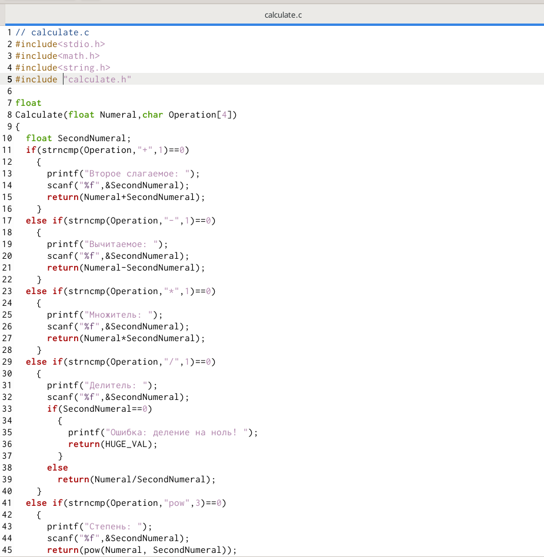{ #fig:001 width=70% }

## Файл calculate.h
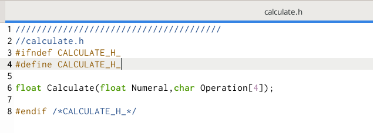{ #fig:002 width=70% }

## Файл main.c
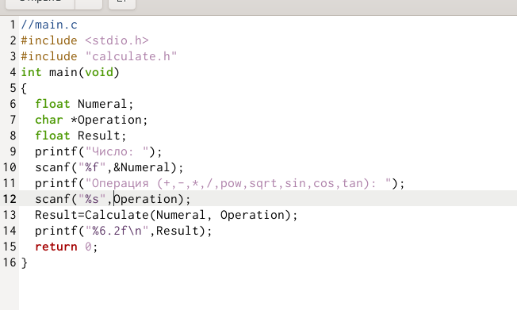{ #fig:003 width=70% } 

## Компиляция программ
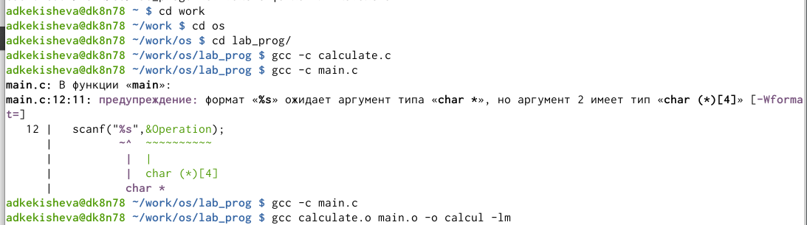{ #fig:004 width=70% } 

## Makefile
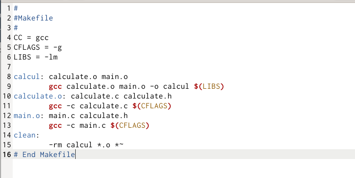{ #fig:005 width=70% } 

## Компиляция Makefile
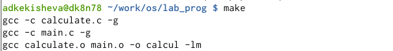{ #fig:006 width=70% } 

## Отладку программы calcul, запуск через gdb

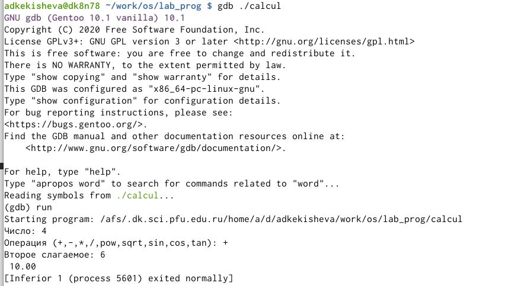{ #fig:007 width=70% } 

## Просмотр кода: list
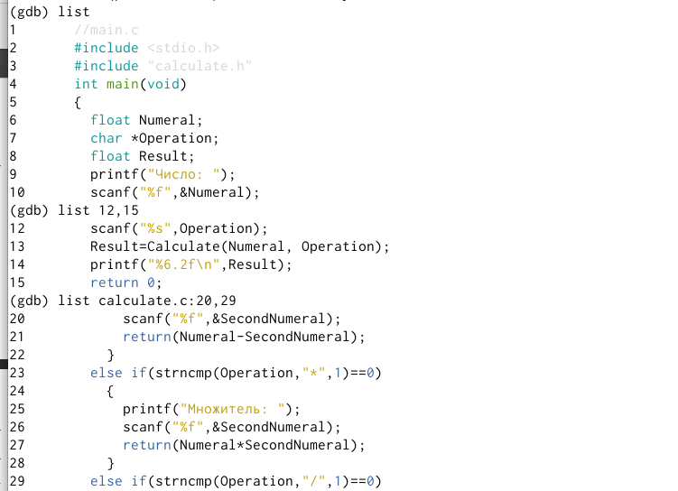{ #fig:008 width=70% } 

## Установка и удаление точки останова
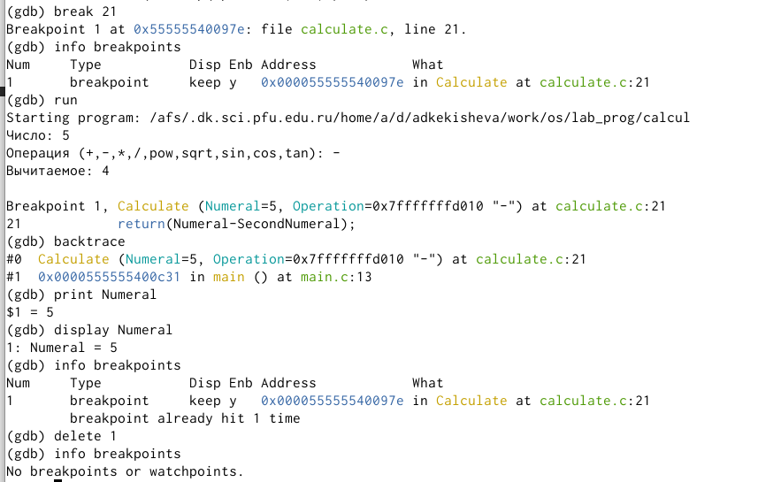{ #fig:009 width=70% } 

## Код файла calculate.c
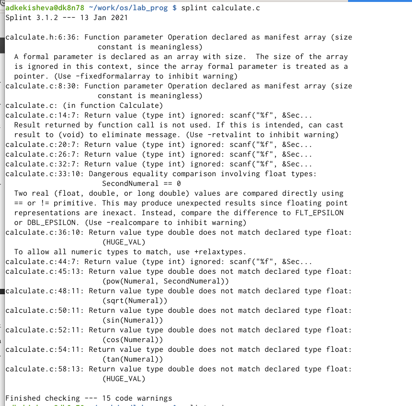{ #fig:010 width=70% } 

## Код файла main.c
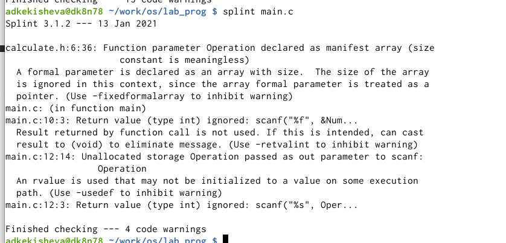{ #fig:011 width=70% } 

## Вывод
Я приобрела простейшие навыки разработки, анализа, тестирования и отладки приложений в ОС типа UNIX/Linux на примере создания на языке программирования С калькулятора с простейшими функциями.

## Библиография
1. [Ссылка 1](https://esystem.rudn.ru/mod/resource/view.php?id=719028)
