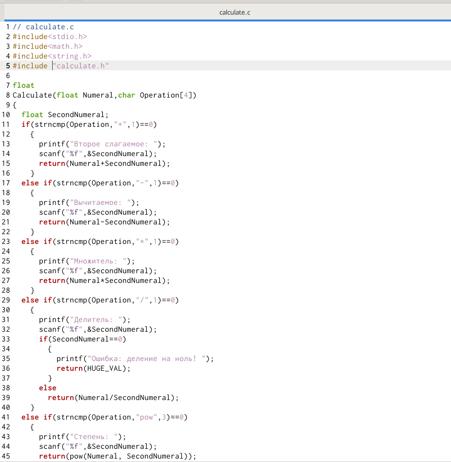
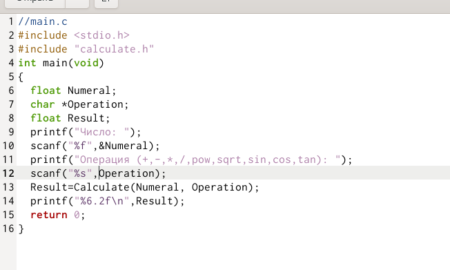
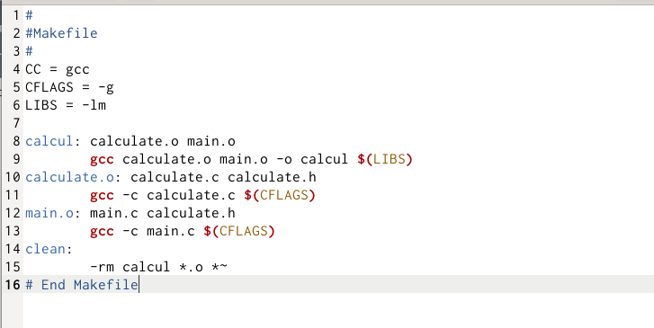
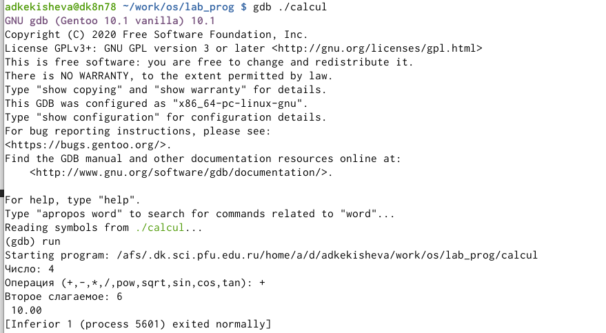
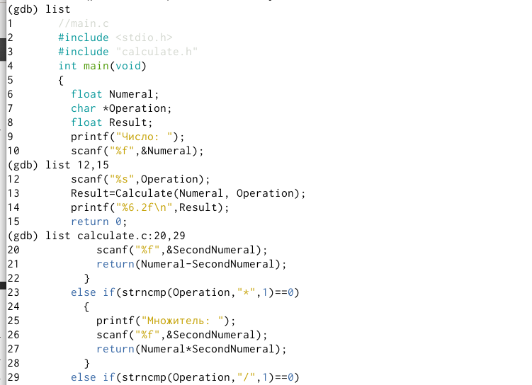
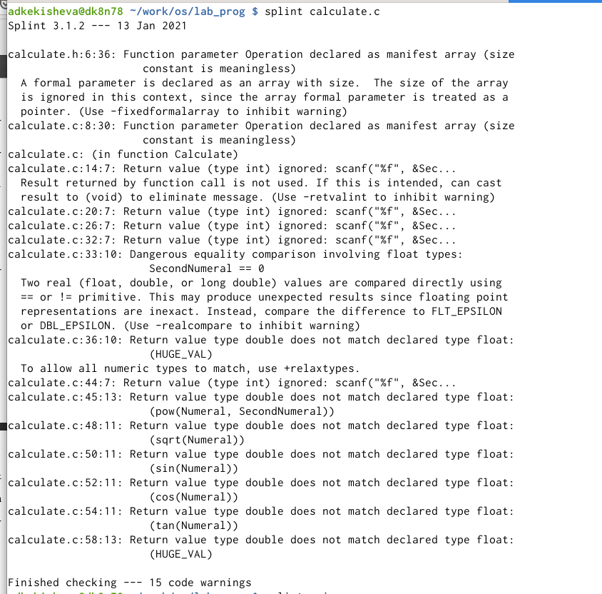

---
# Front matter
lang: ru-RU
title: "Отчёт к лабораторной работе №14"
subtitle: " Средства, применяемые при разработке программного обеспечения в ОС типа UNIX/Linux" 
author: "Кекишева Анастасия Дмитриевна"

# Formatting
toc-title: "Содержание"
toc: true # Table of contents
toc_depth: 2
lof: true # List of figures
lot: true # List of tables
fontsize: 12pt
linestretch: 1.5
papersize: a4paper
documentclass: scrreprt
polyglossia-lang: russian
polyglossia-otherlangs: english
mainfont: PT Serif
romanfont: PT Serif
sansfont: PT Sans
monofont: PT Mono
mainfontoptions: Ligatures=TeX
romanfontoptions: Ligatures=TeX
sansfontoptions: Ligatures=TeX,Scale=MatchLowercase
monofontoptions: Scale=MatchLowercase
indent: true
pdf-engine: lualatex
header-includes:
  - \linepenalty=10 # the penalty added to the badness of each line within a paragraph (no associated penalty node) Increasing the value makes tex try to have fewer lines in the paragraph.
  - \interlinepenalty=0 # value of the penalty (node) added after each line of a paragraph.
  - \hyphenpenalty=50 # the penalty for line breaking at an automatically inserted hyphen
  - \exhyphenpenalty=50 # the penalty for line breaking at an explicit hyphen
  - \binoppenalty=700 # the penalty for breaking a line at a binary operator
  - \relpenalty=500 # the penalty for breaking a line at a relation
  - \clubpenalty=150 # extra penalty for breaking after first line of a paragraph
  - \widowpenalty=150 # extra penalty for breaking before last line of a paragraph
  - \displaywidowpenalty=50 # extra penalty for breaking before last line before a display math
  - \brokenpenalty=100 # extra penalty for page breaking after a hyphenated line
  - \predisplaypenalty=10000 # penalty for breaking before a display
  - \postdisplaypenalty=0 # penalty for breaking after a display
  - \floatingpenalty = 20000 # penalty for splitting an insertion (can only be split footnote in standard LaTeX)
  - \raggedbottom # or \flushbottom
  - \usepackage{float} # keep figures where there are in the text
  - \floatplacement{figure}{H} # keep figures where there are in the text
---

# Цель работы

Приобрести простейшие навыки разработки, анализа, тестирования и отладки приложений в ОС типа UNIX/Linux на примере создания на языке программирования С калькулятора с простейшими функциями.

# Задание
**Выполнить следующие пункты:**

1. В домашнем каталоге создайте подкаталог~/work/os/lab_prog.
2. Создайте в нём файлы:calculate.h,calculate.c,main.c.
3. Выполните компиляцию программы посредством gcc:
> gcc -c calculate.c
> gcc -c main.c 
> gcc calculate.o main.o -o calcul -lm
4. Создайте Makefile со следующим содержанием.
5. С помощью gdb выполните отладку программы calcul (перед использованием gdb исправьте Makefile)
6. С помощью утилиты splint попробуйте проанализировать коды файлов calculate.c и main.c.

# Выполнение лабораторной работы
Перед выполнением лабораторной работы я хорошо ознакомилась с теоритическим материалом для её выполнения [Ссылка 1](https://esystem.rudn.ru/mod/resource/view.php?id=719028)

{ #fig:001 width=70% }

{ #fig:002 width=70% }

{ #fig:003 width=70% } 

1. В домашнем каталоге создала подкаталог ~/work/os/lab_prog. 
2. Создала в нём файлы:calculate.h (рис. 3.1), calculate.c (рис. 3.2), main.c (рис. 3.3).Это примитивнейший калькулятор, способный складывать, вычитать,умножать и делить, возводить число в степень, брать квадратный корень, вычислять sin, cos, tan. При запуске он запрашивает первое число, операцию, второе число. После этого программа выводит результат и останавливается.

{ #fig:004 width=70% } 

3. Выполнила компиляцию программы посредством gcc (рис. 3.4): 

> gcc -c calculate.c

> gcc -c main.c

> gcc calculate.o main.o -o calcul -lm.

Сначала у меня вылезла ошибка при компиляции main.c, чтобы её исправить, я сделал переменную Operation указателем на тип char. И в scanf передавала не ссылку, а значение этой переменной.

{ #fig:005 width=70% } 

{ #fig:006 width=70% } 

4. Создала Makefile (рис. 3.5). После знака = перед CFLAGS поставила опцию -g, чтобы отладочная информация содержалась в результирующем бинарном файле. Его содержание следующее: cначала задаётся список целей, в качестве цели в Makefile может выступать имя файла или название какого-то действия  разделённых пробелами, за которым идёт двоеточие и список зависимостей. Затем в следующих строках указываются команды. Строки с командами начинаются с табуляции. Зависимость задаёт исходные параметры (условия), которые необходимо выполнить для достижения цели.
Далее, скомпилировала программы командой make (рис. 3.6).

{ #fig:007 width=70% } 

6. С помощью gdb выполнила отладку программы calcul:
- Запустила отладчик GDB, загрузив в него программу для отладки: gdb ./calcul (рис. 3.7);
- Для запуска программы внутри отладчика ввела команду run (рис. 3.7);

{ #fig:008 width=70% } 

- Для постраничного (по 9 строк) просмотра исходного код воспользовалась командой list (рис. 3.8);
- Для просмотра строк с 12 по 15 основного файла воспользовалась командой list с параметрами: list 12,15;
- Для просмотра определённых строк не основного файла использовала list с параметрами: list calculate.c:20,29;

{ #fig:009 width=70% } 

- Установила точку останова в файле calculate.c на строке номер 21 командой break 21 (рис. 3.9);
- Вывела информацию об имеющихся в проекте точка останова info breakpoints;
- Запустила программу внутри отладчика и убедилась, что программа остановится в момент прохождения точки останова;
- Посмотрела, чему равно на этом этапе значение переменной Numeral, введя:print Numeral. На экран вывелось число 5.
- Сравнила с результатом вывода на экран после использования команды: display Numeral;
- Удалила точку останова delete 1;

{ #fig:010 width=70% } 

{ #fig:011 width=70% } 

7. С помощью утилиты splint проанализировала коды файлов calculate.c (рис. 3.10) и main.c (рис. 3.11). 
Для файла main.c: первое предупреждение говорит о том, что параметр Operetion воспринимается как массив. Далее, это это главная функция, эта функция возвращает  целочисленный тип.
Размер массива в этом контексте игнорируется, так как формальный параметр массива обрабатывается как
указатель.Используется значение value, которое не может быть инициализировано в значение на некотором
пути выполнения.
 
Для calculate.c: результат, возвращаемый вызовом функции, не используется. Если это предназначено, можно привести
результат к (void), чтобы исключить сообщение. Опасное сравнение равенства с использованием типов с плавающей точкой:второе число == 0. Два реальных значения (float, double или long double) сравниваются непосредственно с помощью или != примитивно. Это может привести к неожиданным результатам, поскольку представления с плавающей запятой неточны.

# Вывод
Я приобрела простейшие навыки разработки, анализа, тестирования и отладки приложений в ОС типа UNIX/Linux на примере создания на языке программирования С калькулятора с простейшими функциями.

# Библиография
1. [Ссылка 1](https://esystem.rudn.ru/mod/resource/view.php?id=719028)

**Контрольные вопросы:**

1. Информацию об этих программах можно получить с помощью функций info и man.

2. Unix поддерживает следующие основные этапы разработки приложений:

- создание исходного кода программы;
- представляется в виде файла;
- сохранение различных вариантов исходного текста;
- анализ исходного текста; необходимо отслеживать изменения исходного кода, а также при работе более двух программистов над проектом программы нужно, чтобы они не делали изменений кода в одно время;
- компиляция исходного текста и построение исполняемого модуля;
- тестирование и отладка; - проверка кода на наличие ошибок;
- сохранение всех изменений, выполняемых при тестировании и отладке.

3. Использование суффикса ".с" для имени файла с программой на языке Си отражает удобное и полезное соглашение, принятое в ОС UNIX. Для любого имени входного файла суффикс определяет какая компиляция требуется. Суффиксы и префиксы указывают тип объекта. Одно из полезных свойств компилятора Си — его способность по суффиксам определять типы файлов. По суффиксу .c компилятор распознает, что файл abcd.c должен компилироваться, а по суффиксу .o, что файл abcd.о является объектным модулем и для получения исполняемой программы необходимо выполнить редактирование связей. Простейший пример командной строки для компиляции программы abcd.c и построения исполняемого модуля abcd имеет вид: gcc -o abcd abcd.c. Некоторые проекты предпочитают показывать префиксы в начале текста изменений для старых (old) и новых (new) файлов. Опция – prefix может быть использована для установки такого префикса. Плюс к этому команда bzr diff -p1 выводит префиксы в форме которая подходит для команды patch -p1.

4. Основное назначение компилятора make языка Си заключается в компиляции всей программы в целом и получении исполняемого модуля.

5. При разработке большой программы, состоящей из нескольких исходных файлов заголовков, приходится постоянно следить за файлами, которые требуют перекомпиляции после внесения изменений. Программа make освобождает пользователя от такой рутинной работы и служит для документирования взаимосвязей между файлами. Описание взаимосвязей и соответствующих действий хранится в так называемом make-файле, который по умолчанию имеет имя makefile или Makefile.

6. В общем случае make-файл содержит последовательность записей (строк), определяющих зависимости между файлами. Первая строка записи представляет собой список целевых (зависимых) файлов, разделенных пробелами, за которыми следует двоеточие и список файлов, от которых зависят целевые. Текст, следующий за точкой с запятой, и все последующие строки, начинающиеся с литеры табуляции, являются командами OC UNIX, которые необходимо выполнить для обновления целевого файла. Таким образом, спецификация взаимосвязей имеет формат: target1 [ target2...]: [:] [dependment1...] [(tab)commands] [#commentary] [(tab)commands] [#commentary], где # — специфицирует начало комментария, так как содержимое строки, начиная с # и до конца строки, не будет обрабатываться командой make; : — последовательность команд ОС UNIX должна содержаться в одной строке make-файла (файла описаний), есть возможность переноса команд (\), но она считается как одна строка; :: — последовательность команд ОС UNIX может содержаться в нескольких последовательных строках файла описаний. Приведённый выше make-файл для программы abcd.c включает два способа компиляции и построения исполняемого модуля. Первый способ предусматривает обычную компиляцию с построением исполняемого модуля с именем abcd. Второй способ позволяет включать в исполняемый модуль testabcd возможность выполнить процесс отладки на уровне исходного текста. Пример можно найти в задании 5.

7. Пошаговая отладка программ заключается в том, что выполняется один оператор программы и, затем контролируются те переменные, на которые должен был воздействовать данный оператор. Если в программе имеются уже отлаженные подпрограммы, то подпрограмму можно рассматривать, как один оператор программы и воспользоваться вторым способом отладки программ. Если в программе существует достаточно большой участок программы, уже отлаженный ранее, то его можно выполнить, не контролируя переменные, на которые он воздействует. Использование точек останова позволяет пропускать уже отлаженную часть программы. Точка останова устанавливается в местах, где необходимо проверить содержимое переменных или просто проконтролировать, передаётся ли управление данному оператору. Практически во всех отладчиках поддерживается это свойство (а также выполнение программы до курсора и выход из подпрограммы). Затем отладка программы продолжается в пошаговом режиме с контролем локальных и глобальных

переменных, а также внутренних регистров микроконтроллера и напряжений на выводах этой микросхемы.

8. backtrace - вывод на экран пути к текущей точке останова (по сути

вывод названий всех функций)

break - установить точку останова (в качестве параметра может

быть указан номер строки или название функции)

clear - удалить все точки останова в функции

continue - продолжить выполнение программы

delete - удалить точку останова

display - добавить выражение в список выражений, значения которых отображаются при достижении точки останова программы

finish - выполнить программу до момента выхода из функции

info breakpoints - вывести на экран список используемых точек останова

info watchpoints - вывести на экран список используемых контрольных выражений

list - вывести на экран исходный код (в качестве параметра может быть указано название файла и через двоеточие номера начальной и конечной строк)

next - выполнить программу пошагово, но без выполнения вызываемых в программе функций

print - вывести значение указываемого в качестве параметра выражения

run - запуск программы на выполнение

set - установить новое значение переменной

step - пошаговое выполнение программы

watch - установить контрольное выражение, при изменении значения которого программа будет остановлена

9. 
- Выполнила компиляцию программы;
- Увидела ошибки в программе;
- Открыла редактор и исправила программу;
- Загрузила программу в отладчик gdb: run — отладчик выполнил программу, ввела требуемые значения.
- Использовала другие команды отладчика и проверила работу программы;

10. Отладчику не понравился формат %s для &Operation, т.к %s — символьный формат, а значит необходим только Operation.

11. Если вы работаете с исходным кодом, который не вами разрабатывался, то назначение различных конструкций может быть не совсем понятным. Система

разработки приложений UNIX предоставляет различные средства, повышающие понимание исходного кода. К ним относятся:

– cscope - исследование функций, содержащихся в программе;

– splint — критическая проверка программ, написанных на языке Си.

12. 
- Проверка корректности задания аргументов всех использованных в программе функций, а также типов возвращаемых ими значений;

- Поиск фрагментов исходного текста, корректных с точки зрения синтаксиса языка Си, но малоэффективных с точки зрения их реализации или содержащих в себе семантические ошибки;

- Общая оценка мобильности пользовательской программы.
