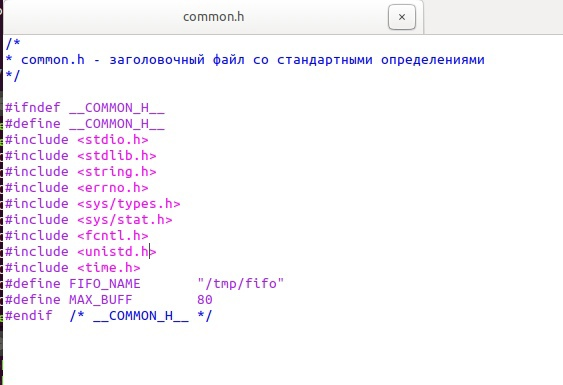
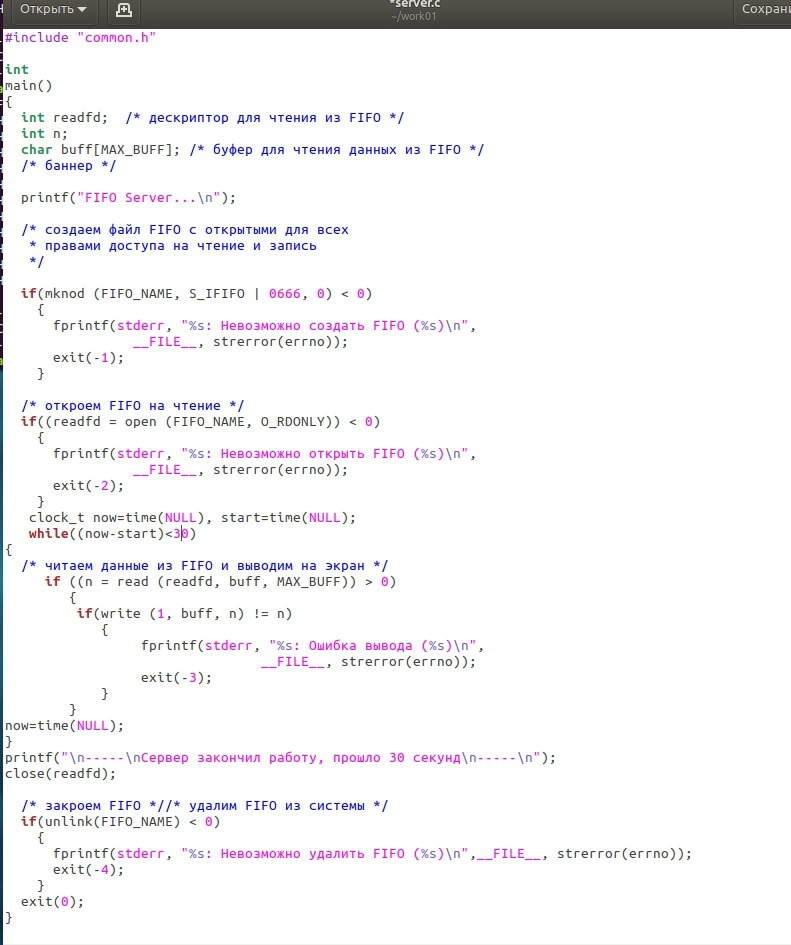
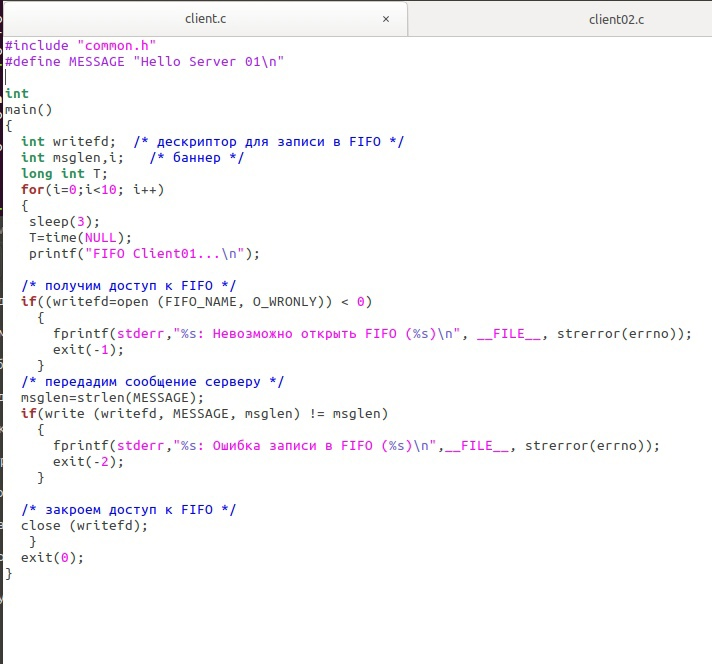
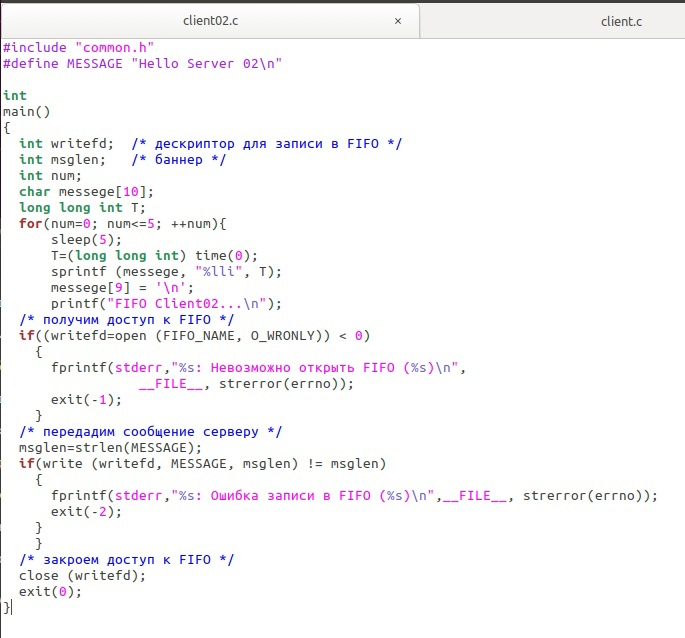
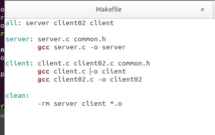
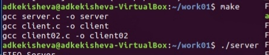
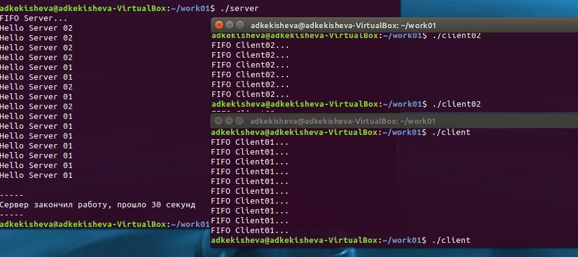
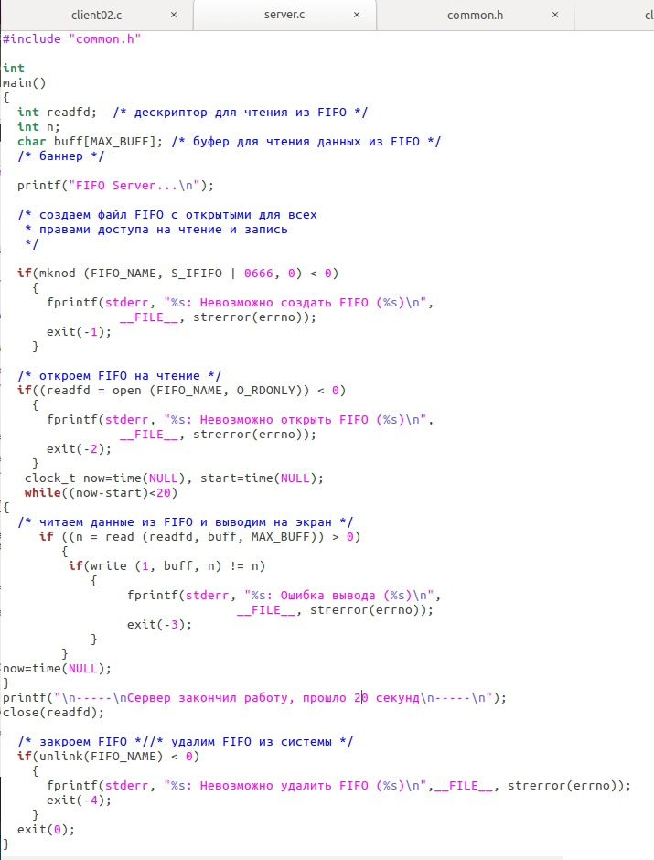
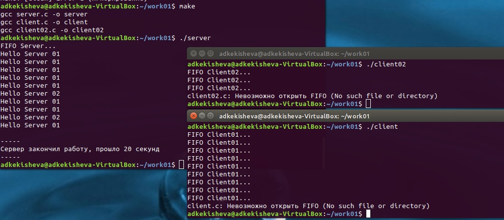

---
## Front matter
lang: ru-RU
title: Лабораторная работа №15. Именованные каналы.

author: 
	Кекишева Анастасия Дмитриевна, НБИ-01-20, \inst{}

institute: |
	\inst{1}RUDN University, Moscow, Russian Federation
date: 30 апреля, 2021

## Formatting
toc: false
slide_level: 2
theme: metropolis
header-includes: 
 - \metroset{progressbar=frametitle,sectionpage=progressbar,numbering=fraction}
 - '\makeatletter'
 - '\beamer@ignorenonframefalse'
 - '\makeatother'
aspectratio: 43
section-titles: true
---

## Цель работы

Приобретение практических навыков работы с именованными каналами.

## Задачи

Изучить приведённые в тексте программы server.c и client.c и напишите аналогичные программы, внеся следующие изменения:

- Работает не 1 клиент, а несколько (например, два).

- Клиенты передают текущее время с некоторой периодичностью (например, раз в пять секунд). Используйте функцию sleep() для приостановки работы клиента.

- Сервер работает не бесконечно, а прекращает работу через некоторое время (например, 30 сек). Используйте функцию clock() для определения времени работы сервера. Что будет в случае, если сервер завершит работу, не закрыв канал?

# Выполнение лабораторной работы

## Файл common.h
{ #fig:001 width=70% }

## Файл server.c: время работы 30 сек
{ #fig:002 width=70% }

## Файл client.c
{ #fig:003 width=70% } 

## Файл client02.c

{ #fig:004 width=70% } 

## Makefile и компиляция файлов
{ #fig:005 width=70% } 
{ #fig:006 width=70% } 

## Результат работы программы 1

{ #fig:007 width=70% } 

## Файл server.c: время работы 20 сек

{ #fig:008 width=70% } 

## Результат работы программы 2
{ #fig:009 width=70% } 

## Вывод
Я приобрела практические навыки работы с именованными каналами, написала программы, с требующимися изменениями.

## Библиография
1. [Ссылка 1](https://esystem.rudn.ru/mod/resource/view.php?id=719031)

