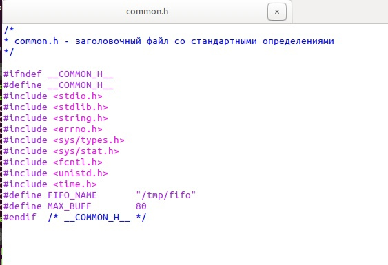
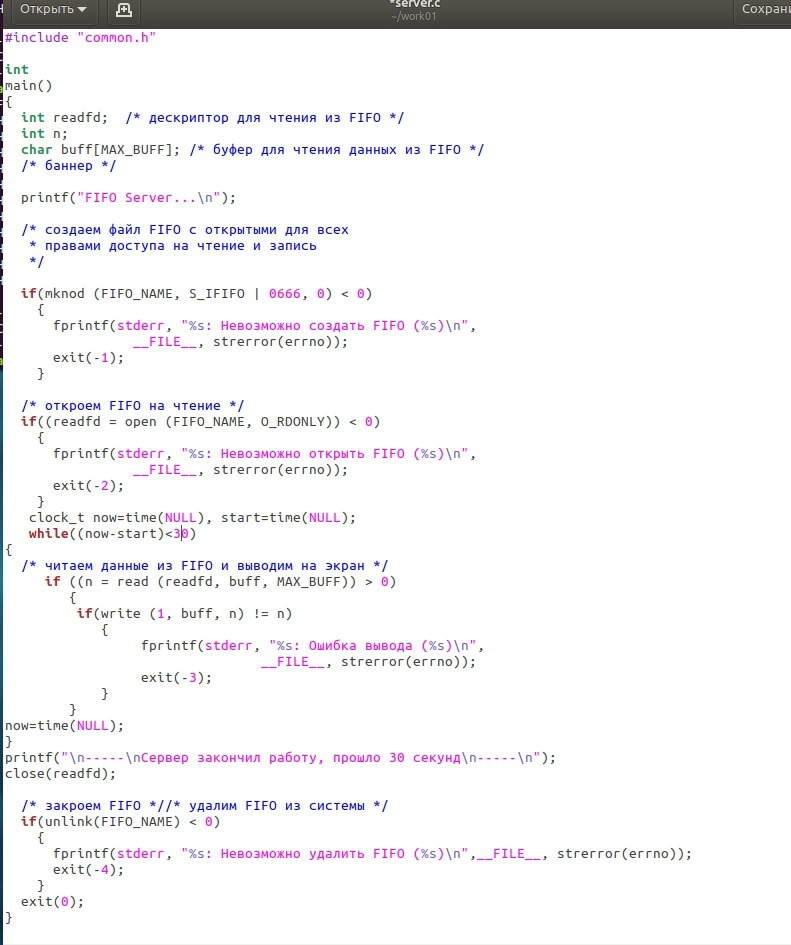
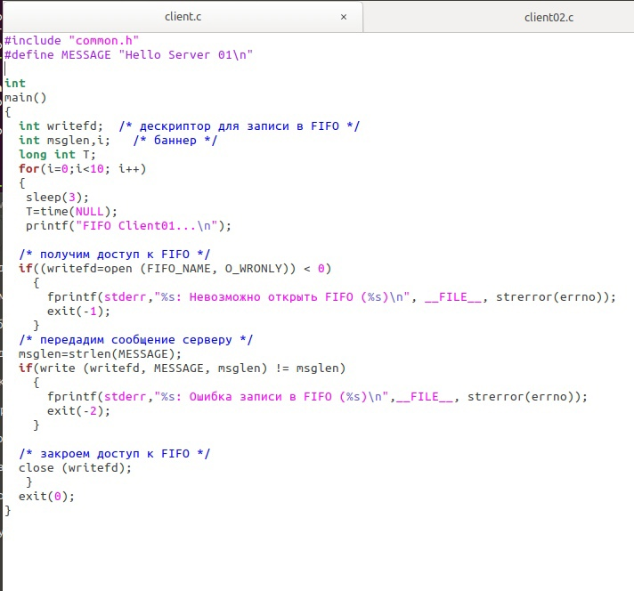
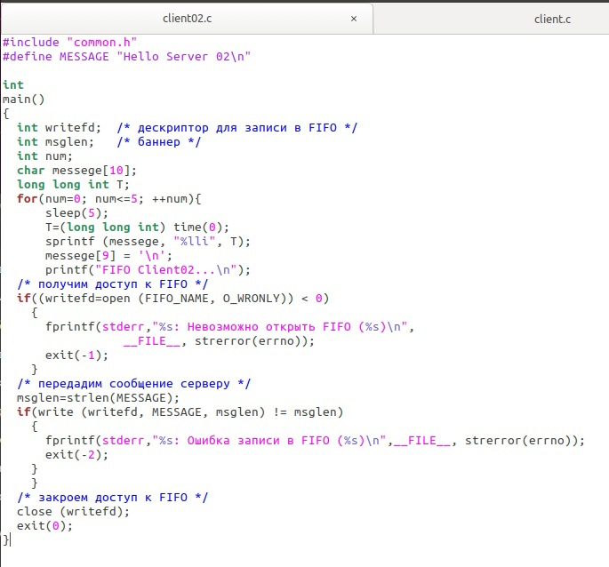
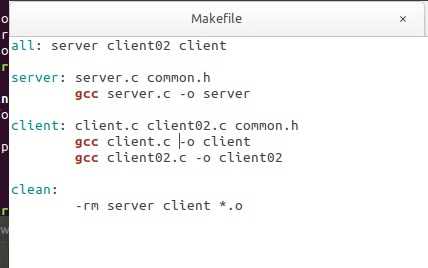
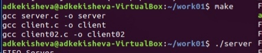
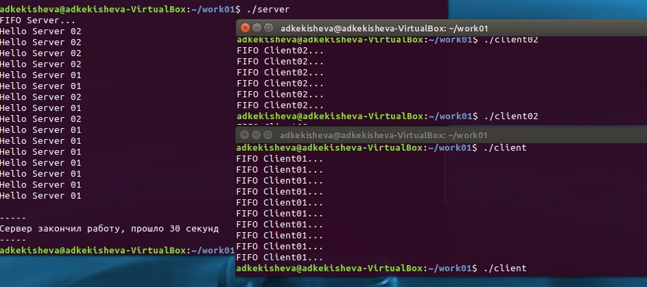
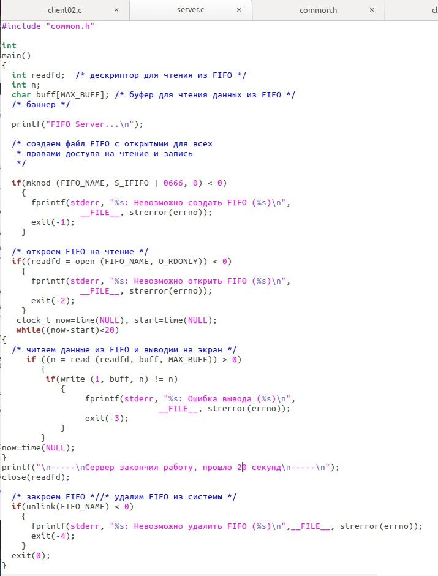
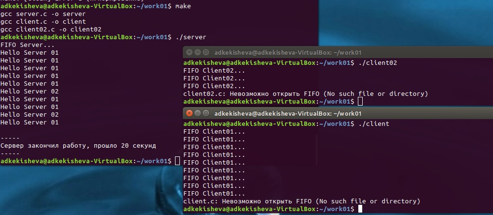

---
# Front matter
lang: ru-RU
title: "Отчёт к лабораторной работе №15"
subtitle: "Именованные каналы." 
author: "Кекишева Анастасия Дмитриевна"

# Formatting
toc-title: "Содержание"
toc: true # Table of contents
toc_depth: 2
lof: true # List of figures
lot: true # List of tables
fontsize: 12pt
linestretch: 1.5
papersize: a4paper
documentclass: scrreprt
polyglossia-lang: russian
polyglossia-otherlangs: english
mainfont: PT Serif
romanfont: PT Serif
sansfont: PT Sans
monofont: PT Mono
mainfontoptions: Ligatures=TeX
romanfontoptions: Ligatures=TeX
sansfontoptions: Ligatures=TeX,Scale=MatchLowercase
monofontoptions: Scale=MatchLowercase
indent: true
pdf-engine: lualatex
header-includes:
  - \linepenalty=10 # the penalty added to the badness of each line within a paragraph (no associated penalty node) Increasing the value makes tex try to have fewer lines in the paragraph.
  - \interlinepenalty=0 # value of the penalty (node) added after each line of a paragraph.
  - \hyphenpenalty=50 # the penalty for line breaking at an automatically inserted hyphen
  - \exhyphenpenalty=50 # the penalty for line breaking at an explicit hyphen
  - \binoppenalty=700 # the penalty for breaking a line at a binary operator
  - \relpenalty=500 # the penalty for breaking a line at a relation
  - \clubpenalty=150 # extra penalty for breaking after first line of a paragraph
  - \widowpenalty=150 # extra penalty for breaking before last line of a paragraph
  - \displaywidowpenalty=50 # extra penalty for breaking before last line before a display math
  - \brokenpenalty=100 # extra penalty for page breaking after a hyphenated line
  - \predisplaypenalty=10000 # penalty for breaking before a display
  - \postdisplaypenalty=0 # penalty for breaking after a display
  - \floatingpenalty = 20000 # penalty for splitting an insertion (can only be split footnote in standard LaTeX)
  - \raggedbottom # or \flushbottom
  - \usepackage{float} # keep figures where there are in the text
  - \floatplacement{figure}{H} # keep figures where there are in the text
---

# Цель работы

Приобретение практических навыков работы с именованными каналами.

# Задание

Изучить приведённые в тексте программы server.c и client.c. Взяв данные примеры за образец, напишите аналогичные программы, внеся следующие изменения:

- Работает не 1 клиент, а несколько (например, два).

- Клиенты передают текущее время с некоторой периодичностью (например, раз в пять секунд). Используйте функцию sleep() для приостановки работы клиента.

- Сервер работает не бесконечно, а прекращает работу через некоторое время (например, 30 сек). Используйте функцию clock() для определения времени работы сервера. Что будет в случае, если сервер завершит работу, не закрыв канал?

# Выполнение лабораторной работы
Перед выполнением лабораторной работы я хорошо ознакомилась с теоритическим материалом для её выполнения [Ссылка 1](https://esystem.rudn.ru/mod/resource/view.php?id=719031)

Во-первых, я изучила приведённые в тексте программы server.c и client.c. Взяв данные примеры за образец, написала аналогичные программы, внеся следующие изменения:

- Работает не 1 клиент, а несколько (например, два).

- Клиенты передают текущее время с некоторой периодичностью, я взяла что первый работает 3 сек, а второй 5, для приостановки работы клиента я использовала функцию sleep().

{ #fig:001 width=70% }

В файл common.h я добавила две библиотеки time.h и unistd.h (рис. 3.1). Первую для времени, и вторую для функций read, wright, close и т.д.

{ #fig:002 width=70% }

В файле server.c добавила функцию clock, присваиваю переменным start и now значение time(NULL). Также, создала цикл while установила время работы 30 сек, в конце цикла мы присваиваем значение time(NULL) переменной now.
Вывожу на экран сообщение о том, что сервер закончил свою работу и время его работы(рис. 3.2).

{ #fig:003 width=70% } 

В файле client.c (рис 3.3)  я ввела дополнительную переменную T для времени, а также сделала цикл for, в котором я определяю сколько раз в первый клиент будет обработан сервером, а также фунцию sleep(3), где задаю время ожидания 3 сек, и вывод на экран, что это клиент первый. Также передаю сообщение серверу, что это первый клиент (#define MESSAGE "Hello Server 01").

{ #fig:004 width=70% } 

В файле client02.c (рис 3.4) я также ввела дополнительную переменную T для времени, массив messege[10], также сделала цикл for, в котором я определяю сколько раз в клиент будет обработан сервером, а также фунцию sleep(5), где задаю время ожидания 5 сек, и вывод на экран, что это второй клиент. Функцией sprintf() произвожу вывод в массив. Также передаю сообщение серверу, что это второй клиент (#define MESSAGE "Hello Server 02"). 

{ #fig:005 width=70% } 

{ #fig:006 width=70% } 

Добавила в Makefile команду для компиляции файла client02.c (рис. 3.5). И выполнила компиляцию файлов (рис. 3.6).

{ #fig:007 width=70% } 

Далее запустила в одной консоли server, во второй client, в третьей client02. Сервер обработал клиентов необходимое количество раз и по происшествии 30 сек закончил работу (рис. 3.7).

{ #fig:008 width=70% } 

{ #fig:009 width=70% } 

Изменила время работы сервера на 20 сек (рис. 3.8). В это  раз сервер не успел обработать всех. Если сервер завершит работу, не закрыв канал, для клиентов выйдет сообщение о том, что невозможно открыть FIFO (рис. 3.9). 

# Вывод

Я приобрела практические навыки работы с именованными каналами, написала программы, с требующимися изменениями.

# Библиография
1. [Ссылка 1](https://esystem.rudn.ru/mod/resource/view.php?id=719031)

# Контрольные вопросы

1. Именованные каналы отличаются от неименованных наличием идентификатора канала, который представлен как специальный файл (соответственно имя именованного канала — это имя файла). Поскольку файл находится на локальной файловой системе, данное IPC используется внутри одной системы.

2. Создание неименованного канала из командной строки невозможно.

3. Создание именованного канала из командной строки возможно.

4. int read(int pipe_fd, void *area, int cnt);

int write(int pipe_fd, void *area, int cnt);

Первый аргумент этих вызовов - дескриптор канала, второй - указатель на область памяти, с которой происходит обмен, третий - количество байт. Оба вызова возвращают число переданных байт (или -1 - при ошибке).

5. int mkfifo (const char *pathname, mode_t mode) ;

mkfifo(FIFO_NAME, 0600) ;

Первый параметр — имя файла, идентифицирующего канал, второй параметр маска прав доступа к файлу. Вызов функции mkfifo() создаёт файл канала (с именем, заданным макросом FIFO_NAME).

6. При чтении меньшего числа байтов, чем находится в канале, возвращается требуемое число байтов, остаток сохраняется для последующих чтений. При чтении большего числа байтов, чем находится в канале или FIFO возвращается доступное число байтов.

7. При записи большего числа байтов, чем это позволяет канал или FIFO, вызов write(2) блокируется до освобождения требуемого места. При этом атомарность операции не гарантируется. Если процесс пытается записать данные в канал, не открытый ни одним процессом на чтение, процессу генерируется сигнал. Запись числа байтов, меньшего емкости канала или FIFO, гарантированно атомарно. Это означает, что в случае, когда несколько процессов одновременно записывают в канал, порции данных от этих процессов не перемешиваются.

8. В общем случае возможна много направленная работа процессов с каналом, т.е. возможна ситуация, когда с одним и тем же каналом взаимодействуют два и более процесса, и каждый из взаимодействующих каналов пишет и читает информацию в канал. Но традиционной схемой организации работы с каналом является однонаправленная организация, когда канал связывает два, в большинстве случаев, или несколько взаимодействующих процесса, каждый из которых может либо читать, либо писать в канал.

9. Write - Функция записывает length байтов из буфера buffer в файл, определенный дескриптором файла fd. Эта операция чисто 'двоичная' и без буферизации. Реализуется как непосредственный вызов DOS. С помощью функции write мы посылаем сообщение клиенту или серверу.

10. Строковая функция strerror - функция языков C/C++, транслирующая код ошибки, который обычно хранится в глобальной переменной errno, в сообщение об ошибке, понятном человеку. Ошибки эти возникают при вызове функций стандартных Си-библиотек. Возвращенный указатель ссылается на статическую строку с ошибкой, которая не должна быть изменена программой. Дальнейшие вызовы функции strerror перезапишут содержание этой строки. Интерпретированные сообщения об ошибках могут различаться, это зависит от платформы и компилятора.

